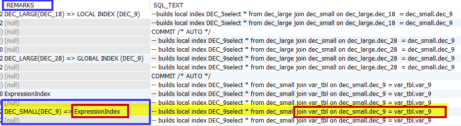
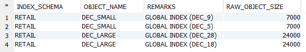

# What happens when I JOIN DECIMAL datatypes of various sizes? 
## Question

Knowing that JOINS on VARCHAR of various sizes can create an expression index, what about using datatype DECIMAL? 

## Answer

Before we go into detail, a few things to keep in mind:

1. Joins between columns of the same datatype will build an index that is permanent (see point 3 for clarity).  If you are joining on distribution keys (best practice), then the index will be local, otherwise, joins on columns which are NOT distribution keys result in a global index. You can see the importance of using distribution keys for processing efficiency.
2. The index is created on the table which follows the JOIN. The size of the index in this exercise is taken from the DECIMAL column following the join statement itself - meaning, joining a DEC(9) to a DEC(18) column will build the index size larger than. vice versa, joining a DEC(18) to a DEC(9) which builds a smaller index.
3. DECIMAL joins to VARCHAR (different datatypes) results in the higher cost expression index - which does NOT persist and must be generated for each and every join.

### Demonstration

#### Environment build

Our demonstration is using the SALES table from [https://github.com/exasol/database-migration/tree/master/test/testing_files/retail_mini](https://github.com/exasol/database-migration/tree/master/test/testing_files/retail_mini).


```sql
create or replace table dec_small (dec_5 decimal(5,0), dec_9 decimal(9,0));
create or replace table dec_large ( dec_18 decimal(18,0), dec_28 decimal(28,0));
create or replace table int_tbl (int_1 integer);
create or replace table var_tbl(var_9 varchar(9));
insert into int_tbl select ( cast(price as integer)) from sales limit 1000 ;--Just insert some numeric data - our example uses a sales table.;

insert into dec_small(dec_5, dec_9)  select int_1, int_1 from int_tbl;
insert into dec_large(dec_18, dec_28)  select int_1, int_1 from int_tbl;
insert into var_tbl(var_9)  select int_1 from int_tbl;
```
#### Run JOINs and generate statistics


```sql
select * from dec_small join dec_large on dec_small.dec_5 = dec_large.dec_18; -- builds local index DEC_18
select * from dec_small join dec_large on dec_small.dec_5 = dec_large.dec_28; -- builds local index DEC_28
select * from dec_small join dec_large on dec_small.dec_9 = dec_large.dec_18; -- builds local index DEC_18
select * from dec_small join dec_large on dec_small.dec_9 = dec_large.dec_28; -- builds local index DEC_28
select * from dec_large join dec_small on dec_large.dec_18  = dec_small.dec_5; --builds local index DEC_5
select * from dec_large join dec_small on dec_large.dec_28  = dec_small.dec_5; --builds local index DEC_5
select * from dec_large join dec_small on dec_large.dec_18  = dec_small.dec_9; -- builds local index DEC_9
select * from dec_large join dec_small on dec_large.dec_28  = dec_small.dec_9; -- builds local index DEC_9
select * from dec_small join var_tbl on dec_small.dec_9 = var_tbl.var_9; -- from EXA_DBA_PROFILE_LAST_DAY: INDEX CREATE,EXPRESSION INDEX on REPLICATED table,RETAIL,VAR_TBL
```
#### Externalize and show the statistics.


```sql
flush statistics;

select stmt_id
      ,COMMAND_NAME
      ,PART_ID
      ,PART_NAME
      ,OBJECT_NAME
      ,OBJECT_ROWS
      ,OUT_ROWS
      ,REMARKS
      ,SQL_TEXT
from EXA_DBA_PROFILE_LAST_DAY 
  where session_id = (select current_session) 
order by stmt_id, part_id;
```
The most interesting line in the output is the expression index creation - which should be minimized if not avoided altogether.



 Next, let's look at the indices created.


```sql
select edi.index_schema
      ,edos.object_name
      ,edi.remarks
      ,edos.raw_object_size
   from exa_dba_object_sizes edos
             ,exa_dba_indices edi
  where edi.index_table in ( 'DEC_LARGE', 'DEC_SMALL', 'VAR_TBL')
    and edos.root_name = edi.index_schema
    and edos.object_name = edi.index_table
;
```
Reviewing the output, we see 4 indexes, 2 for each table and 0 indexes for the VAR_TBL.



## Additional References

[Local and Global Joins](https://exasol.my.site.com/s/article/Local-and-Global-Joins)

[Best practice: Datatypes and Joins](https://exasol.my.site.com/s/article/Best-practice-Datatypes-and-Joins)

[NULL in Exasol](https://exasol.my.site.com/s/article/NULL-in-Exasol)

*We appreciate your input! Share your knowledge by contributing to the Knowledge Base directly in [GitHub](https://github.com/exasol/public-knowledgebase).* 