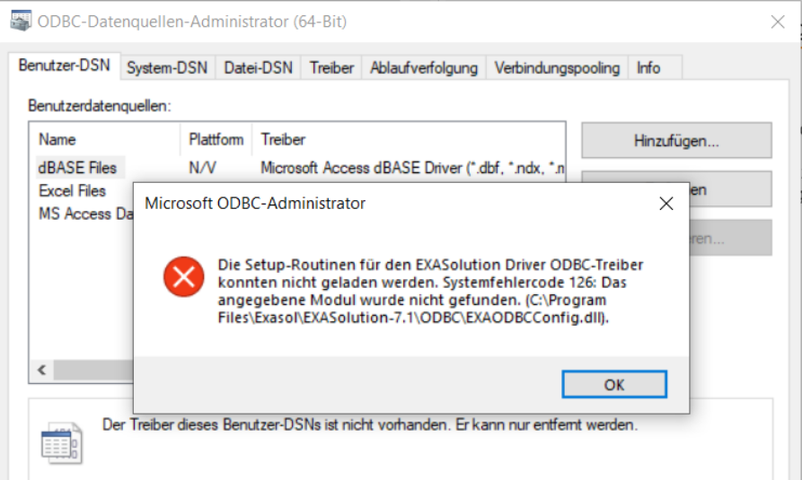
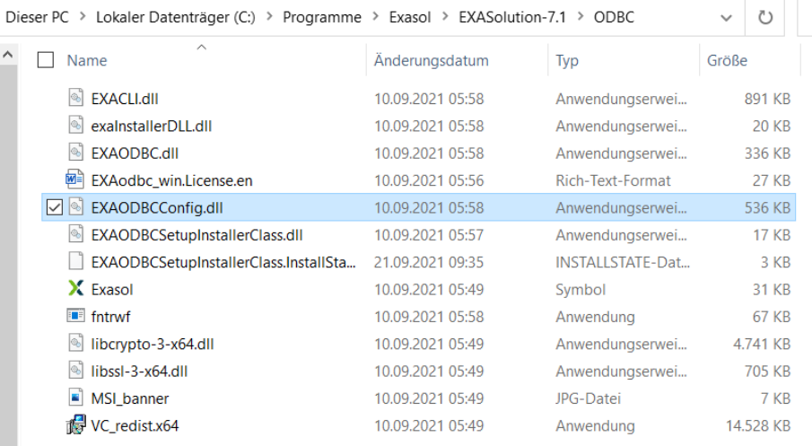

# What to do, when the ExaSolution ODBC Driver could not be started during Setup 
## Scope

Users may report that they are not able to install Exasol ODBC drivers on Windows. They get an error while trying to create an ODBC data source, saying that `EXAODBCConfig.dll` is missing. Although if the user copy the path from the error message, the file exists.

## Diagnosis

Usually, when there is such an ODBC installation issue, you would see an error message such as:  
  


```
The setup routines for the EXASolution Driver ODBC driver could not be loaded due to system error code 126:   
The specified module could not be found. ((C:\Program Files\Exasol\EXASolution-x\ODBC\EXAODBCConfig.dll)
```
On German Windows System:


```
Die Setup-Routinen für den EXASolution Driver ODBC-Treiber konnten nicht geladen werden. Systemfehlercode 126:   
Das angegebene Modul wurde nicht gefunden. (C:\Program Files\Exasol\EXASolution-x\ODBC\EXAODBCConfig.dll)
```
The module`(C:\Program Files\Exasol\EXASolution-x\ODBC\EXAODBCConfig.dll)`is available:  


## Explanation

The issue lies in the VC++ 2019 Redistributable which is embedded in the Exasol ODBC x64 driver installer. In short, the embedded VC++ Redistributable DOES NOT get installed successfully by the Exasol ODBC driver installer.

## Recommendation

Download Manually and install the VC++ Redistributable from Microsoft website directly, and then Exasol ODBC 7.0.x/ 7.1.x works.

The Visual Studio redistributables for 32 and 64 bit can be downloaded from here: <https://support.microsoft.com/de-de/topic/aktuelle-unterst%C3%BCtzte-downloads-f%C3%BCr-visual-c-2647da03-1eea-4433-9aff-95f26a218cc0>

## Additional References

* <https://docs.exasol.com/7.0/connect_exasol/drivers/odbc/odbc_windows.htm#KnownIssues> => 7.0
* <https://docs.exasol.com/7.1/connect_exasol/drivers/odbc/odbc_windows.htm>[#KnownIssues](https://docs.exasol.com/7.0/connect_exasol/drivers/odbc/odbc_windows.htm#KnownIssues) => 7.1
