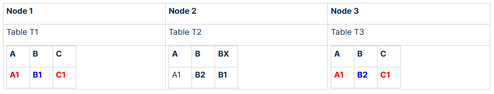
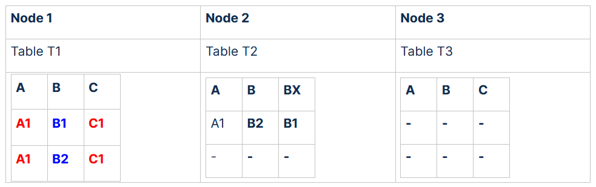

# What to do, when you have a bad Performance on Join Queries 

## Scope

Fast response times are key to user satisfaction. Slow queries mean that you see overhead instead of the information you requested. **This is especially important for questions that are executed very often.**

Bad query performance can occur if no or the wrong distribution key is defined. Then table rows are distributed at random across the nodes. 

Let us assume the following example:


```sql
create or replace table T1(A varchar(2), B varchar(2), C varchar(2),   
                  distribute by A,B,C);  
create or replace table T2(A varchar(2), B varchar(2), Bx varchar(2),   
                  distribute by A,B,Bx);  
create or replace table T3(A varchar(2), B varchar(2), C varchar(2),   
                  distribute by A,B,C);
```
With the following slow running query which joins the 3 tables: 


```sql
SELECT *  
FROM T1  
join T2  
on T2.Bx = T1.B  
and T2.A = T1.A  
join T3  
on T3.B = T2.B  
and T3.A = T2.A  
and T3.C = T1.C;
```
## Diagnosis

To figure out the problem, run a test of the problematic statement with profiling switched on.

Follow the below steps to run a test of the problematic statement with profiling switched on:

1. Open a new database connection (for example, using DB Visualizer or any desired database client).
2. Copy the problematic SQL query into the following statement, and execute it:


```sql
set autocommit on;  
alter session set profile='on';  
alter session set query_cache='off';  
  
-- Example query  
  
SELECT *  
FROM T1  
join T2  
on T2.Bx = T1.B  
and T2.A = T1.A  
join T3  
on T3.B = T2.B  
and T3.A = T2.A  
and T3.C = T1.C;  
  
flush statistics;  
  
select *  
from EXA_STATISTICS.EXA_USER_PROFILE_LAST_DAY  
where session_id = current_session;
```

### Result:

| **PART_ID** | **PART_NAME** | **PART_INFO** | **OBJECT_SCHEMA** | **OBJECT_NAME** | **OBJECT_ROWS** | **OUT_ROWS** |
| --- | --- | --- | --- | --- | --- | --- |
| 1 | COMPILE / EXECUTE |   |   |   |   |   |
| 2 | PUSHDOWN |   |   |   |   |   |
| 3 | SCAN |   | TEST | A | 4356367676 | 9664506 |
| 4 | JOIN | **GLOBAL** | **TEST** | **B** | 513087803 | 1325798 |
| 5 | JOIN | **GLOBAL** | **TEST** | **C** | 6772480 | 0 |
| 6 | INSERT | on TEMPORARY table | tmp_subselect0 | 0 | 

If you see only GLOBAL JOINs, especially in joining a huge amount of data then you should think to improve the distribution key.

## Explanation

The compiler assumes data to be similar to the following example:



In our example, we can see that the row which matches the join is distributed on 2 nodes because they are not the same (**A1,B1**,**C1** <>**A1,B2**,**C1**). A global join will be used to compute the result.

Global join T1, T2 requires, that appropriate data from T1 has to be redistributed to appropriate nodes. As table T1 is relatively big, it causes a lot of network traffic, which leads to performance degradation. 

From the analyzed slow query, we see that A, B are the joined columns between table **T1** and table **T2**. Because the used distribution key on the tables doesn't fit with join columns, the global join will be used.

Because of this, table **T3** has to be redistributed to the appropriate nodes. As this is a big table, maybe not evenly distributed (which would amplify redistribution issue), it causes a lot of network traffic to redistribute it, which causes this overhead.

## Recommendation

Thus recommended solution would be to make the join between those big tables local. It is also important, that this new distribution is even, otherwise overhead will be moved to one node. Setting the distribution key on both tables **T1** and **T2** to **A, B** could help in this case and eliminate this overhead.

Improvement **could be** achieved by enforcing local join instead of a global join. For this, try to modify the distribution key as follows:

distribute by A,C

 In our example this would lead to the following new distribution:



With a distribution key A,C, the row which matches the first join is distributed now on one node, because they are t the same (A1,C1 <>A1,C1). To compute the first join a local join will be used. Every row finds a local join partner on the same node, so the network communication between the nodes on behalf of the join is not required.

As a general rule: **A single distribution column is optimal**, because more joins and aggregations can profit this way (apart from data distribution imbalances)

## Additional References

* [Best Practices - ](https://docs.exasol.com/db/latest/performance/best_practices.htm#DistributionKeys)
* [ALTER TABLE (Distribution/Partitioning)](https://docs.exasol.com/sql/alter_table(distribution_partitioning).htm)
* [Profiling Information](https://docs.exasol.com/administration/on-premise/support/profiling_information.htm)

*We appreciate your input! Share your knowledge by contributing to the Knowledge Base directly in [GitHub](https://github.com/exasol/public-knowledgebase).* 