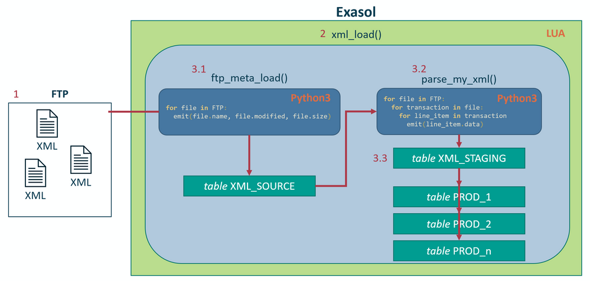
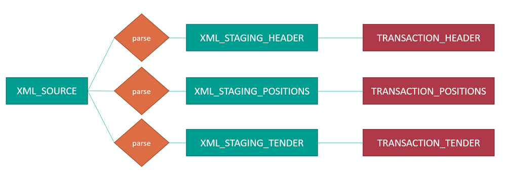

# XML-parsing in retail using Python3 UDFs 
## Background

Let's face it: XML is dead.

But just because new shiny alternatives like YAML or JSON are around does not mean we can abandon XML altogether. There are still companies [hiring Cobol developers](https://www.stepstone.de/5/job-search-simple.html?stf=freeText&ns=1&qs=%5B%5D&companyID=0&cityID=0&sourceOfTheSearchField=homepagemex%3Ageneral&searchOrigin=Homepage_top-search&ke=cobol&ws=&ra=30) you know...  
So until the last 21 gun salute for XML has faded over the wide, misty graveyard of forgotten programming languages, we are going to keep on working with it. And as always, Exasol will support you doing your job in every possible way!

In this demo I am going to show a full ELT process, loading retail XML files in the POSlog format into an Exasol database using nothing but SQL, LUA and Python3. This is more of an example on how things could be done then a generic tool at your disposal. The reason for this is simple. Whenever unstructured or semi structured data is transformed into structured data, logic has to be applied. How this logic looks depends on the business case (what information is of interest) and the source format (how to get information). Please keep this in mind when reading the following article. 

## Prerequisites

You need an Exasol database to follow along. Some FTP sever would be beneficial too, because we are going to load the XML files we are ingesting into the database from FTP.  
FTP is just a example here. Since we are using Python3 as our scripting language it does not matter if  our files live on S3, FTP, SFTP, SCP, HTTP, HTTPS, SMB, NFS, CIFS or [punch cards](https://en.wikipedia.org/wiki/Punched_card) we can read from literally any source system.

You can get the demo XML file this code is tailored to from: <https://gist.github.com/tsusanto/a4ce99390ac25fc239e518f53f092869> ([Mirror](https://drive.exasol.com/f/da5737db758c46f1b727/?dl=1))

## I don't care how it works, just give me the code!

Okay, here you go:

* [GitHub repository](https://github.com/exasol/xml-parsing-demo)
* [Poslog format XML file you can test with](https://drive.exasol.com/f/da5737db758c46f1b727/?dl=1)
* [Exasol free test version](https://www.exasol.com/test-it-now/)

## How to import XML data into Exasol

As with any programmatical problem there are infinite ways to solve it. Below is the way I approached it for this demo:



*Schematic overview of the ELT process*

1. We have a FTP server storing our XML files. In order to access it, we need a `username`, `password`, `directory` and `host-ip`.
2. On Exasol we run a script called **xml_load()**. It is a LUA script and is used to orchestrate the ELT process. In order to start our ELT process we just type  

```markup
EXECUTE SCRIPT schema.xml_load('host-ip', 'directory', 'username', 'password');
```
and watch the magic happen.
3. When we call the outer script wrapper a series of SQL statements is executed.
	1. The wrapper script writes the outputs of the **ftp_meta_load()** UDF into the **XML_SOURCE** table.
	2. The **parse_my_xml()** uses the information from **XML_SOURCE** to write the data contained in the XML-files to the **XML_STAGING** table.
	3. The wrapper script distributes the data from **XML_STAGING** onto the different PROD tables.

## How the ftp_meta_load() UDF works


```python
--/
CREATE OR REPLACE python3 SCALAR SCRIPT ftp_metadata_load(ftp_host VARCHAR(5000), ftp_dir VARCHAR(500), ftp_user VARCHAR(500), ftp_password VARCHAR(500))
EMITS (file_name v(500), last_changed TIMESTAMP, file_size INT) AS
FROM ftplib import FTP
import datetime

def run(ctx):
        with FTP(ctx.ftp_host) as ftp:
            ftp.login(ctx.ftp_user, ctx.ftp_password)
            ftp.cwd(ctx.ftp_dir)
            for file in ftp.mlsd():
                ctx.emit(file[0], datetime.datetime.strptime(file[1].get('modify'), '%Y%m%d%H%M%S'), int(file[1].get('size')))
/
```
In order to read from the FTP server we need to know which files are on it, this UDF helps us figuring that out. We call **ftp_meta_load()** with `username`, `password`, `directory` and `host-ip`. The UDF establishes a connection to the FTP server, authenticates itself and changes to the directory where our files are. It then emits [`filename`, `modification_date`, `file_size`] for each file it finds in that directory.

## How the parse_my_xml() UDF works

Like with the **ftp_metadata_load()** script at first we connect to the FTP server. However our script now requires the additional `file_name` parameter. We provide this parameter using our **xml_load()** wrapper script. More on that later.


```python
from lxml import etree as ET
from io import BytesIO
from ftplib import FTP
from datetime import datetime
from hashlib import md5

def run(ctx):
    with FTP(ctx.ftp_host) as ftp:
        raw_xml = BytesIO()

        ftp.login(ctx.ftp_user, ctx.ftp_password)
        ftp.cwd(ctx.ftp_dir)

        path = f'RETR {ctx.file_name}'
        ftp.retrbinary(path, raw_xml.write)
        raw_xml.seek(0)
        root = ET.parse(BytesIO(raw_xml.read())).getroot()

    namespaces = {"poslog":"http://www.nrf-arts.org/IXRetail/namespace/",
                    "x":"http://www.nrf-arts.org/IXRetail/namespace/",
                    "acs":"http://www.ncr.com/rsd/acs/tlog/markup/poslog/2.1",
                    "raw":"http://www.ncr.com/rsd/acs/tlog/markup/raw/base/6.1",
                    "xsi":"http://www.w3.org/2001/XMLSchema-instance",
                    "msxsl":"urn:schemas-microsoft-com:xslt",
                    "as":"urn:ACSScript",
                    "acssm":"urn:ACSSigMap"}

    def get_Satzart(element):
        tag = element.tag
        tag = tag.replace('{http://www.nrf-arts.org/IXRetail/namespace/}', '')
        tag = tag.replace('{http://www.wincor-nixdorf.com}', '')

        if tag == "Transaction":
            return "Transaction"
        elif tag == "LineItem" and element.get('EntryMethod'):
            return "Sale"
        elif tag == "RetailPriceModifier":
            return "RetailPriceModifierInSale"
        elif tag == "Tender":
            return "Tender"
        elif tag == "BSCMTransaction":
            return "BSCMTransaction"

    def safe_list_get(l, i, default='', attribute_flag=False):
        try:
            itm = l[i]
            if attribute_flag:
                return itm
            else:
                return itm.text
        except IndexError:
            return default

    def safe_attribute_get(e, keyword, default=''):
        try:
            return e.get(keyword)
        except AttributeError:
            return default

    for transaction in root.xpath('./x:Transaction', namespaces=namespaces):
        RETAIL_STORE_ID = safe_list_get(transaction.xpath('x:RetailStoreID', namespaces=namespaces), 0)

        try:
            MANDANT = RETAIL_STORE_ID[:3]
        except IndexError:
            MANDANT = ""

        FILENAME = ctx.file_name
        raw_xml.seek(0)
        MD5 = md5(raw_xml.read()).hexdigest()
        WORKSTATION_ID = safe_list_get(transaction.xpath('x:WorkstationID', namespaces=namespaces), 0)
        BON_ID = safe_list_get(transaction.xpath('x:SequenceNumber', namespaces=namespaces), 0)
        TX_LINENUM = transaction.sourceline
        RECEIPT_DATE_TIME = safe_list_get(transaction.xpath('x:BusinessDayDate', namespaces=namespaces), 0)
        OPERATOR_ID = safe_list_get(transaction.xpath('x:OperatorID', namespaces=namespaces), 0)
        SATZART = get_Satzart(transaction)

        ReceiptDateTime = safe_list_get(transaction.xpath('x:RetailTransaction/x:ReceiptDateTime', namespaces=namespaces), 0)

        _OPERATOR_NAME = safe_list_get(transaction.xpath('x:OperatorID', namespaces=namespaces), 0, attribute_flag=True)
        OPERATOR_NAME = safe_attribute_get(_OPERATOR_NAME, 'OperatorName')

        CURRENCY_CODE = safe_list_get(transaction.xpath('x:CurrencyCode', namespaces=namespaces), 0)
        _VERSION = safe_list_get(transaction.xpath('x:RetailTransaction', namespaces=namespaces), 0, attribute_flag=True)
        VERSION = safe_attribute_get(_VERSION, 'Version')

        TOTAL_GRAND = safe_list_get(transaction.xpath('x:RetailTransaction/x:Total[@TotalType="TransactionGrandAmount"]', namespaces=namespaces), 0)
        TRANSACTION_TAX = safe_list_get(transaction.xpath('x:RetailTransaction/x:Total[@TotalType="TransactionTaxAmount"]', namespaces=namespaces), 0)

        if transaction.xpath('x:RetailTransaction/x:LineItem', namespaces=namespaces):
            TRANSACTION_COUNT = safe_list_get(transaction.xpath('x:RetailTransaction/x:TransactionCount', namespaces=namespaces), 0)
            ItemCount = safe_list_get(transaction.xpath('x:RetailTransaction/acs:ItemCount', namespaces=namespaces), 0)
            for line_item in transaction.xpath('x:RetailTransaction/x:LineItem', namespaces=namespaces):
                # Satzarten
                LINEITEM_SATZART = get_Satzart(line_item)

                # Linenums
                LINEITEM_LINENUM = line_item.sourceline

                _ITEM_TYPE = safe_list_get(line_item.xpath("x:Sale", namespaces=namespaces), 0, attribute_flag=True)
                if not _ITEM_TYPE:
                    _ITEM_TYPE = safe_list_get(line_item.xpath("x:Return", namespaces=namespaces), 0, attribute_flag=True)
                ITEM_TYPE = safe_attribute_get(_ITEM_TYPE, 'ItemType')

                ITEM_ID = safe_list_get(line_item.xpath("x:Sale/x:ItemID", namespaces=namespaces), 0)
                ITEM_DESCRIPTION = safe_list_get(line_item.xpath("x:Sale/x:Description", namespaces=namespaces), 0)
                REGULAR_SALES_UNIT_PRICE = safe_list_get(line_item.xpath("x:Sale/x:RegularSalesUnitPrice", namespaces=namespaces), 0)
                DiscountAmount = safe_list_get(line_item.xpath("x:Sale/x:DiscountAmount", namespaces=namespaces), 0)

                QUANTITY = safe_list_get(line_item.xpath("x:Sale/x:Quantity", namespaces=namespaces), 0)

                UNIT_LIST_PRICE = safe_list_get(line_item.xpath("x:Sale/x:RegularSalesUnitPrice", namespaces=namespaces), 0)
                ENTRY_METHOD = line_item.get('EntryMethod')

                _TENDER_ROOT = safe_list_get(line_item.xpath("x:Tender", namespaces=namespaces), 0, attribute_flag=True)
                TENDER_TYPE_CODE = safe_attribute_get(_TENDER_ROOT, 'TypeCode')
                TENDER_TYPE = safe_attribute_get(_TENDER_ROOT, 'TenderType')
                TENDER_AMOUNT = safe_list_get(line_item.xpath("x:Tender/x:Amount", namespaces=namespaces), 0)

                ctx.emit(...)
        else:
            ctx.emit(...)
```
As you can easily tell: The way this script looks will depend mostly on the structure of your XML file. While XML like YAML and JSON is a semi structured data format our RDBMS only supports structured data. To convert one into the other we need to apply logic and this logic is what makes up about 90% of our script (and 95% of the development time spent). Each and every XML field from the XML file that we want to have in our database needs to be specifically addressed. I chose the `lxml` parsing library to do this job. The addressing language we are going to use is `XPATH`.

To now get the information we desire, we need to write code like this:


```python
ITEM_ID = safe_list_get(line_item.xpath("x:Sale/x:ItemID", namespaces=namespaces), 0)
```
Notice how each of the element names are preceded by `x:`. this is because `lxml` does not allow the usage of unnamed default namespaces. Either you use namespaces in your code or you don't. Since the poslog XML we use comes with namespaces preconfigured we need to come up with a name for our default namespace. Since we are at Exasol the name of our default namespace is `x` .

lxml's `xpath()` returns a list containing values or `None` if no value was found. This is unfortunate, because whenever we find a value, there will never be more then one item in the list. However writing `result[0]` is unsafe. If no item in the given `XPATH` was found, this would evaluate to `None[0]` causing an `IndexError`. I therefore implemented a couple of methods like `safe_list_get()` which handle occurring `None`/`Null` values gracefully and replace `None` with an empty string (which will eventually be replaced by `NULL` when returned to Exasol from the UDF context).

Since there can be more then one transaction (receipt) in a XML file and more then one line item in a transaction we need to apply a little bit of looping as well. Our goal is to emit the leaf-element of the XML tree whereever possible and usefull to get the most information. 

The variable `ITEM_ID` together with many more is eventually emitted from the UDF and returned to the calling **xml_load()** script where it is going to be processed and written into the **XML_STAGING** table.

Please refer to the [GitHub](https://github.com/exasol/xml-parsing-demo) repository in order to get the the full (and up to date) version of the script.

## How the xml_load() script works

Contrary to the two UDFs above **xml_load()** is a `LUA` script. `LUA` scripts in Exasol can serve as UDFs (creating them as `scalar` or `set` scripts) but they can also be created as `SCRIPT` (without the `scalar` or `set` keyword) making them stored procedures which are able to control SQL statements.

We are using the **xml_load()** script to run the two scripts mentioned above and orchestrate our whole ELT process. The following things are achieved by executing **xml_load()**:

1. The **XML_STAGING** and **XML_SOURCE**tables are truncated
2. One(!) connection to the FTP server is established querying the file list
3. The result of that query is written into the **XML_SOURCE** table
4. The **parse_my_xml()** statement is called in an `INSERT` statement. The emitted results of **parse_my_xml()** are written into **XML_STAGING**
5. The loaded XML files are marked as loaded with the current timestamp in **XML_SOURCE** providing rudimental delta-load capibilities
6. **XML_STAGING** is distributed into different productive tables. Type conversions are applied on the fly and sometimes handled implicitly


```markup
CREATE OR REPLACE SCRIPT xml_load(schema, ftp_host, ftp_dir, ftp_user, ftp_password) RETURNS ROWCOUNT AS
-- Clean up staging
query([[TRUNCATE TABLE ::s.XML_STAGING]], {s = schema});
query([[TRUNCATE TABLE ::s.XML_SOURCE]], {s = schema});

-- Fill xml_source table with FTP files to load
xml_source_res = query([[INSERT INTO ::s.xml_source (file_name, last_changed, file_size, loaded)
                        SELECT ::s.ftp_metadata_load(:h, :d, :u, :p), null]],
                        {s = schema, h = ftp_host, d = ftp_dir, u = ftp_user, p = ftp_password})
output(xml_source_res.rows_inserted..' FTP files added to download queue.')

-- Write into staging
xml_staging_res = query([[INSERT INTO ::s.xml_staging ( 
                             ...bunch of colums...)
                        WITH temp AS (  SELECT    ::s.PARSE_MY_XML(s.file_name, :d, :h, :u, :p)
                                        FROM      ::s.XML_SOURCE s)
                        SELECT * FROM temp;
        ]], {s = schema, h = ftp_host, d = ftp_dir, u = ftp_user, p = ftp_password});
output(xml_staging_res.rows_inserted..' rows inserted into XML_STAGING')    

----
--Mark loaded files as loaded
----
xml_source_res = query([[UPDATE ::s.xml_source
                        SET loaded = current_timestamp
                        WHERE true]],
                        {s = schema});
                        
----
--Write into target tables
----

--Header
xml_header_res = query([[INSERT INTO ::s.TRANSACTION_HEADER (...bunch of columns...)
        SELECT  ...bunch of columns...
        FROM ::s.xml_staging
        where header_id in (
                select distinct first_value(header_id) over (partition by bon_id) header_id
                                from ::s.xml_staging)
                ]], {s = schema})
output(xml_header_res.rows_inserted..' rows inserted into TRANSACTION_HEADER')


--Position
xml_positions_res = query([[INSERT INTO ::s.TRANSACTION_POSITIONS
        SELECT  ...bunch of columns...  
        FROM ::s.xml_staging
        WHERE ITEM_ID is not null
        ]], {s = schema})
output(xml_positions_res.rows_inserted..' rows inserted into TRANSACTION_POSITION')

--Zahlungsart
xm_tender_res = query([[INSERT INTO ::s.TRANSACTION_TENDER
       SELECT   ...bunch of columns...   
        FROM ::s.xml_staging
        WHERE TENDER_TYPE_CODE is not null
        ]], {s = schema})
output(xm_tender_res.rows_inserted..' rows inserted into TRANSACTION_TENDER')
/
------------------------

EXECUTE SCRIPT xml_load(
'',                      -- schema
'',                      --ftp host
'',                      --ftp directory
'',                      --ftp user
''                       --ftp password
) WITH OUTPUT;
```
## Additional Notes -  Could we have done something differently?

As with every coding challenge there are endless ways of solving it. Some of these ways make more sense then others. Let's look at a few different approaches to what we just discussed.

### You could store the XML in a VARCHAR(2000000) column and parse it from there

We could write the **xml_load()** UDF in a way that emits the raw XML text to the **XML_SOURCE** table. The **parse_my_xml()** UDF would use the this VARCHAR() column for parsing.

**PRO:**- When parsing you do not have to rely on a stable FTP connection

**CON:**

- You need more space in your staging layer because you are storing all XML raw text before processing it  
- You are limited to the VARCHAR() character limit which is currently two million

By itself this approach does not make much sense because it uses up more space and limits the size of XML files you can handle. However in combination with the approach below this becomes way more powerful.

### Write data into different staging tables for each prod table

Currently we are writing all the information we pull from our XML into the **XML_STAGING** table. In order to be left with sensible data we need to completely denormalize it. Data duplication is the name of the game here. Because of the staging table having all future production table data it becomes very wide and clunky to work with (e.g. differentiating . In order to be able to write to multiple, individual staging tables we need to split our **parse_my_xml()** UDF as well, because a UDF can only emit **one** set of values which is emitted to **one** SQL context, inserting into **one** table. This would leave us with:



**PRO**-Easy namespace management and clearer/parallel development process because parsing UDFs and staging tables are kept separate

**CON**- XML has to be parsed multiple times (for each staging table)  
- If you read directly from FTP your load on the FTP server will be multiplied by the number of staging/tables you are filling.

The second CON-point is the reason we talked about storing the raw XML in a **VARCHAR()** column earlier. You would still need to parse the XML multiple times but you would do so within the perimeter of your database and not cause excess network traffic. Depending on the complexity of your XML files, the power of your FTP server, your development process and your general architecture different approaches might suite you.


