# Operational Handbook for SDDC Administration

This document contains information about how to use the SDDC Feature with Exasol.

## Table of Contents

- [Table of Contents](#table-of-contents)
- [Foreword](#foreword)
- [Background – how SDDC works](#background--how-sddc-works)
- [SDDC Installation](#sddc-installation)
  - [Cluster Interconnect: Requirements and Bandwidth Planning](#cluster-interconnect-requirements-and-bandwidth-planning)
  - [Installation Example](#installation-example)
- [SDDC Administration](#sddc-administration)
  - [Starting a database](#starting-a-database)
  - [Configuring a database](#configuring-a-database)
  - [Creating new volumes](#creating-new-volumes)
  - [Creating Backups](#creating-backups)
  - [Activating or Deactivating Backup Schedules](#activating-or-deactivating-backup-schedules)
  - [Switch Active Database to DR database](#switch-active-database-to-dr-database)
  - [Switch back DR Database to PROD Database](#switch-back-dr-database-to-prod-database)
- [SDDC Monitoring](#sddc-monitoring)
  - [Monitoring Volume States](#monitoring-volume-states)
  - [Monitoring Database Info](#monitoring-database-info)
  - [Monitoring Segments](#monitoring-segments)
  - [Monitoring Redundancy Recovery](#monitoring-redundancy-recovery)
- [Active Node Failure Scenarios](#active-node-failure-scenarios)
  - [Scenario: Transient Node Failure](#scenario-transient-node-failure)
  - [Scenario: Persistent Node Failure](#scenario-persistent-node-failure)
- [Passive Node Failure Scenarios](#passive-node-failure-scenarios)
- [Disaster Scenarios](#disaster-scenarios)
  - [SDDC Test scenario](#sddc-test-scenario)
  - [Disaster of active data center (DC1)](#disaster-of-active-data-center-dc1)
  - [Disaster of passive site DC2](#disaster-of-passive-site-dc2)
  - [Network Failure between the data centers (Split Brain)](#network-failure-between-the-data-centers-split-brain)

## Foreword

SDDC (Synchronous Dual Data Center) is a very powerful configuration within Exasol which enables business continuity using two data centers. The information provided within this article is meant for **advanced** users of Exasol who are already very familiar with Exasol databases and their administration, especially using [ConfD](https://docs.exasol.com/db/latest/confd/confd.htm) and [c4](https://docs.exasol.com/db/latest/administration/aws/admin_interface/c4.htm).

**When administering an SDDC cluster, extreme caution is recommended. Incorrect actions could lead to data loss. If there is any doubt, contact Exasol Support.**

The information and examples provided are developed with a customer's set up in mind. This guide was created using version 8.29.12 and therefore does not include mention of the [Admin UI](https://docs.exasol.com/db/latest/administration/on-premise/admin_interface/admin_ui_overview.htm). We recommend to perform any administration tasks using the steps provided in this guide.

Illustrations are used heavily within this document in order to easily conceptualize how SDDC works. For example:

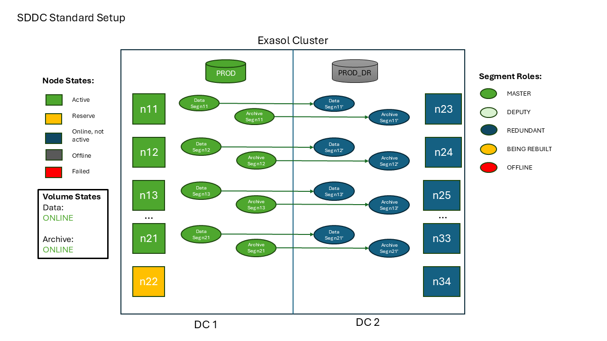

This illustration uses colors to convey the status of databases, nodes, data segments, and volumes. Throughout this document, we are referencing a cluster with the following configuration:

- The cluster uses an 11+1 configuration on each data center (24 nodes total).
- A data volume is configured to use all nodes from DC1 as active nodes.
  - The volume is created with redundancy 2
  - The nodes from DC2 are defined to hold the redundant copies.
- An archive volume is configured in the same way with respect to redundancy.
- The active database ("PROD") is created using the "stretched" data volume and with the active nodes set to n11-n21 and n22 set as the reserve node. The database has port 8563.
- The passive database ("PROD_DR") is created using the same data volume as the primary database, but has the active nodes set to n23 – n33 and n34 as the reserve node. It is also set to use port 8563.

> **NOTE:** For simplification purposes, only 5 nodes are displayed. The "…" between nodes n13 and n21 and n25 and n33 are used to show that the rest of the nodes have the exact same configuration but are not displayed. The diagram purposefully paints a simplified picture of an SDDC setup. In reality, the mirrored segments in DC2 may not align in the exact same order as illustrated due to situations in which a reserve node takes over.

## Background – how SDDC works

In a normal Exasol setup, a cluster consists of multiple nodes, typically with one or more nodes marked as a "reserve" node which will take over for any failed node on demand. In these configurations, the data is stored redundantly on 2 nodes to ensure that even in case of a hardware failure, the data is not lost because a copy of it exists on a different node. This type of setup, however, is unable to protect against a disaster scenario in which the entire data center is unavailable. For more information on how redundancy works in a standard setup, see [Redundancy](https://docs.exasol.com/db/latest/administration/on-premise/architecture/redundancy.htm).

SDDC (Synchronous Dual Data Center), on the other hand, allows for business continuity with minimal downtime by stretching the storage for a database across servers in multiple data centers. Each cluster is split into an "active" side with half of the nodes and a "passive" side with half of the nodes at a different data center. Each side contains a database with the exact same number of nodes, and each database is using the same data volume. As a result, only one database can be running at a time.

On the storage layer, redundant copies of the data are created and maintained on the passive side. This redundancy is a part of every commit in the database which guarantees that the data is present on both data centers for each successful transaction. There is no delay between Commit time and the data being synchronized to the other data center because the synchronization happens as a part of the commit.

A simplified SDDC Setup looks like this:

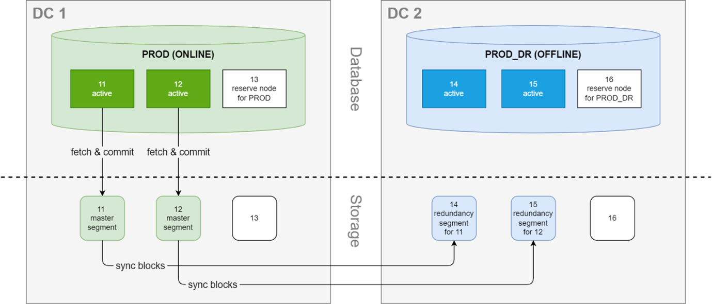

The ability to write to the redundant copy requires that all volumes are online and operational. **If all volumes are in the ONLINE state, then SDDC is functioning properly and the cluster is capable of handling a disaster scenario and swapping to the passive data center. In any other state (DEGRADED or RECOVERING), there is no guarantee that the cluster can handle a disaster scenario on the passive or active side.** In these statuses, it depends on which nodes crash and if there is a full redundancy already in place for those nodes.

## SDDC Installation

### Cluster Interconnect: Requirements and Bandwidth Planning

#### Key Points

- **SDDC clusters** connecting multiple sites require a dedicated network link or reserved bandwidth on the interconnect to avoid bottlenecks.
- Performance is influenced by network latency, disk I/O, shared/limited bandwidth, and can be impacted by firewalls or encryption.
- Network saturation may make cluster nodes unresponsive, threatening stability. The goal is to minimize bottlenecks and performance loss between sites.

---

#### Required Bandwidth Calculation

Estimate the minimum interconnect bandwidth using:

> Required Bandwidth (MB/s) = Number of Active Database Nodes × Number of Disks per Node × Disk Throughput per Disk (MB/s)

- **Example (Database Commits Only):**  
  3 nodes × 4 disks per node × 200 MB/s per disk = **2,400 MB/s**
- **If backups are running simultaneously:**  
  Assuming each node backs up at **250 MB/s**:  
  3 nodes × 250 MB/s = **750 MB/s** additional base load
- **Total Required Bandwidth:**  
  2,400 MB/s (commits) + 750 MB/s (backups) = **3,150 MB/s**

- Convert MB/s to Gbit/s:  
  3,150 MB/s / 125 MB/s (per Gbit/s) = **25.2 Gbit/s**

**Result:**  
For this example, provision at least **25 Gbit/s** interconnect bandwidth to handle peak database and backup activity without bottlenecks.

> **Note:**  
> Disk throughput is a **theoretical maximum**. Actual throughput depends on disk type (e.g. SSD, NVMe, HDD), IOPS, block size, encryption, controller features, size and frequency of database writes (small or large blocks), and the type of database queries being executed.

 **Tip:**  
> Only peak write operations and backups are covered here. Be sure to include all regular and exceptional loads (application traffic, management tasks, etc.) in final network sizing.

---

#### Throughput Reference Table

| Interconnect Speed | Throughput    | Time for 30 GB | Time for 3 GB  |
|--------------------|--------------|---------------|---------------|
| 1 Gbit/s           | 125 MB/s     | ~245.8 s (4.1 min) | ~24.6 s      |
| 10 Gbit/s          | 1,250 MB/s   | ~24.6 s       | ~2.5 s        |
| 20 Gbit/s          | 2,500 MB/s   | ~12.3 s       | ~1.2 s        |
| 40 Gbit/s          | 5,000 MB/s   | ~6.1 s        | ~0.6 s        |

- Times are for transferring either 30 GB or 3 GB at maximum available throughput, not accounting for protocol or environmental overhead.
- Actual transfer rates will typically be **lower** due to real-world factors.

---

#### Recommendations

- Match interconnect speed to peak aggregate workload, including all file transfers, backups, and failover traffic.
- Use higher bandwidth (e.g. 40 Gbit/s) for high-performance clusters with simultaneous database writes and backups.
- Always analyze actual production workloads and consider real-life testing to validate theoretical sizing.

---

### Installation Example

#### Prepare new hosts (rootless)

Prepare hosts according to [Prepare Host](https://docs.exasol.com/db/latest/administration/on-premise/installation/install_rootless.htm)

- Disk layout and disk names
- Hugepages access
- Disk access
- Download c4 and Exasol binary
- prepare ssh access
- create Exasol technical user

---

#### Cluster Node Overview

- Nodes n11 - n22 (DC1, n22 is a reserve node)
- Nodes n23 - n34 (DC2, n34 is a reserve node)
- In the c4 config file, all nodes from both data centers are specified
- A new DATA and ARCHIVE volume is created (note the number of master nodes; the example uses 11 active nodes, reserve nodes omitted)
- A new temporaray DATA volume is created for the standby database
- Two new databases are created, one in DC1 (active) and one in DC2 (standby)

**Example:**

1. When deploying an SDDC cluster, you need to create a config file as if you were creating a normal Exasol database. For more instructions, see the [documentation](https://docs.exasol.com/db/latest/administration/on-premise/installation.htm). When creating your config file, include the ip addresses of all nodes from both data centers. You also need to add a parameter so that c4 does not create a default database or data volume during installation. Open the config file and add the following parameter:

   ```bash
   CCC_PLAY_WITH_DB=false
   ```

2. Start deployment with

    ```bash
    ./c4 host play -i config
    ```

3. Create new data volume

    **NOTE:** Exclude reserve nodes, add all storage nodes from both sites DC1 and DC2 (in that order), number of master nodes = active database nodes in DC1. Data volumes will automatically grow as the database grows if there is enough disk space in the cluster to accomodate it.

    ```bash
    confd_client st_volume_create name: data_vol disk: disk1 type: data size: '100 GiB' nodes: '[11,12,13,14,15,16,17,18,19,20,21,23,24,25,26,27,28,29,30,31,32,33]' redundancy: 2 num_master_nodes: 11 shared: false
    ```

4. Create new archive volume (optional)

    When creating an archive volume, consider how large the archive volume needs to be before creation. Unlike the data volume, the archive volume can only expand manually and cannot be decreased. The below example uses 100 GiB as the size, but for most production workloads, the size should be much larger. View [Sizing Guidelines](https://docs.exasol.com/db/latest/administration/on-premise/sizing.htm#Backupdiskspace) for more information.

    ```bash
    confd_client st_volume_create name: arc_vol disk: disk1 type: archive size: '100 GiB' nodes: '[11,12,13,14,15,16,17,18,19,20,21,23,24,25,26,27,28,29,30,31,32,33]' redundancy: 2 num_master_nodes: 11
    ```

5. Create Temporary data volume

    **NOTE:** This volume will be deleted later it is only needed for creating the standby database. The volume is created in redundancy 1 and only on the active nodes in DC2, exclude reserve node(s)

    ```bash
    confd_client st_volume_create name: DataVolumeTemporary disk: disk1 type: data size: '100 GiB' nodes: '[23,24,25,26,27,28,29,30,31,32,33]' redundancy: 1 num_master_nodes: 11
    ```

6. Create active database

    When creating a database, specify the data volume you created in step 4. When creating a database, you must specify the amount of DB RAM the database is allocated (mem_size). If you specify a size larger than what is physically possible given the available physical memory, it will automatically be reduced. View [Sizing Information](https://docs.exasol.com/db/latest/administration/on-premise/sizing.htm#DatabaseRAMDBRAM) for more information about calculating the amount of DB RAM. The example below creates a database with 100 GiB of RAM.
    > **NOTE**: The database is created with the auto_start flag set to false. As a result, the database will need to be started manually after starting the services (for example, after database updates, firmware updates, etc). This is done to protect the database against unwanted startups during disaster scenarios.

    ```bash
    confd_client db_create db_name: PROD version: 8.29.12 data_volume_name: data_vol mem_size: '100 GiB' port: 8563 nodes: '[11,12,13,14,15,16,17,18,19,20,21,22]' num_active_nodes: 11 auto_start: false
    ```

7. Install database certificates (optional)

    ```bash
    confd_client cert_update
    ```

8. Create standby database

    When creating the standby database, keep the parameters the same as the active database. However you must use the temporary data volume created in step 6. This is important because upon startup, the database will wipe the volume. After the database has been started once, we will swap which volume is in use. Specify all of the nodes on DC2 within the node list. Auto_start should be set to false to prevent the database from starting automatically after a restart of the cluster or update.

    ```bash
    confd_client db_create db_name: PROD_DR version: 8.29.12 data_volume_name: DataVolumeTemporary mem_size: '100 GiB' port: 8563 nodes: '[23,24,25,26,27,28,29,30,31,32,33,34]' num_active_nodes: 11 auto_start: false
    ```

9. Install database certificates (optional)

    ```bash
    confd_client cert_update
    ```

10. Start active database

    ```bash
    confd_client db_start db_name: PROD
    ```

11. Start and stop standby database + remove create_new_db-flag

    ```bash
    confd_client db_start db_name: PROD_DR
    confd_client db_stop db_name: PROD_DR
    confd_client db_configure db_name: PROD_DR create_new_db: false
    ```

12. Update data volume of the standby database

    **NOTE:** set to the same data volume as the active database

    ```bash
    confd_client db_configure db_name: PROD_DR data_volume_name: data_vol
    ```

13. Remove temporary database volume(s)

    ```bash
    confd_client st_volume_delete vname: DataVolumeTemporary
    ```

14. Create backup schedules for active database and standby database

    **NOTE:** both databases will use the same archive volume. Example shows L-0 backup. The schedule of the standby database is disabled as the backup cannot run if the database is offline.

    ```bash
    confd_client db_backup_add_schedule db_name: PROD backup_name: SundayFullBackup backup_volume_name: arc_vol enabled: true level: 0 expire: '1w 3d' hour: 0 day: '*' month: '*' weekday: 0
    confd_client db_backup_add_schedule db_name: PROD_DR backup_name: SundayFullBackup backup_volume_name: arc_vol enabled: false level: 0 expire: '1w 3d' hour: 0 day: '*' month: '*' weekday: 0
    ```

---

## SDDC Administration

This section will only include administration topics that are different for SDDC setups compared to normal database administration as described in [Exasol Documentation](https://docs.exasol.com/).

All administration tasks are done using the Exasol [ConfD client](https://docs.exasol.com/db/latest/confd/confd.htm).

---

### Starting a database

It is **critical** that only one database is configured to run at a time. Starting both the active and passive databases at the same time will result in data corruption. If you try to start the passive database while the active database is running, you will receive an error message that the data volume is in use. Only start a database if both databases are in the setup state.

1. Check the state of each database with the following command:

   ```bash
   confd_client db_state db_name: PROD
   running

   confd_client db_state db_name: PROD_DR
   setup
   ```

    NOTE: Databases with the "running" state are up and running. Databases with the "setup" state are shutdown.

2. To start up a database:

    ```bash
    confd_client db_start db_name: PROD
    ```

    NOTE: The database is fully up and running when the "connectible" property is set to "yes".

3. Check database connectivity:

    ```bash
    confd_client db_info db_name: <database name> | grep connectible
    ```

For more details refer to:

- [Starting a database](https://docs.exasol.com/db/latest/administration/on-premise/manage_database/start_db.htm)
- [db_state](https://docs.exasol.com/db/latest/confd/jobs/db_state.htm)
- [db_start](https://docs.exasol.com/db/latest/confd/jobs/db_start.htm)
- [db_info](https://docs.exasol.com/db/latest/confd/jobs/db_info.htm)

---

### Configuring a database

To change the configuration of an existing database, such as enabling auditing or adding a paramter, the database must first be shut down. Keep in mind that any database configuration changes are only applied to the database specified in the [db_configure](https://docs.exasol.com/db/latest/confd/jobs/db_configure.htm) command. Any changes made on one database should be applied immediately afterwards to the passive database to ensure that database configuration is in sync between both databases.

The below example adds a new parameter to both existing databases:

1. Add a database parameter to both databases active and passive

    ```bash
    confd_client db_configure db_name: PROD params_add: '[-oidcProviderClientSecret=abcd]'

    confd_client db_configure db_name: PROD_DR params_add: '[-oidcProviderClientSecret=abcd]'
    ```

---

### Creating new volumes

Whenever a new volume is needed, ensure that the following is set:

- Redundancy 2
- the list of nodes includes all active nodes from both data centers (but no reserve nodes!)
- The *num_master_nodes* parameter is set to the same number of active database nodes.

For example:

```bash
confd_client st_volume_create name: arc_vol disk: disk1 type: archive size: '100 GiB' nodes: '[11,12,13,14,15,16,17,18,19,20,21,23,24,25,26,27,28,29,30,31,32,33]' redundancy: 2 num_master_nodes: 11
```

---

### Creating Backups

NOTE: Backups are database-specific, meaning that it is not possible to create a L-1 backup based on a L-0 backup from a different database, even if the database is using the same data volume. For SDDC setups, this means that the PROD_DR database is not able to create a L-1 backup until you create a L-0 backup first.

1. ConfD job to create a backup:

    ```bash
    confd_client db_backup_start db_name: PROD_DR backup_volume_name: arc_vol level: 0 expire: 1w
    ```

NOTE: This needs to be performed even if there is an automatic backup schedule which attempts to create an L-1. In that case, the L-1 will fail.

---

### Activating or Deactivating Backup Schedules

In order to avoid false alerts or error messages, we recommend to deactivate all backup schedules for the passive database and only activate it once the database is in use.

After a swap to the passive site, the backup schedule needs to be activated for the PROD_DR database. Use the [db_backup_modify_schedule](https://docs.exasol.com/db/latest/confd/jobs/db_backup_modify_schedule.htm) job. Backups configured in the schedule will not run if the database is not running.

1. ConfD job to modify an existing backup schedule:

    ```bash
    confd_client db_backup_modify_schedule db_name: PROD_DR backup_name: "Backup PROD_DR Level 0" enabled: true
    ```

NOTE: A L-0 backup must be taken before any scheduled L-1 backup can run.

Similarly, to deactivate a backup schedule, you would use the same ConfD job. This is recommended for any databases which are not running.

```bash
confd_client db_backup_modify_schedule db_name: PROD_DR backup_name: "Backup PROD_DR Level 0" enabled: false
```

---

### Switch Active Database to DR database

1. Stop active database

    ```bash
    confd_client db_stop db_name: PROD
    ```

2. Stop active site database nodes

    Repeat on all nodes of the active site.

    ```bash
    systemctl --user stop c4_cloud_command
    systemctl --user stop c4
    ```

3. Check the state of the stopped nodes from one of the passive sited nodes.

    ```bash
    confd_client node_state
    ```

4. Suspend nodes

    Suspend all nodes from the active site

    ```bash
    confd_client node_suspend nid: '[11,12,13,14,15,16,17,18,19,20,21,22]'
    ```

5. Start DR database

    ```bash
    confd_client db_start db_name: PROD_DR
    ```

---

### Switch back DR Database to PROD Database

This scenario assumes that the nodes of the former PROD database are offline - if the nodes are already running just check the state of the nodes using 'confd_client node_state' and skip resuming or starting the service on these nodes. Nodes are automatically added to the cluster upon startup, so there is no need to explicitly resume them.

1. Start Exasol Service on the previously offline nodes

    ```bash
    systemctl --user start c4
    systemctl --user start c4_cloud_command
    ```

2. Check the state of the previously stopped nodes from one of the passive sited nodes. Wait until all nodes are shown as ONLINE.

    ```bash
    confd_client node_state
    ```

3. Stop DR database

    ```bash
    confd_client db_stop db_name: PROD_DR
    ```

4. Wait until the DR database status is shown as 'setup'

    ```bash
    confd_client db_state db_name: PROD_DR
    ```

5. Start PROD database once the PROD_DR database is shut down.

    ```bash
    confd_client db_start db_name: PROD
    ```

## SDDC Monitoring

It is important to always monitor the status of the volumes to ensure that SDDC is functioning properly. In general, as long as all volumes and redundancies are built, any commit made in the database is written on the redundant node automatically during commit, so there is no potential for data loss in that respect.

However, the ability to write to the redundant copy requires that all volumes are online and operational. **If all volumes are in the ONLINE state, then SDDC is functioning properly and the cluster is capable of handling a disaster scenario and swapping to the passive data center. In any other state (DEGRADED or RECOVERING), there is no guarantee that the cluster can handle a disaster scenario on the passive or active side.** In these statuses, it depends on which nodes crash and if there is a full redundancy already in place for those nodes.

You can use the below tools to ensure:

1. All volumes are in an ONLINE state
2. There aren't any segments on a reserve node (causes degraded performance)
3. All redundant segments are on nodes in DC2
4. The data and archive volumes are using the same nodes. This is recommended to avoid any headaches in case of a future node failure which could result in the data and archive volumes being in different states. For example, if a reserve node is taken offline to perform maintenance, but this is still in use by the archive volume, then the archive volume would be in a DEGRADED state, but the data volume is ONLINE.

### Monitoring Volume States

You should monitor the state of the volumes and take the appropriate action:

```bash
confd_client st_volume_info vname: Data_vol --json | jq -r '.state'

confd_client st_volume_info vname: Arc_vol --json | jq -r '.state'
```

Desired result: ONLINE

Undesired results:

- DEGRADED
- RECOVERING
- LOCKED

---

### Monitoring Database Info

The database also delivers a message in these cases:

1. If the redundancy is lost
2. If a node is using data from a different node

In the proper state, the following command will deliver nothing:

```bash
confd_client db_info db_name: PROD | grep info
info:  ''
```

Therefore you should monitor if this check is delivering a blank value. If the result contains one of these messages, action is required:

```bash
info: 'Payload of database node 22 resides on volume master node 12. 1 segments of the database volume are not online (missing redundancy)'
```

---

### Monitoring Segments

In the default state, each volume contains a MASTER segment and a REDUNDANT segment. You can use the following command to identify and parse which segments and redundant copies are stored on which nodes. You should also verify that any reserve nodes are not holding any segments of the data and archive volumes.

```bash
csinfo -R
```

---

### Monitoring Redundancy Recovery

If one of the volumes is in the RECOVERING state, then a redundancy is being built from a different node. During recovery, a log message is printed in the Storage logs every 5 minutes with a counter on the given status and an ETA:

```bash
logd_collect Storage
```

For example, after moving a segment to n22, you would see a message like this in the logfile:

```bash
Recovery state for node 'n22': 250.60 GiB left | ETF 6m
```

Additionally, you can use csrec to monitor the recovery of a volume:

```bash
csrec -s -v <vol_id>
```

If there is no recovery, the message "Volume # has no active recovery maps!" will display. Otherwise, information about the recovery speed, amount, and time is displayed.

## Active Node Failure Scenarios

An active node is any node which is actively being used by a running database. For example, in PROD this would be nodes n11-n21.

Anytime the cluster detects the failure of an active database node, the cluster will perform an automatic replacement of that node (failover). In the below example, node n22 is defined as reserve node for the active site DC1.

Within each database, the setting **volume_move_delay** defines the period of time in seconds before the storage service begins transferring storage data segments to the now active reserve node. By default, the delay is set to 600 seconds (10 minutes). This feature protects against heavy write operations caused by moving data segments between nodes in case of a transient node failure (for example a brief network outage or node reboot). If a failed node rejoins the cluster within the **volume_move_delay** NO storage segment relocation is triggered.

Cluster Overview in normal operation mode:


---

### Scenario: Transient Node Failure

A transient node failure is defined as any node failure which is recovered within the **volume_move_delay** period (default 600 seconds).

The example below illustrates the failure of the active node n12 in DC1. During the failover phase node n12 is replaced automatically by the reserve node n22.

**INFO**: Once the database is up and running again after a failover, the now active reserve node uses the redundancy segment(s) of the failed node on the passive site in DC2. Any redundancy segment used by a master node is temporarily promoted as a "deputy" segment. Storage Volumes with missing master or redundancy copies will show as degraded.

**CAUTION: In this operation state and until the volume_move_delay period has been met, an additional node failure (n24 - deputy) would bring the database down as there are no extra redundancy copies in place. An additional node failure of n24 would bring the storage volume to "locked" state. Locked state means "missing data segments".**

Cluster overview after node failure:

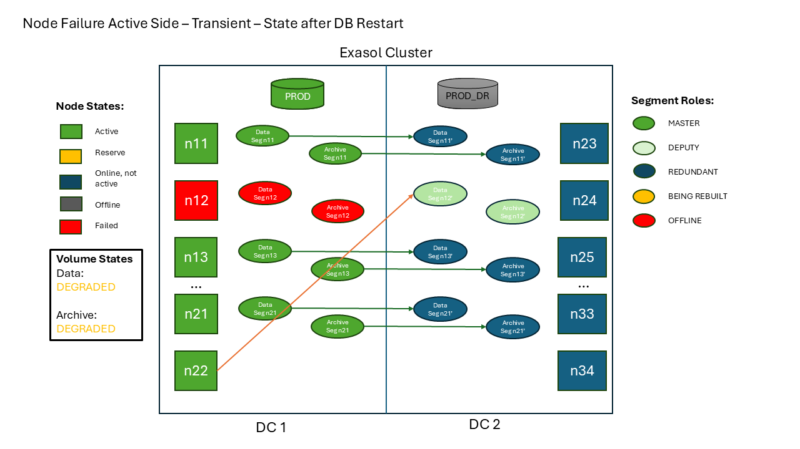

1. After a failover the volume states should be checked using ConfD:

    ```bash
    confd_client st_volume_info vname: data_vol --json | jq -r '.state'
    DEGRADED

    confd_client st_volume_info vname: arc_vol --json | jq -r '.state'
    DEGRADED
    ```

    NOTE: use jq to filter multiple "states" returned by ConfD.

2. Verify the database state (grep for info section):

    ```bash
    confd_client db_info db_name: PROD | grep info
    info: 'Payload of database node 22 resides on volume master node 12. 1 segments of the database volume are not online (missing redundancy)'
    ```

    NOTE: the above message shows that the active database node n22 is using the storage segments from master 12 and that one storage segment is not online.

If a failed node (n12) recovers within the **volume_move_delay** period it resumes the previous master segment role. Any data on n12 that is out-of-date will be re-synchronized from the redundancy segment.

**CAUTION**: The database is still using n22 as an active database node (former reserve node), but data will be accessed on n12 (new reserve node and former active node which failed).

Cluster overview after the failover (n22 active database node and n12 active storage node):

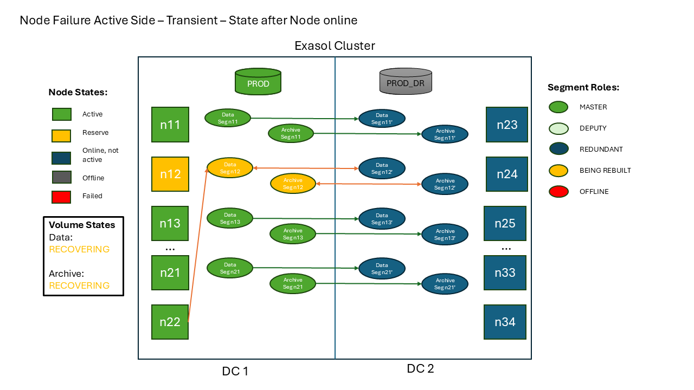

Cluster Overview after the restoration of n12 is done:

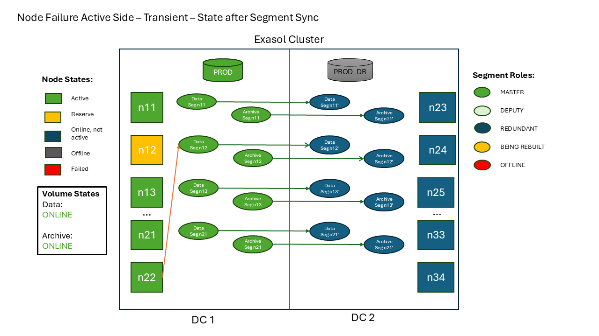

Use ConfD to verify that storage data is accessed remotely:

```bash
confd_client db_info db_name: PROD | grep info
info: 'Payload of database node 22 resides on volume master node 12.'
```

**INFO**: In comparison to the data volumes, archive volumes do not have a **volume_move_delay**. Archive volumes are never moved automatically after a node failure; this is again to protect against long-running and heavy read-write operations.

Once segments on node n12 are recovered, volume states will change from recovering to online. The cluster is now capable of handling disaster scenarios again. However, after a transient node failure scenario, storage segments are not accessed locally anymore, since the data of the failed node was not moved to the new active node. This can introduce latency and performance degradation in the IO layer and is not recommended for long periods of time.

---

#### Recovering from a transient node failure

#### Option 1 – Restart database with the failed node as active node

Stop the database and restart the database using n12 as an active node and n22 as the reserve node so that the database is back into its original state. For this activity, a short downtime is required.

1. Stop and start database:

    ```bash
    confd_client db_stop db_name: PROD 

    confd_client db_start db_name: PROD
    ```

**INFO**: The database starts using n12 automatically because the storage segments are stored there.

 Cluster overview after the restart:


#### Option 2 – Move segments to new active node

Move data segments from node n12 to node n22. No downtime is required. This is typically done if maintenance needs to be performed on n12 after the failure. You can verify on which nodes the segments exist before moving them to ensure the segments are running on the nodes that you expect. For more details, see [Monitoring Segments](#monitoring-segments).

**CAUTION: During the restoration of the data segments on the target node, the cluster cannot handle disaster scenarios.** Moving segments needs to be done for both the DATA volume and the ARCHIVE volume to ensure that both volumes are using the same nodes.

1. Move nodes segments using ConfD:

    ```bash
    confd_client st_volume_move_node vname: data_vol src_nodes: '[12]' dst_nodes: '[22]'

    confd_client st_volume_move_node vname: arc_vol src_nodes: '[12]' dst_nodes: '[22]'
    ```

    … wait until all segments have moved and move redundant segments (optional)

    ```bash
    confd_client st_volume_move_node vname: data_vol src_nodes: '[24]' dst_nodes: '[34]'

    confd_client st_volume_move_node vname: arc_vol src_nodes: '[24]' dst_nodes: '[34]'
    ```

    **NOTE**: it is not strictly necessary to also move the redundant segments. It is included here so that the nodes in DC1 have the same configuration as in DC2. As long as the redundancy exists on a node on the passive side, then the cluster is in a proper state.

2. Monitor the progress of the synchronization using the Storage logs (Progress will be updated every 5 minutes):

    ```bash
    logd_collect Storage
    ```

Cluster Overview after all data has been moved from n12 (n24) to n22 (n34):

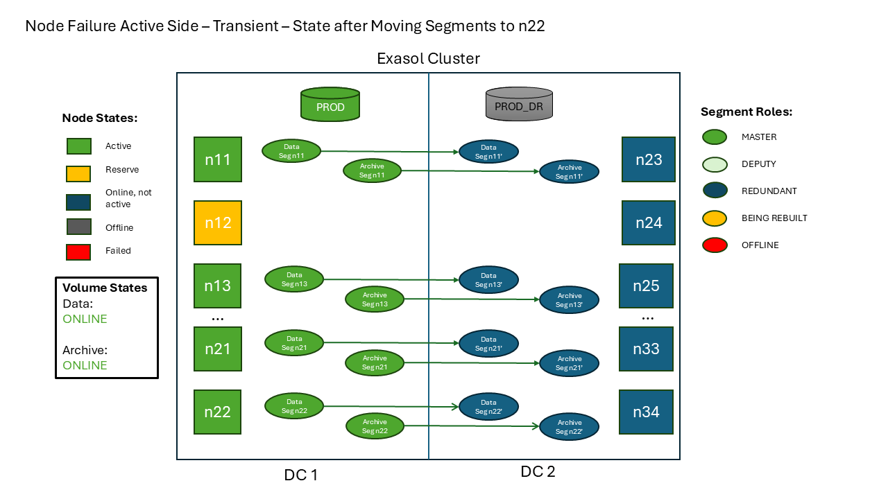

---

### Scenario: Persistent Node Failure

A persistent node failure is defined as any node failure in which the failed node cannot be recovered immediately or after the **volume_move_delay** passed.

The example below illustrates the failure of the active node n12 in DC1. During the failover phase node n12 is replaced automatically by the reserve node n22.

If a failed node (n12) does not recover within the **volume_move_delay** storage segments are automatically rebuilt on the now activated reserve node (n22). Segments are restored from the redundant copies running on node n24 in DC2. During restoration, the volumes are in a RECOVERING state, and **a node failure in DC2 would bring the database down (volume locked state) until at least one master or redundancy segment for each node is online.**

Cluster Overview after persistent node failure:

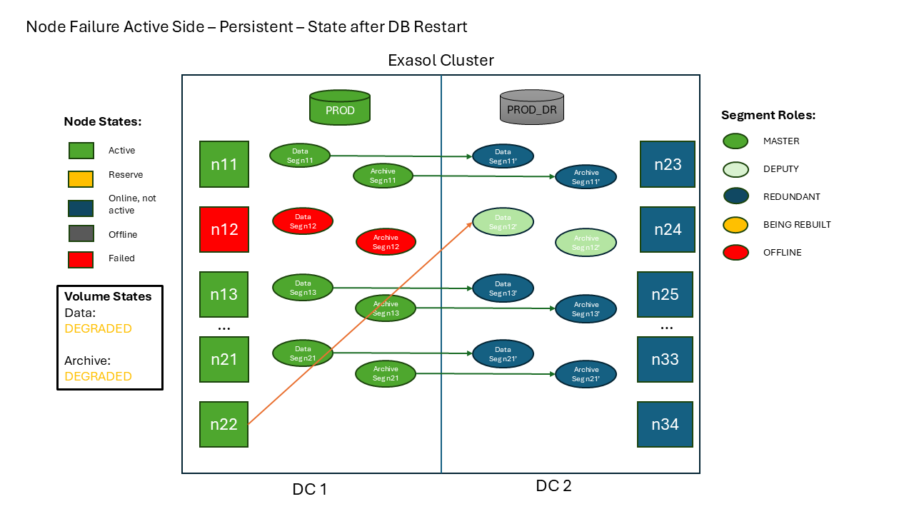

1. Use ConfD to validate volume states:

    ```bash
    confd_client st_volume_info vname: data_vol --json | jq -r '.state'
    DEGRADED

    confd_client st_volume_info vname: arc_vol --json | jq -r '.state'
    DEGRADED
    ```

    NOTE: use jq to filter multiple states.

2. Use ConfD to validate database state:

    ```bash
    confd_client db_info db_name: PROD | grep info
    info: 'Payload of database node 22 resides on volume master node 12. 1 segment of the database volume are not online (missing redundancy)'
    ```

Compared to the Transient Node Failure state, n12 does not recover. After the delay period, the data segments are automatically moved to the reserve node.

Cluster overview after the **volume_move_delay** passed:

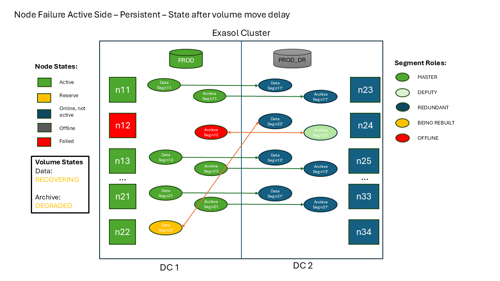

During recovery, the status of the *data* volume is in the RECOVERING state, and the archive volume is DEGRADED.

Archive volumes do not have any mechanisms in place to automatically move segments to other nodes. Anytime an archive volume is in a DEGRADED state, the segments must be moved to a different node using [st_volume_move_node](https://docs.exasol.com/db/latest/confd/jobs/st_volume_move_node.htm).

1. Confd command to move the storage volume segments to another node:

    ```bash
    confd_client st_volume_move_node vname: arc_vol src_nodes: '[12]' dst_nodes: '[22]'
    ```

    Cluster overview after the rebuild of the segments for the data and archive volumes on node n22:

    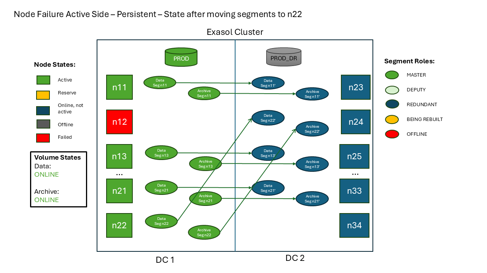

    In this state, the database and all storage segments are redundant, and the cluster can handle Disaster Scenarios again. If you want to keep the passive site layout similar to the active site, you can move the segments stored on n24 to n34. This requires no database downtime, but during the duration of the synchronization, the cluster cannot switch to the passive site.

2. Use [st_volume_move_node](https://docs.exasol.com/db/latest/confd/jobs/st_volume_move_node.htm) to move node segments of a volume (and repeat for both data and archive volumes) (optional):

    ```bash
    confd_client st_volume_move_node vname: data_vol src_nodes: '[24]' dst_nodes: '[34]'
    confd_client st_volume_move_node vname: arc_vol src_nodes: '[24]' dst_nodes: '[34]'
    ```

    Cluster overview after moving volume segments to n34:

    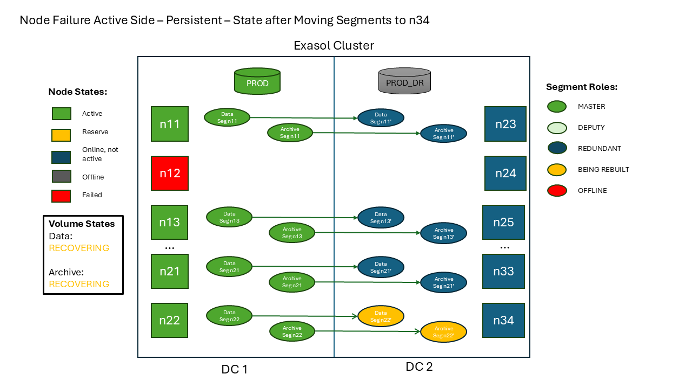

3. Monitor the progress of the synchronization in the Storage logs (progress and ETA is updated every 5 minutes):

    ```bash
    logd_collect Storage
    ```

Cluster overview after the synchronization is complete:

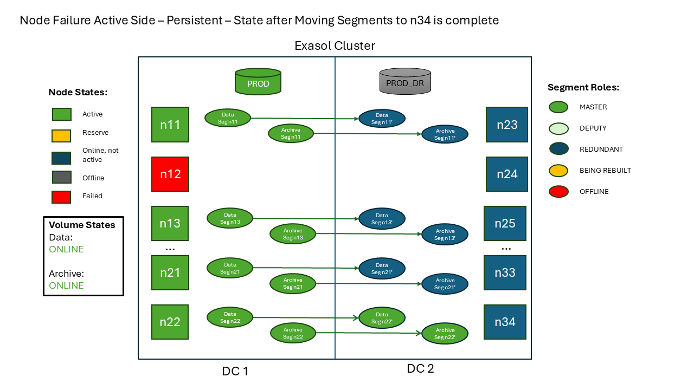

Cluster overview once the failed node is repaired. The failed node will automatically be added as reserve node:

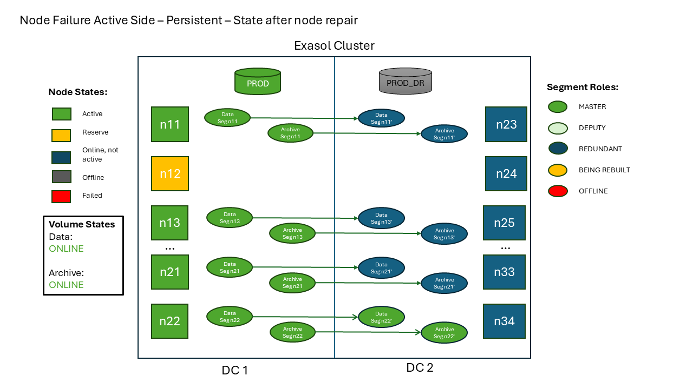

## Passive Node Failure Scenarios

A node failure on a passive node is defined as any node failure which occurs on a node which is not actively running a database and which is only holding redundant copies of the storage segments.

> **NOTE**: Because there is no active, running database on those nodes, there is no automatic process to move the database segments, so there is also no difference made between transient and persistent node failures.

Cluster overview before a node failure on the passive site:


Once a passive node experiences a failure, both the data volume and the archive volume will be in a DEGRADED status because there is no redundancy in place. The database, however, is unaffected by the crash and is running the entire time.

Cluster overview if n24 fails:

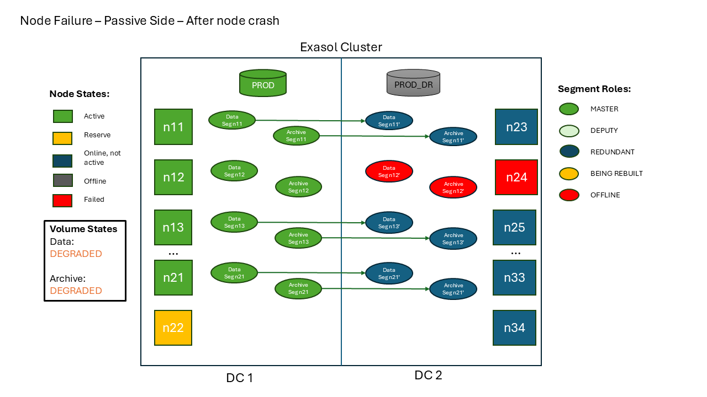

> **NOTE: An additional node failure in the active site (for example n12) would bring the database down as there is no redundancy segment in place.**

If the failed node becomes online again, the redundancy is re-created automatically. Otherwise to restore the situation, the redundant segments for both the data and archive volume need to be rebuilt on the reserve node in the passive side.

1. ConfD job to restore missing segments:

    ```bash
    confd_client st_volume_move_node vname: data_vol src_nodes: '[24]' dst_nodes: '[34]'
    confd_client st_volume_move_node vname: arc_vol src_nodes: '[24]' dst_nodes: '[34]'
    ```

Cluster overview while redundant segments are rebuilt from the master segment on the primary side:

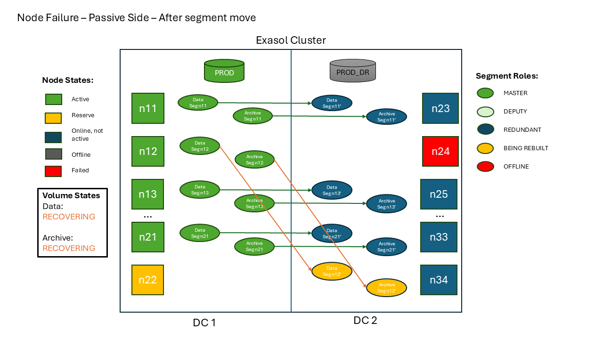

Once the segments are rebuilt, the volumes enter the ONLINE status again, and the cluster is fully capable of handling DR Scenarios again.

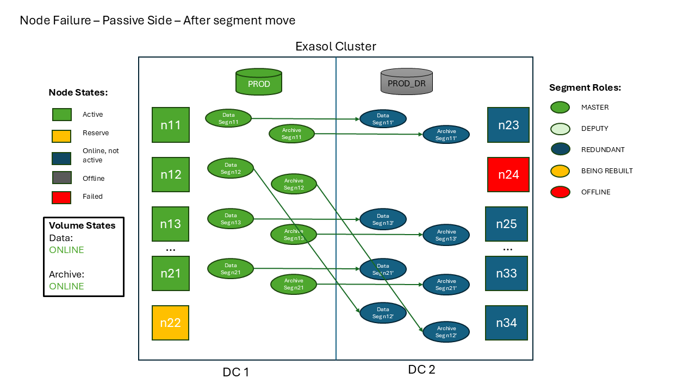

To restore the database to its original state, wait until the failed node is online again. Once the failed node is repaired, it is automatically added to the cluster as a passive node. Afterwards, the segments of the data and archive volume can be returned to that node. During the recovery phase, the database is not capable of swapping to the passive side until the redundancy is rebuilt.
> Note: Moving the data segments back to n24 is totally optional. The cluster is already in a proper state and can handle DR scenarios because all volumes are ONLINE and the redundancy is complete on both data centers. It is included here for demonstration purposes to return the cluster back to it's "original" state.

1. ConfD job to move segments back to the original node after node is restored (optional):

    ```bash
    confd_client st_volume_move_node vname: data_vol src_nodes: '[34]' dst_nodes: '[24]'
    confd_client st_volume_move_node vname: arc_vol src_nodes: '[34]' dst_nodes: '[24]'
    ```

The database is back in its original state after the segments are rebuilt:


## Disaster Scenarios

### SDDC Test scenario

In the test scenario, the "active" database in DC1 is shut down, and the "passive" database in DC2 is started. The storage master segments remain on the active site DC1.

Cluster overview before the start of the test scenario:


1. Shutdown the active database:

    ```bash
    confd_client db_stop db_name: PROD 
    ```

    Once the database is shut down, there are no active database nodes anymore. However, the storage remains online:

    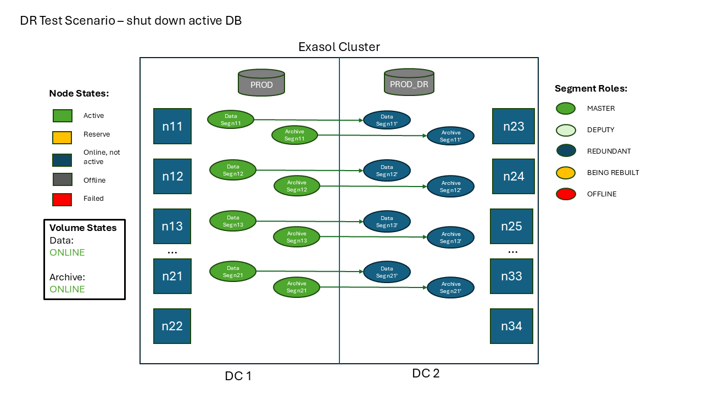

2. Start up the passive database:

    ```bash
    confd_client db_start db_name: PROD_DR 
    ```

> **NOTE**: The PROD_DR database is running on the now active nodes in DC2, storage master segments remain unchanged (DC1). As a result, node n23 is using the master segment stored on n11, which in turn is redundantly written back to n23.

Cluster overview active database node from DC2 accesses data remotely in DC1 and redundancy copies are written to DC2:

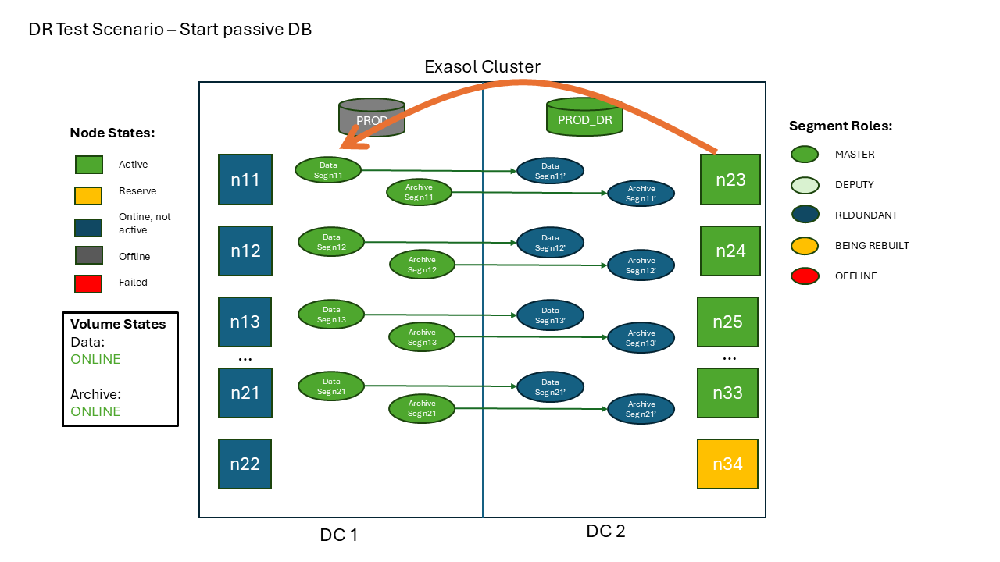

Next steps to finalize the swap

1. Activate the backup schedule(s) as described in [Activating Backup Schedules](#activating-or-deactivating-backup-schedules)  
2. Deactivate backup schedule(s) for the former active database (optional)
3. [Perform a L0 backup](#creating-backups)
   1. If the test runs for more than one day: ensure there is enough disk capacity in the archive volume to support an additional L0 backup.

> **NOTE**: During the test, the cluster is capable of handling node failures and site failures because the storage is unaffected, and all volumes are in the ONLINE state.

To revert back to normal operation, follow a similar procedure which involves stopping the PROD_DR database and starting the PROD database.

1. ConfD jobs to stop the database in DC2 and start the database in DC1:

    ```bash
    confd_client db_stop db_name: PROD_DR 
    confd_client db_start db_name: PROD
    ```

2. Activate the backup schedule(s) as described in [Activating Backup Schedules](#activating-or-deactivating-backup-schedules) for the PROD database.
3. Deactivate backup schedule(s) for the PROD_DR database (see [Activating Backup Schedules](#activating-or-deactivating-backup-schedules)).

The next L-1 will run using the previously created L-0 backup from the weekend. After the L-1 backup is done, consider deleting the L-0 backup from the passive database (DC2) to free up space in advance.

---

### Disaster of active data center (DC1)

Cluster overview before the data center failure:


During a Disaster Scenario, all nodes on the active site in DC1 become unavailable. As a result, the active database in DC1 crashes due to multiple active node failures. All data which was last successfully committed in the active database is also written redundantly on the passive side. The only data loss would therefore be data which was not yet committed or in the process of being committed when the database crashed.

Cluster overview after DC1 (active site) failed:

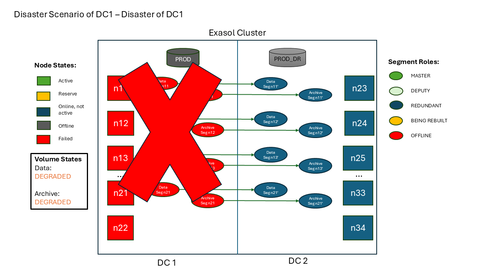

> **CAUTION:** The cluster requires manual intervention from here. While a disaster-case is normally that one Data Center is unavailable (or at least two active nodes have failed), it actually may also be the case that the link between the two data centers is severed, so each site of the cluster thinks the other has failed (split-brain). For this reason, a process, team or runbook decides which set of nodes to mark as suspended or which steps to execute next.
>
> **NOTE:** To operate an Exasol cluster, the cluster needs a quorum. If the cluster has no quorum, the cluster does not accept any changes to any of the services and for example also confd will not show the right data or does not respond to requests properly. To create a quorum, at least 50% + 1 of the nodes of a cluster need to be online.

In this example, all nodes from DC1 failed and this will make the quorum of the cluster fail. In order to restore the quorum with the remaining nodes from DC2 the failed nodes need to be suspended (temporarily removed from the cluster quorum).

> **WARNING:** The below actions are critical. Ensure that you are only suspending 50% of the nodes and that you only suspend the nodes from one data center. Performing this action on both sides would lead to an inconsistent state and potential data corruption. Exercise extreme caution. It might take up to 60 seconds for the cluster to reevaluate the quorum and to recognize failed nodes. Reelections are constantly ongoing every couple of seconds.

1. Use ConfD to suspend the failed nodes from DC1:

    ```bash
    confd_client node_suspend nid: '[11, 12, 13, 14, 15, 16, 17, 18, 19, 20, 21, 22]'
    ```

    With the nodes being suspended, the quorum is reached again and ConfD jobs will behave normally. In this state, all volumes are DEGRADED, however functional. The database on the passive site in DC2 can now be started using ConfD.

2. Start the database in DC2:

    ```bash
    confd_client db_start db_name: PROD_DR
    ```

Cluster overview after the nodes in DC1 have been suspended:

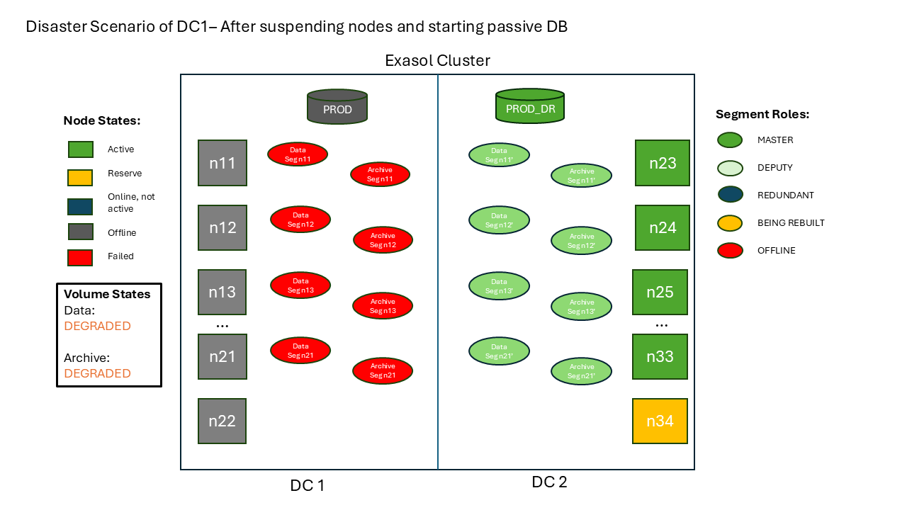

The database in DC2 is up and running, and the original redundant segments have been promoted to "deputy" status and are running as the master segment until the failed former active nodes rejoin the cluster.

**NOTE:** The database is up and running but there is no storage redundancy. All volumes with redundancy now show as degraded.

To be protected against further node failures in DC2, temporarily increase redundancy for both the data volume and the archive volume in DC2.

1. ConfD job to increase the redundancy of a volume:

    ```bash
    confd_client st_volume_increase_redundancy vname: data_vol delta: 1

    confd_client st_volume_increase_redundancy vname: arc_vol delta: 1
    ```

    **NOTE**: This command will create additional redundancy segments on all nodes in DC2.

    Cluster overview after creating additional redundancy in DC2 (redundancy 3):

    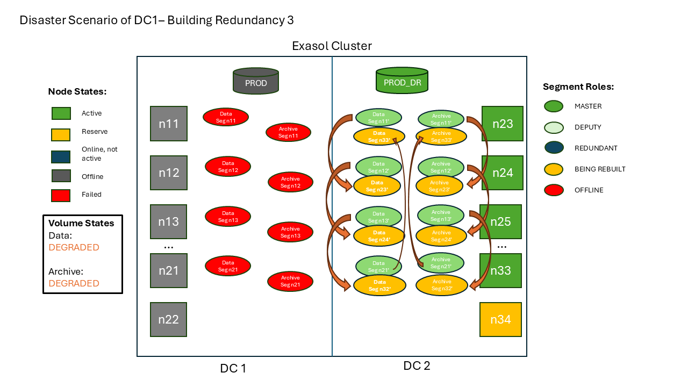

2. Monitor the progress using logd_collect or csrec:

    ```bash
    logd_collect Storage
    ```

    or

    ```bash
    csrec -l
    ```

    or

    ```bash
    csrec -s –v VOLUME_ID  
    ```

> TIP: Once the redundancy is rebuilt, take a new L-0 backup to serve as the basis for other scheduled L-1 backups. For details, see [Activating Backup Schedules](#activating-or-deactivating-backup-schedules) and [Perform a L0 backup](#creating-backups).

Cluster overview after the redundancy has been increased to 3:

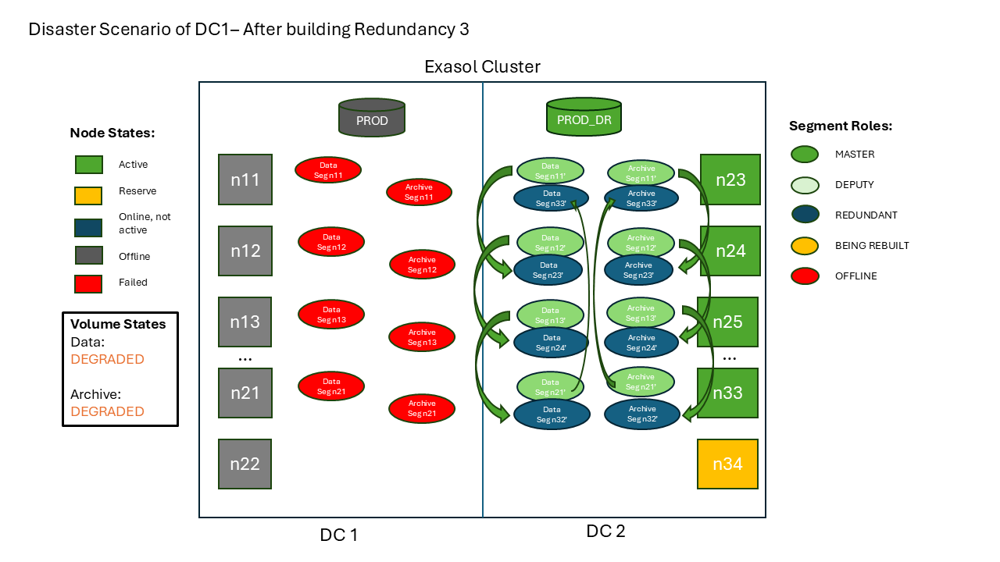
Now the database is again protected against single node failures. The procedures to handle a node failure are the same as [Active Node Failure Scenarios](#active-node-failure-scenarios).

#### Return to normal operation

> **NOTE:** This scenario assumes that the same original nodes from DC1 rejoin the cluster. If new nodes join, an installation of those nodes is required. This means the Exasol software must be installed and nodes are re-added to the cluster as existing nodes.

Nodes are automatically resumed in the cluster upon start of the Exasol services on those machines. This will clear the 'suspended' status.

1. Start the services on the affectd nodes.

    As soon as the nodes from DC1 are resumed and online, all storage deputy segments in DC2 will be demoted to redundancy copies and the resynchronizing of all storage segments in DC1 is started. The recovery starts automatically, the duration of the resynchronization depends on the amount of data that is out of date.

    > **NOTE:** In the worst case, all data is resynchronized.

    Cluster overview showing the resynchronization process:

    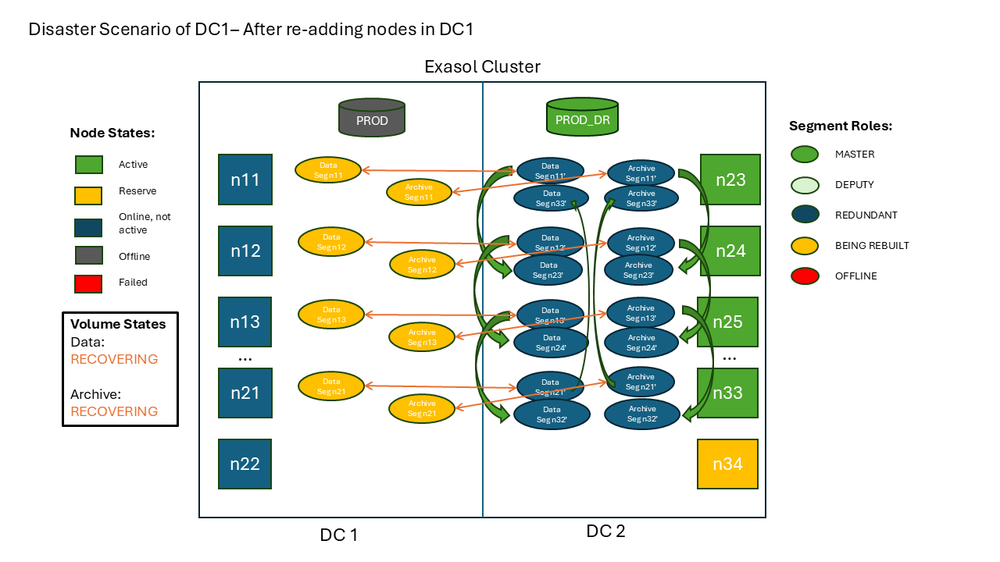

2. Once the volumes are fully resynchronized and in ONLINE status, the redundancy in DC2 should be reduced from 3 to 2 to keep disk IO at a minimum.

    ```bash
    confd_client st_volume_decrease_redundancy vname: data_vol delta: 1 nid: 23

    confd_client st_volume_decrease_redundancy vname: arc_vol delta: 1 nid: 23
    ```

    NOTE: Until the database in DC1 is started, the PROD_DR database is still running in DC2. The storage is being used from the nodes in DC1 and then synchronized to the redundancy segments in DC2.

    Cluster overview after the master segments have been resynced:

    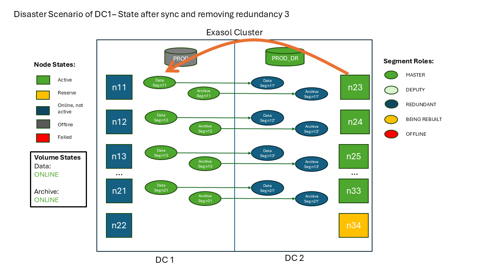

3. To revert the cluster state back to its original state, stop the database in DC2 and start the database in DC1.

    ```bash
    confd_client db_stop db_name: PROD_DR 

    confd_client db_start db_name: PROD
    ```

4. Take an L-0 backup of the PROD database immediately to ensure that future L-1 backups have the correct base, re-activate the backup schedules for PROD, and de-activate the backup schedules for PROD_DR.

---

### Disaster of passive site DC2

Cluster overview before DC2 fails:


During this Disaster Scenario, all nodes in DC2 fail. When all nodes in DC2 fail, the cluster has lost its quorum and during that state, several ConfD jobs do not function as expected.

> **NOTE:** The database may still report as connectible, but users are not able to actually connect or run any commits because the storage service is not functioning properly in this state due to missing quorum.  All data which was last successfully committed in the database is written to disk. The only data loss would therefore be data which was not yet committed or in the process of being committed when the database crashed.

Cluster overview once site DC2 failed:

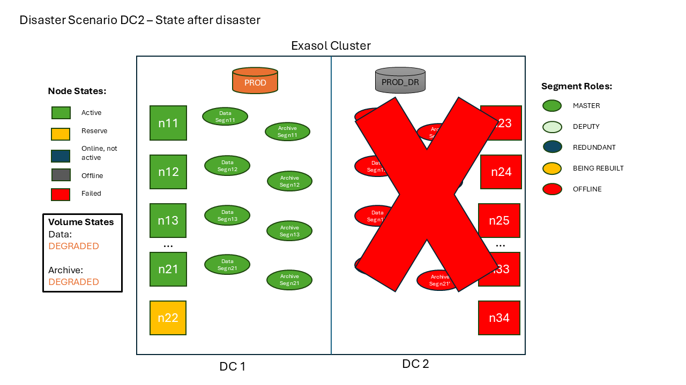

> **CAUTION:** The cluster requires manual intervention from here. While a disaster-case is normally that one Data Center is unavailable (or at least two active nodes have failed), it actually may also be the case that the link between the 2 data centers is severed, so each site of the cluster thinks the other has failed (split-brain). For this reason, a process, team or runbook decides which set of nodes to mark as suspended or which steps to execute next.
>
> **NOTE:** To operate an Exasol cluster, the cluster needs a quorum. If the cluster has no quorum, the cluster does not accept any changes to any of the services and for example also confd will not show the right data or does not respond to requests properly. To create a quorum at least 50% + 1 of the nodes of a cluster need to be online.

In this example, all nodes from DC2 failed and this will make the quorum of the cluster fail. In order to restore the quorum with the remaining nodes from DC1 the failed nodes need to be suspended (temporarily removed from the cluster quorum).

> **WARNING:** The below actions are critical. Ensure that you are only suspending 50% of the nodes and that you only suspend the nodes from one data center. Performing this action on both sides would lead to an inconsistent state and potential data corruption. Exercise extreme caution. It might take up to 60 seconds for the cluster to reevaluate the quorum and to recognize failed nodes. Reelections are constantly ongoing every couple of seconds.

1. Suspend all nodes from DC2:

    ```bash
    confd_client node_suspend nid: '[23, 24, 25, 26, 27, 28, 29, 30, 31, 32, 33, 34]'
    ```

    Cluster overview after the failed nodes from DC2 have been suspended:

    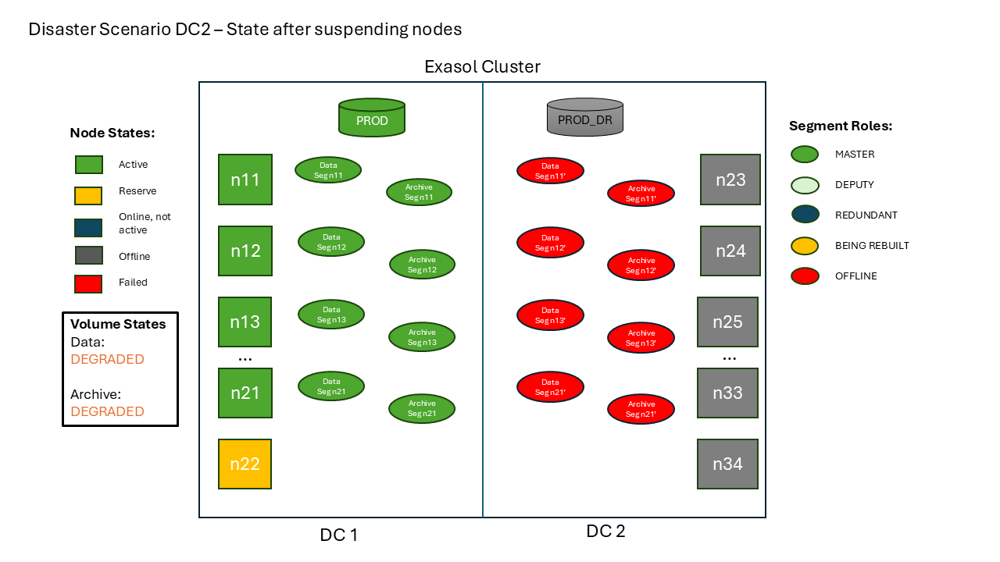

    With the nodes suspended, the quorum is reached again and ConfD jobs will behave normally. All volumes are in DEGRADED state, that means at least one master or redundancy segment is offline. Depending on how long the cluster was without quorum, the database in DC1 may or may not be online (responding to client requests). The database in DC1 can now be started if it is not already online.

2. ConfD job to start the database in DC1:

    ```bash
    confd_client db_start db_name: PROD
    ```

3. When viewing information about the database, check for messages indicating that the redundancy is missing.

    ```bash
    confd_client db_info db_name: PROD | grep info
    info: "11 segments of the database volume are not online (missing redundancy)"
    ```

    > **WARNING:** DB Info "11 segments of the database volume are not online (missing redundancy)" means that there are no redundant copies of any of the data segments.

    The database is now running, and the master segments are in use as before, but there is no storage redundancy. To be protected against further node failures in DC1 temporarily increase the redundancy for both the data volume and the archive volume locally.

4. Increase the redundancy of the storage volumes:

    ```bash
    confd_client st_volume_increase_redundancy vname: data_vol delta: 1

    confd_client st_volume_increase_redundancy vname: arc_vol delta: 1
    ```

    > **NOTE:** This command will create additional redundancy on all in-use storage nodes in DC1.

5. Monitor the progress using logd_collect or csrec:

    ```bash
    logd_collect Storage
    ```

    or

    ```bash
    csrec -l
    ```

    or

    ```bash
    csrec -s –v VOLUME_ID  
    ```

Once redundancy is increased, a manual backup is not needed as an L-1 backup will run automatically according to the previous schedule.

Cluster overview after the redundancy has been increased to 3:

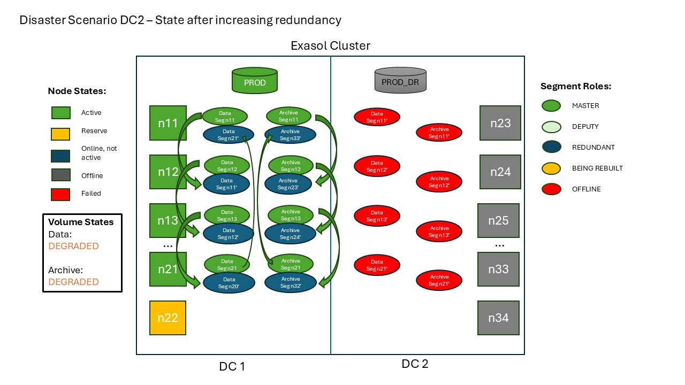

In this cluster configuration, the cluster is still protected against single node failures due to volume redundancy 3. The procedures to handle a node failure are the same as [Active Node Failure Scenarios](#active-node-failure-scenarios), with the difference being that the redundant copies are in DC1.

#### Return to standard operation

> **NOTE:** This scenario assumes that the same original nodes from DC2 rejoin the cluster. If new nodes join, an installation of those nodes is required. This means the Exasol software must be installed and nodes are re-added to the cluster as existing nodes.

Nodes are automatically resumed in the cluster upon start of the Exasol services on those machines. This will clear the 'suspended' status.

1. Start the Exasol services on the affected nodes

    As soon as the nodes have joined the quorum, storage will start to resync the outdated storage segments in DC2. The recovery starts automatically, the duration of the resynchronization depends on the amount of data that is out of date.

    > **NOTE:** In the worst case, all data is resynchronized.

    Cluster overview showing nodes in DC2 being resynchronized:

    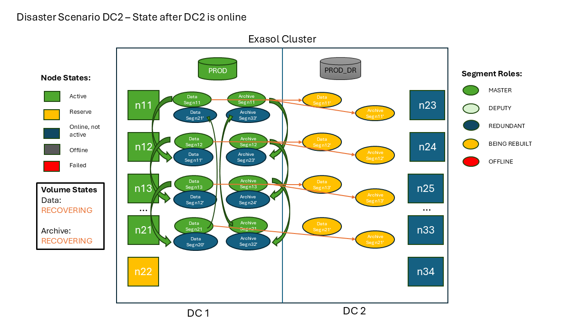

    Once all volumes are resychronized, volume states will switch from RECOVERING to ONLINE.

2. To keep disk IO at a minimum it is recommended to reduce the volume redundancy from 3 back to 2:

    ```bash
    confd_client st_volume_decrease_redundancy vname: data_vol delta: 1 nid: 11

    confd_client st_volume_decrease_redundancy vname: arc_vol delta: 1 nid: 11
    ```

Cluster overview showing the cluster in its original state:


---

### Network Failure between the data centers (Split Brain)

In most of the Disaster Scenarios, one of the data centers is unavailable for a period of time. However, if the network between the 2 data centers is severed, then manual intervention is required to determine which cluster to use. In this state, both "halves" of the cluster are still available, but not able to connect to the other half. When this happens, the quorum for the cluster is lost. To return the cluster to an operational state, you must choose which site to leave online and which to leave offline.

To recover from this scenario:

1. Shut down all nodes from the site that will not be used (if possible)
   1. If you are unable to connect via SSH, physically shut down the machines. This is needed to prevent the two sites from running with different configurations. Not doing so may lead to issues when recovering from the situation.
2. Based on which site was shut down, follow either [Disaster of active data center (DC1)](#disaster-of-active-data-center-dc1) or [Disaster of passive site DC2](#disaster-of-passive-site-dc2).

These kinds of situations could also be handled by using a small VM as a "quorum node", with the only purpose of being a tiebreaker to determine which side is active or not. For more details, you can contact Exasol Support.
