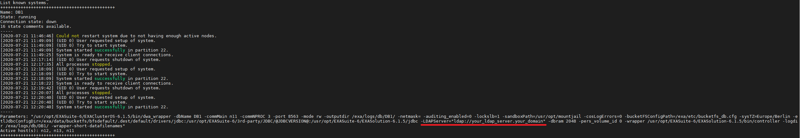
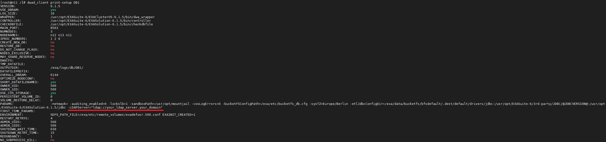

# Add an LDAP server for your Docker-based Exasol Database 
With this article, you will learn how to add an LDAP server for your database:

1. Log in to your Exasol container:


```
$ docker exec -it <container_name> /bin/bash
```
2. Inside the container go to the ***/exa/etc/*** folder and open the ***EXAConf*** file with a text editor of your choice:


```
$ cd /exa/etc  
$ vim EXAConf
```
3. Under the **DB** section, right above the **[[JDBC]]** sub-section add a line that says **Params** and the values mentioned after it:


```
[DB : DB1]  
    Version = 6.1.5  
    MemSize = 6 GiB  
    Port = 8563  
    Owner = 500 : 500  
    Nodes = 11,12,13  
    NumActiveNodes = 3  
    DataVolume = DataVolume1  
    Params = -LDAPServer="ldap://<your_ldap_server.your_domain>"  
    [[JDBC]]  
        BucketFS = bfsdefault  
        Bucket = default  
        Dir = drivers/jdbc  
    [[Oracle]]  
        BucketFS = bfsdefault  
        Bucket = default  
        Dir = drivers/oracle
```
**NOTE:** You can also use *ldaps* instead of *ldap*

4. Change the value of **Checksum** in **EXAConf**:


```
$ sed -i '/Checksum =/c\    Checksum = COMMIT' /exa/etc/EXAConf
```
5. Commit the changes:


```
$ exaconf commit
```
6. At this point you have 2 options:

6.1. Restart the container:


```
$ dwad_client stop-wait <database_instance>     # Stop the database instance (inside the container)  
$ csctrl -d                                     # Stop the storage service (inside the container)  
$ exit                                          # Exit the container  
$ docker restart <container_name>               # Restart the container  
$ docker exec -it <container_name>              # Log in to the container's BASH environment  
$ dwad_client setup-print <database_instance>   # See the database parameters  
  
...  
PARAMS: -netmask= -auditing_enabled=0 -lockslb=1 -sandboxPath=/usr/opt/mountjail -cosLogErrors=0 -bucketFSConfigPath=/exa/etc/bucketfs_db.cfg -sysTZ=Europe/Berlin -etlJdbcConfigDir=/exa/data/bucketfs/bfsdefault/.dest/default/drivers/jdbc:/usr/opt/EXASuite-6/3rd-party/JDBC/@JDBCVERSION@:/usr/opt/EXASuite-6/EXASolution-6.1.5/jdbc -LDAPServer="ldap://your_ldap_server.your_domain"  
...
```
As you can from the output mentioned above, the parameters have been added. However, rebooting the cluster can cause some downtime. In order to shorten the duration of your downtime, you can try the method below.

6.2. Use a configuration file to change the parameters by just rebooting the database, not container:


```
$ dwad_client setup-print <database_instance> > db1.cfg # See the database parameters  
$ vim db1.cfg                                           # Edit the configuration file
```
When you open the file, find the line starting with **PARAMS** and the parameter you need, like:


```
PARAMS: -netmask= -auditing_enabled=0 -lockslb=1 -sandboxPath=/usr/opt/mountjail -cosLogErrors=0 -bucketFSConfigPath=/exa/etc/bucketfs_db.cfg -sysTZ=Europe/Berlin -etlJdbcConfigDir=/exa/data/bucketfs/bfsdefault/.dest/default/drivers/jdbc:/usr/opt/EXASuite-6/3rd-party/JDBC/@JDBCVERSION@:/usr/opt/EXASuite-6/EXASolution-6.1.5/jdbc -LDAPServer="ldap://your_ldap_server.your_domain"
```
After adding the parameters, save the file and execute the following commands:


```
$ dwad_client stop-wait <database_instance>       # Stop the database instance (inside the container)  
$ dwad_client setup <database_instance> db1.cfg   # Setup the database with the db1.cfg configuration file (inside the container)  
$ dwad_client start-wait <database_instance>      # Start the database instance (inside the container)
```
This will add the database parameters, but will not be persistent throughout reboots. Therefore, by adding the parameters this way you shorten your downtime, but the changes aren't permanent. After doing this, we would recommend to also do method 6.1, in case you decide to reboot sometime in the future.

7. Verify the parameters:

7.1. With **dwad_client list:**



7.2. With **dwad_list print-setup <database_instance>:**



*We appreciate your input! Share your knowledge by contributing to the Knowledge Base directly in [GitHub](https://github.com/exasol/public-knowledgebase).* 