# Bonding on Exasol Cluster 
## Background

This quick HOWTO will show how to create bonding interfaces on your nodes for the private and public networks. 

## Prerequisites

You need a working License Sever and at least a server/vm with two or more NICs per network, each in the same VLAN. 

## How to add bonding on an Exasol Cluster

## Step 1

To add bonding interfaces please click on the left tab under Configuration on Network, then click on the Additional Networks tab.

## Step 2

On Additional Private Networks click on add and you'll see the following screen, enter a description for your network in this case I've chosen "private", default MTU and on the Bonding network combo select Private network then click on Add.

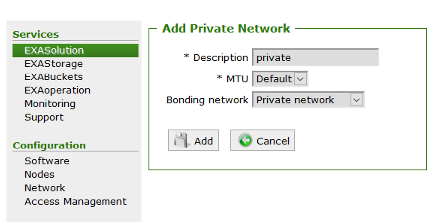

## Step 3

You'll see the following screen, the new private network is available. Now on Additional Public Networks click on Add.

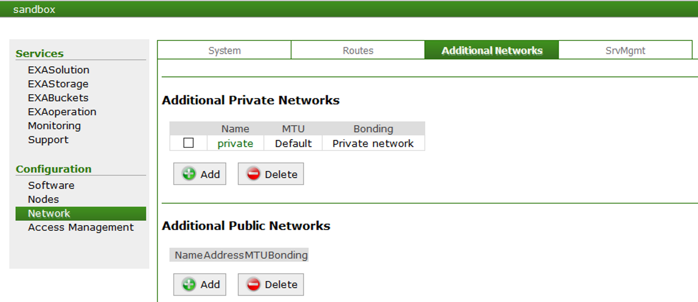

## Step 4

 You'll see the following screen, select a Description for your network in this example I've just used "public" ,on the Network field you'll see 192.168.16.0/24 please remove that and on the Bonding network combo box select Public network then click on Add.

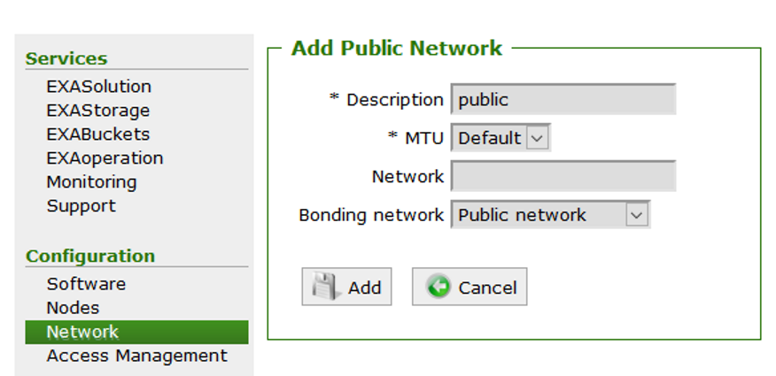

## Step 5

 Now you should see the following screen with both new networks configured.

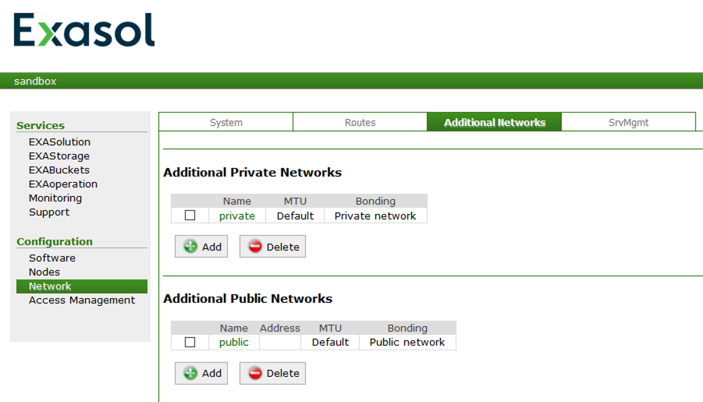

## Step 6

 Now you need to add the new MAC addresses to the nodes that you want in this example the node n0012 has two additional NICs, one for the private subnet and one for the public subnet. Select the node and click on Edit.

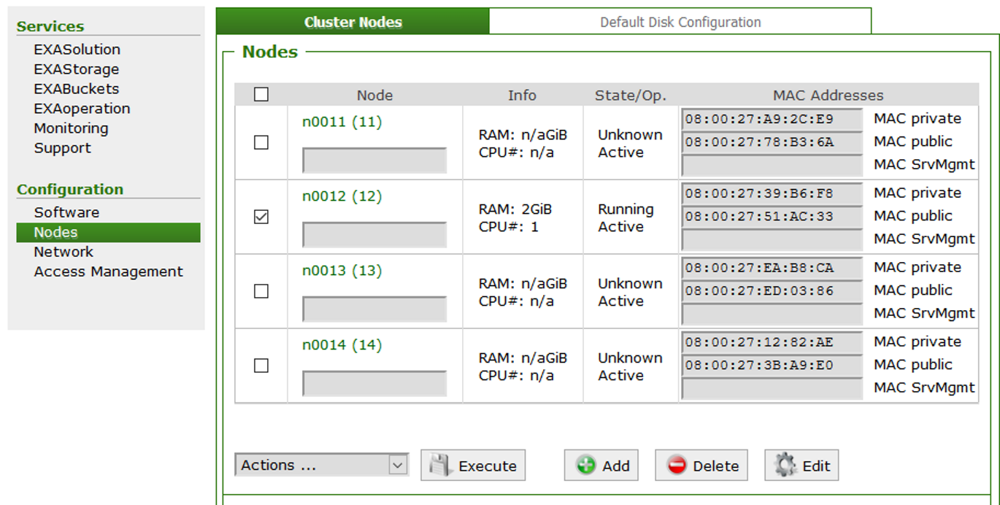

## Step 7

 On the Extra private network interfaces click on Add MAC Address and type the new MAC address for the private network in the format XX:XX:XX:XX:XX:XX then on the Extra Public Network Interfaces click on Add MAC Address and type the new MAC address for the public network in the same format as before, click on Apply to save the config.

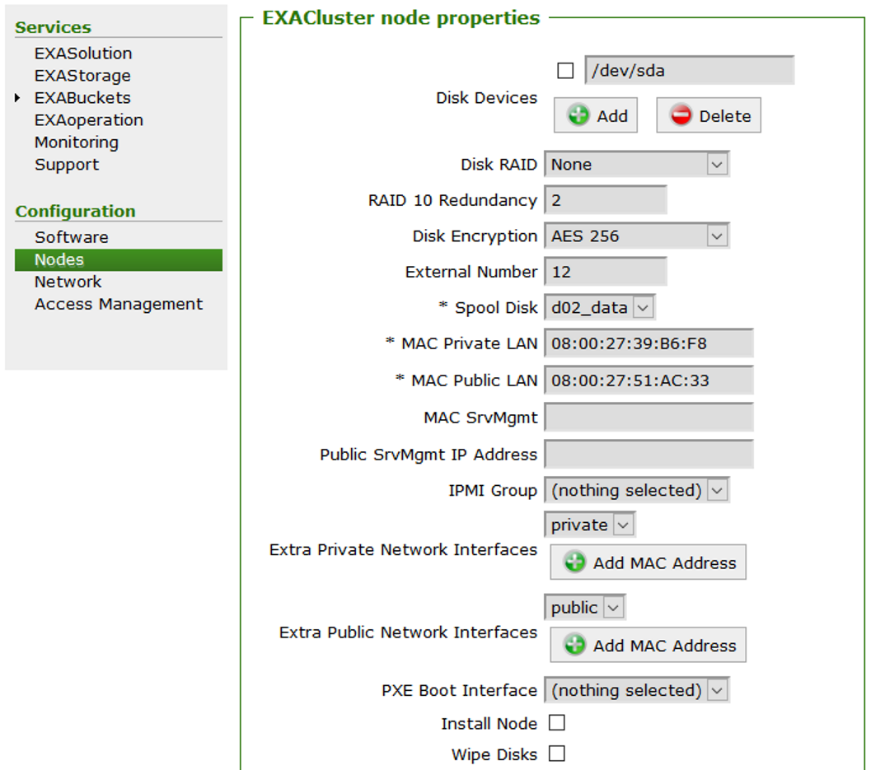

This is an example of my custom setup:

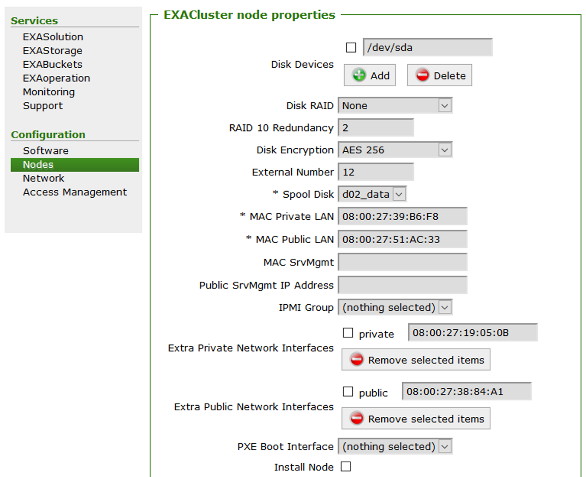

## 

## Step 8

 Now the node configuration should show something like this, where you can see the 4 MAC addresses in place.
 
 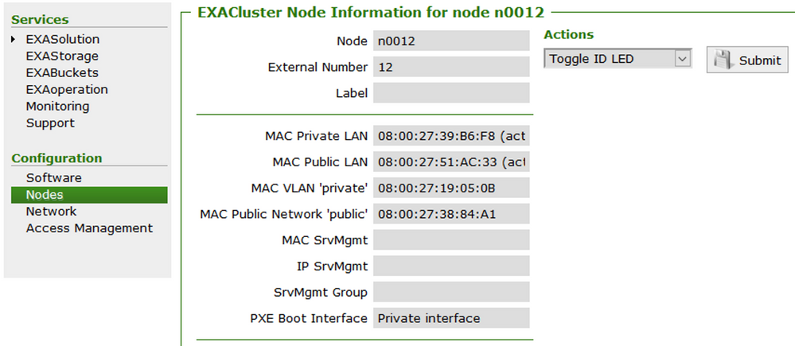

## 

## Step 9

If you want to delete the new added MAC Addresses select the checkboxes as below and click on Apply.

 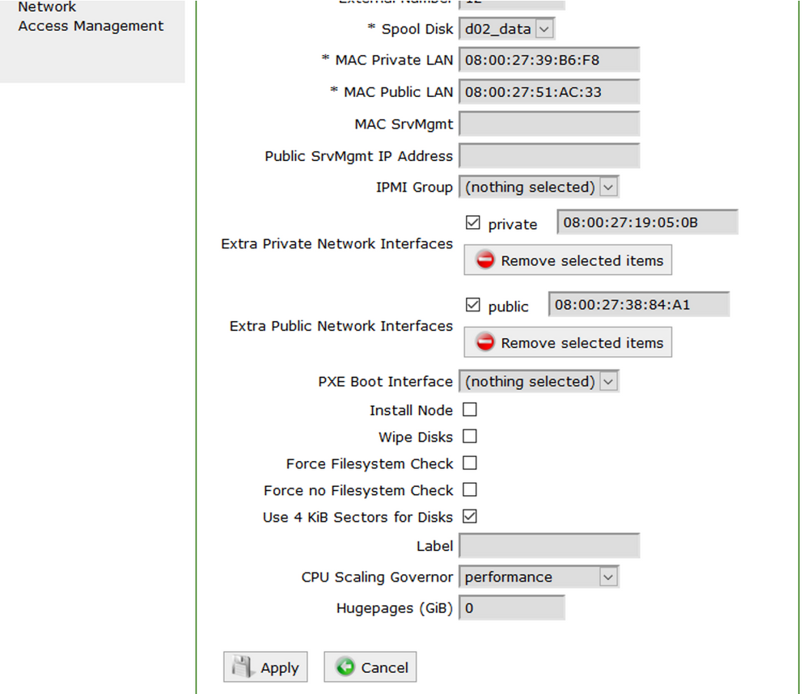

## 

After booting the node the new interfaces will be configured automatically as you can see below:

 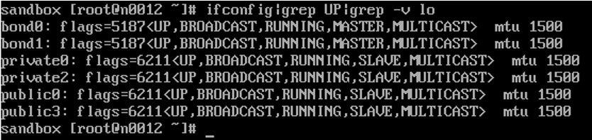

## 

We can verify that the MAC addresses that we selected were configured correctly.

 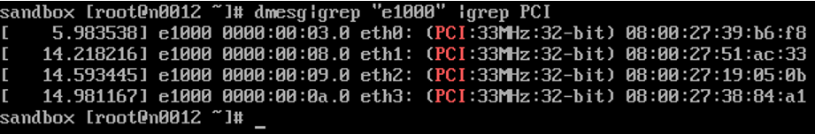

## 

## Additional Notes

* Important: the server/vm won't boot if the main private NIC is not available. In that situation swap the primary private NIC MAC address with the secondary private NIC MAC address in the node configuration and the server will boot.
* This example is for adding only one extra interface to the private & public LANs you can adjust it to your requirements.

## Additional References

[Configuring Network Access - On Premise | Exasol Documentation](https://docs.exasol.com/administration/on-premise/manage_network/configure_network_access.htm#Addition)

*We appreciate your input! Share your knowledge by contributing to the Knowledge Base directly in [GitHub](https://github.com/exasol/public-knowledgebase).* 