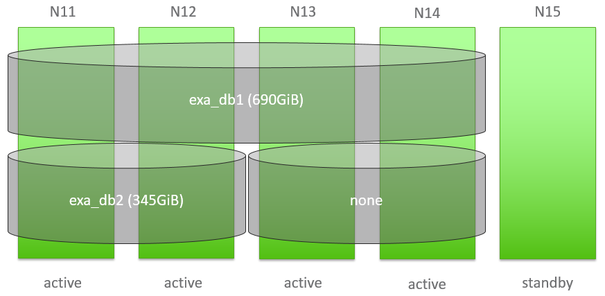

# Calculate Database RAM 
## Background

This article describes the calculation of the optimal (maximum) DB RAM on a:

* 4+1 system with one database (dedicated environment)
* 4+1 system with two databases (shared environment)

The calculation of the OS Memory per Node stays the same for both environments. Shared environments are **not recommended** for production systems.

#### Example Setup:

The 4+1 cluster contains four active data nodes and one standby node.  
Each node has 384 GiB of main memory.

## How to calculate Database RAM

### OS Memory per Node

It is vital for the database that there is enough memory allocatable through the OS. We recommend using at least 10% of the main memory on each node. This prevents the nodes from swapping on high load (many sessions).

Main Memory per Node * 0.1 = OS Memory per Node


```python
384 * 0.1 = 38,4 -> 38 GiB
```
In order to set this value, the database needs to be shut down. **EXAoperation 'Configuration > Network' - "OS Memory/Node (GiB)"**

### Maximum DB RAM (dedicated environment)

(Main Memory per Node - OS Memory per Node) * Number of active Nodes = Maximum DB RAM

Example: 4 x data nodes with 384GiB (Main Memory per Node) - 38 GiB (OS Memory per Node)


```python
(384 GiB - 38 GiB) * 4 = 1380 GiB
```
### Maximum DB RAM (shared environment)

Example

* Database "one" on **four** data nodes (exa_db1)
* Database "two" on **two** data nodes (exa_db2)

As before, the "Maximum DB RAM" is 1380 GiB. With two databases sharing the Maximum DB RAM, we need to recalculate and redistribute it.

Maximum DB RAM / Number of Databases = Maximum DB RAM per database


```python
1380 GiB / 2 = 690 GiB
```
For database "one" (exa_db1), which is running on all four nodes 690 GiB DB RAM can be configured.  
The smaller database "two" (exa_db2) is running on two nodes, therefore "Maximum DB RAM per database" needs to be divided by the number of data nodes it's running on (2).

Maximum DB RAM per database / Number of active Nodes = Maximum DB RAM per database


```python
690 GiB / 2 = 345 GiB
```
 

## Additional References

[Sizing Considerations](https://docs.exasol.com/administration/on-premise/sizing.htm)

*We appreciate your input! Share your knowledge by contributing to the Knowledge Base directly in [GitHub](https://github.com/exasol/public-knowledgebase).* 