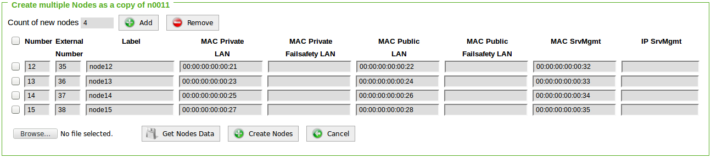
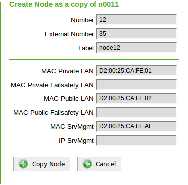

# Creating new data nodes using the copy function 
Adding data nodes to a cluster does not mean that they must be created again. If a data node has already been configured, then by going to the Nodes tab and clicking on the existing node, we can find the **Copy** and **Multiple Copy** options.

**Copy** will use the current node's configuration to create a new one with the same configuration, while **Multiple Copy** will create any desired number of nodes using the "master" node's configuration.

#### Multiple Copy

* Number: Represents the last octet within the private network (CICN)
* External Number: Represents the last octet within the public network (CSCN)
* Label: Optional Label
* MAC Private LAN: MAC address of the private network interface (CICN)
* MAC Private Failsafety LAN (optional)
* MAC Public LAN: MAC address of the public network interface (CSCN)
* MAC Public Failsafety LAN (optional)
* MAC SrvMgmt: MAC address of the IPMI network interface (LOM)  
**OR**
* IP SrvMgmt: IP address of the IPMI network interface (LOM)

The example shows the creation of four new nodes using the configuration of "master" node n0011

#### Copy

* Has the same configuration fields as Multiple Copy, but only for one node.

The example shows the creation of one new nodes using the configuration of "master" node n0011

