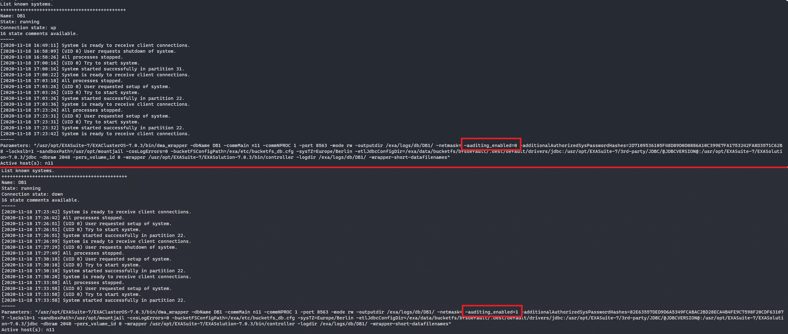

# Enabling Auditing in a Docker-based Exasol system

**Since database version 8 please use `confd_client` to manage audit settings:**

* [Enable Auditing](https://docs.exasol.com/db/latest/administration/on-premise/manage_database/enable_auditing.htm)
* [Disable Auditing](https://docs.exasol.com/db/latest/administration/on-premise/manage_database/disable_auditing.htm)

**Likely, this functionality will eventually be added to Admin UI.**

In this section we will show you how to:

1. Edit the EXAConf file and add the Auditing parameter
2. Commit the changes
3. Restart the container(s)
4. Verify the parameter's value

### Step 1. Log in to the Docker host and edit your EXAConf file

Log in to your Docker host via ssh (or console), log in to your Exasol container:

```shell
docker exec -it <your_exasol_container_name> /bin/bash
```

Edit the EXAConf file with your preferred text editor and add the following line to your database parameters: 

```text
EnableAuditing = yes
```

The database section of your EXAConf file should look like this:

```text
[DB : DB1]  
    Version = 7.0.3  
    MemSize = 2 GiB  
    Port = 8563  
    Owner = 500 : 500  
    Nodes = 11  
    EnableAuditing = yes  
    NumActiveNodes = 1  
    DataVolume = DataVolume1
```

### Step 2. Commit the changes

Once the changes are done, run the following command inside the container:

```shell
sed -i '/Checksum =/c\ Checksum = COMMIT' /exa/etc/EXAConf
```

If you are running a cluster then be sure to also sync the file:

```shell
cos_sync_files /exa/etc/EXAConf
```

### Step 3. Restart the container(s)

Once the changes are done, restart the container(s) on you Docker hosts

```shell
docker restart <your_exasol_container_name>
```

### Step 4. Verify the parameter's value

Once the container is restarted, log in to the container and run the following command:

```shell
dwad_client list
```
The output should be similar to:



## References

* [Enable Auditing](https://docs.exasol.com/db/latest/administration/on-premise/manage_database/enable_auditing.htm)
* [Disable Auditing](https://docs.exasol.com/db/latest/administration/on-premise/manage_database/disable_auditing.htm)

*We appreciate your input! Share your knowledge by contributing to the Knowledge Base directly in [GitHub](https://github.com/exasol/public-knowledgebase).*
