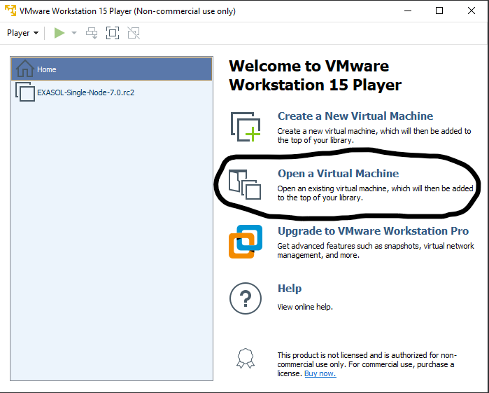
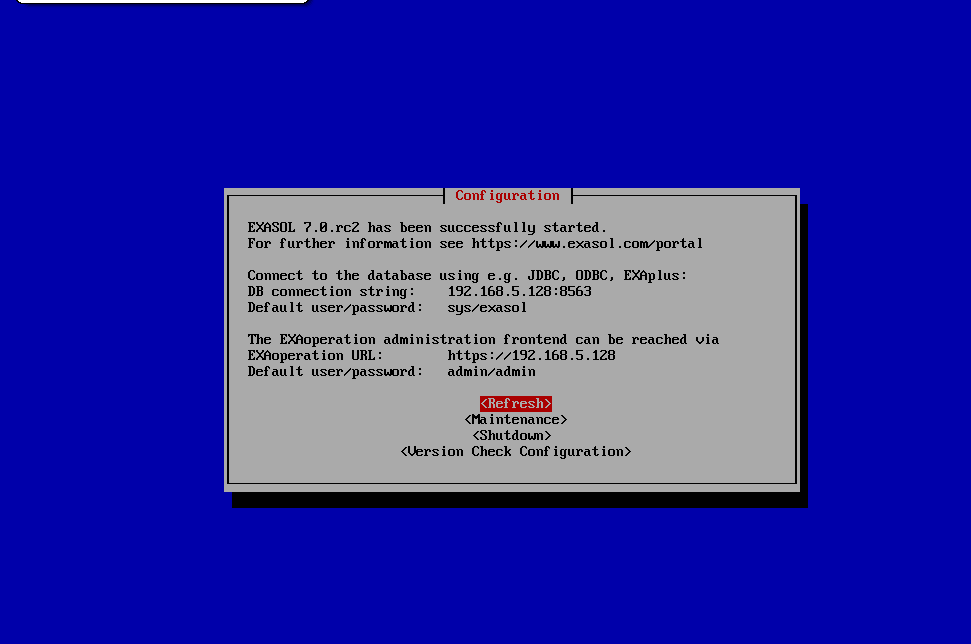
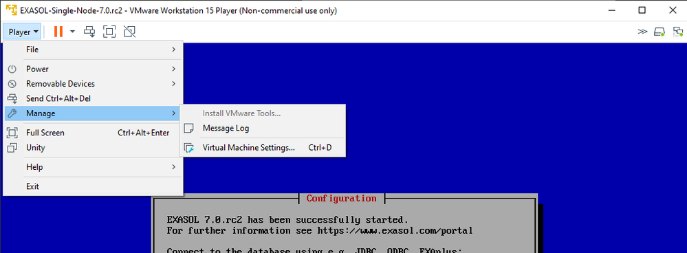
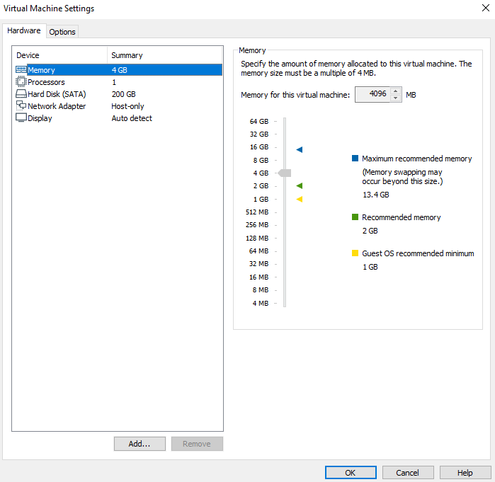
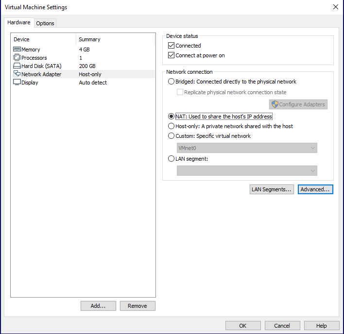
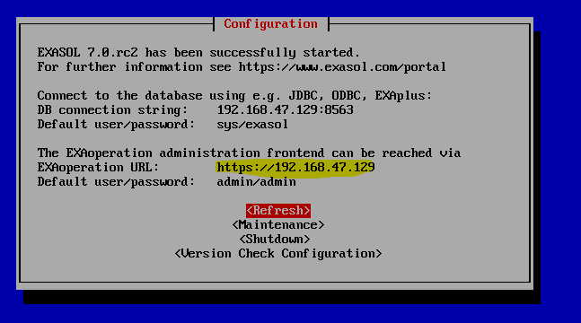
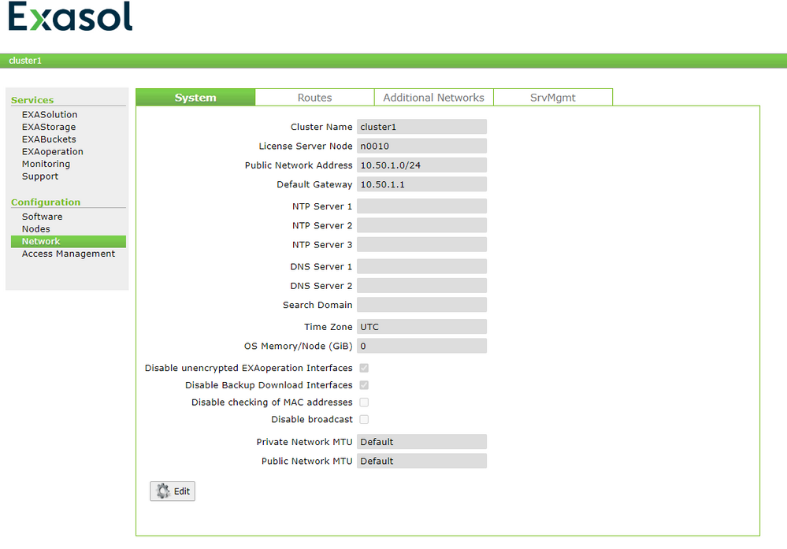
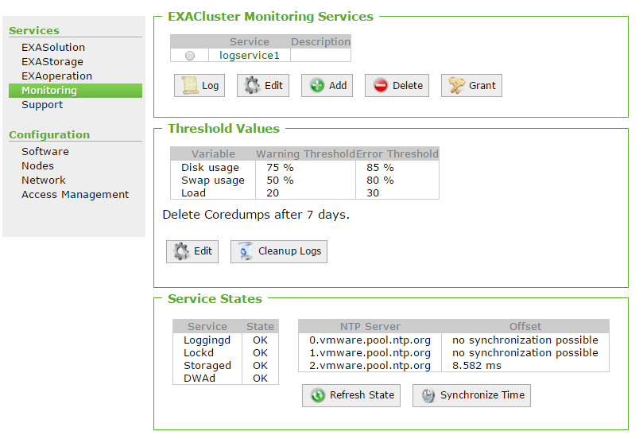

# Exasol Community Edition: Enable Internet Access using Vmware 
## Background

Sometimes, you may want to enable internet access for your Community Edition, for example to load publicly accessible data sets. This article shows how to do this using VMWare. A [similar article](https://exasol.my.site.com/s/article/Enable-internet-access-for-Exasol-Community-Edition) exists already for Virtualbox.

## Prerequisites

First, download the Exasol Community Edition by filling out [this form](https://www.exasol.com/en/product-overview/community-edition-download/) and choosing the .OVA file to download.

If not already done, import the Exasol OVA file into VMWare by clicking on "Open a Virtual Machine" and choosing the OVA file you downloaded. 

 Accept the "End User License Agreement" and the "Privacy Statement" and wait until the image has been successfully loaded.

You will know when Exasol has been completely installed when you see a page that looks like this: 

## How to Enable Internet Access

## Step 1: Open Virtual Machine Settings

Open up the Virtual Machine settings by clicking Player -> Manage -> Virtual Machine Settings. It should look like this:

## Step 2: Change Network Adapter

In the Virtual Machine Settings, change the Network Adapter to type "NAT". 

NOTE: You could also choose a Bridged Adapter, however this can be more complicated because you must ensure that the correct adapters have internet access and are set for bridged mode. For this example, we will continue with NAT.

Then click "OK".

## Step 3: Reboot the Virtual Machine

You can go to Maintenance -> Reboot to restart the Virtual Machine so that the network settings are applied. 

## Step 4: Add NTP and DNS Servers

Once the machine has been rebooted, please open EXAoperation by visiting the link that is displayed on the machine. In the picture below, I can access EXAoperation by visiting <https://192.168.47.129>. You will need to accept the security risk. 

 In EXAOperation, click on the Network Button. On this page, we will add NTP and DNS servers.

Click on Edit and add your DNS and NTP servers. You can use the google DNS Servers 8.8.8.8 or 8.8.4.4 and the NTP servers *.de.pool.ntp.org. Of course, you can also use any other DNS or NTP server that you would like.  The end result will look like this:

## 

## Step 5: Synchronize Time

Click on the Monitoring Tab in EXAoperation and synchronize the time. 

Now you should be able to connect to the internet. You can test this by running an IMPORT on a publicly-available data set or by creating a UDF which connects to the internet. 

## Additional Notes

Network settings on virtual machines can be very tricky. Even after performing these steps, the internet connection might work. In most cases, this is due to your company's network settings or firewall settings. If you are still having trouble, you can contact your company's IT team to help troubleshoot the network problems. 

## Additional References

* [VMWare Documentation](https://docs.vmware.com/en/VMware-Workstation-Pro/index.html)
* [Community Edition Installation](https://docs.exasol.com/get_started/tryexasol/communityedition.htm)
* [Enable networking for Virtualbox](https://exasol.my.site.com/s/article/Enable-internet-access-for-Exasol-Community-Edition)

*We appreciate your input! Share your knowledge by contributing to the Knowledge Base directly in [GitHub](https://github.com/exasol/public-knowledgebase).* 