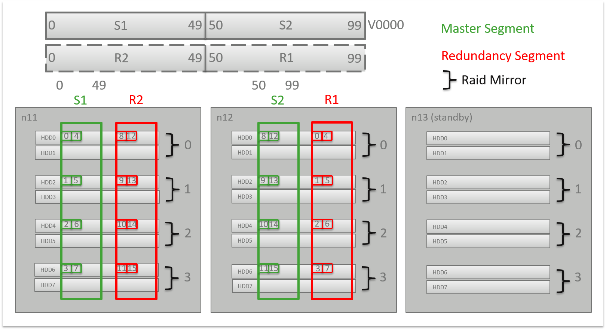

# EXAStorage Logical View 
This article presents an overview of EXAStorage, which consists of the following: 

#### Volumes

* Volumes are partitioned into logical blocks
* Blocks are distributed equally across all nodes/segments
* Nodes may have segments of multiple volumes

#### Segments

* A segment consists of (an arbitrary number of) partitions
* Partitions may be distributed across (an arbitrary number of) disks
* Blocks are distributed equally across all partitions

#### Block distribution

* **horizontal block distribution**
	+ More flexible
	+ Application is responsible for handling parallelism
* **vertical block distribution (currently in use)**
	+ Maximum automatic parallelism
	+ Parallelism is not handled by the application
	+ Stripe size 1 (4K)
* **Version 6**
	+ Uses vertical block distribution with stripes (256K, stripe size 64)
	+ DATA volumes must be recreated in version 6 to use this improvement

