# How to change public IP subnet 
## Background

That article guides you through the procedure to change the network for a cluster without tagged VLAN. It's strongly recommended to contact EXASOL support if you have tagged VLAN.

## Prerequisites

1. This task requires a maintenance window of at least 30 minutes
2. The tasks performed in EXAoperation require a user with at least "Administrator" privileges
3. The network requirements are described in [system_requirements](https://docs-test.exasol.com/6.1/administration/on-premise/installation/system_requirements.htm)
4. This guide is **only** for the case that the subnet mask and the host addresses won't be changed

## Instructions

## 1. EXAoperation master node

* The changes must be applied to the real license server since it is the only node that boots from the local hard drive.
* Check the following:

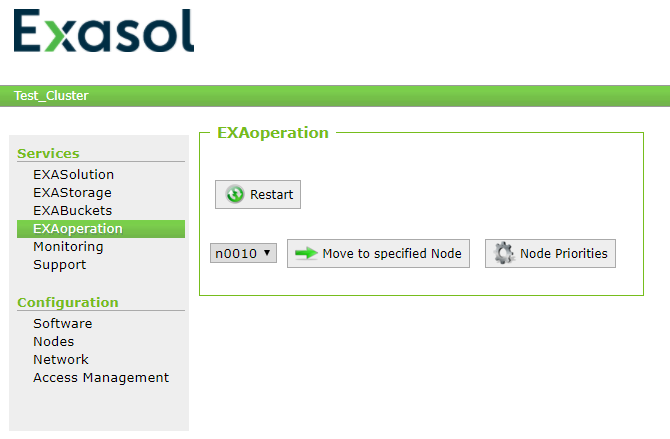 Is EXAoperation running on the license server? If not, move it to the license server.

## 2. Shutdown all databases

* Navigate to the EXAoperation page Services > EXASolution
* Review the database list and check if the column "Background Restore" indicates "None" on all instances

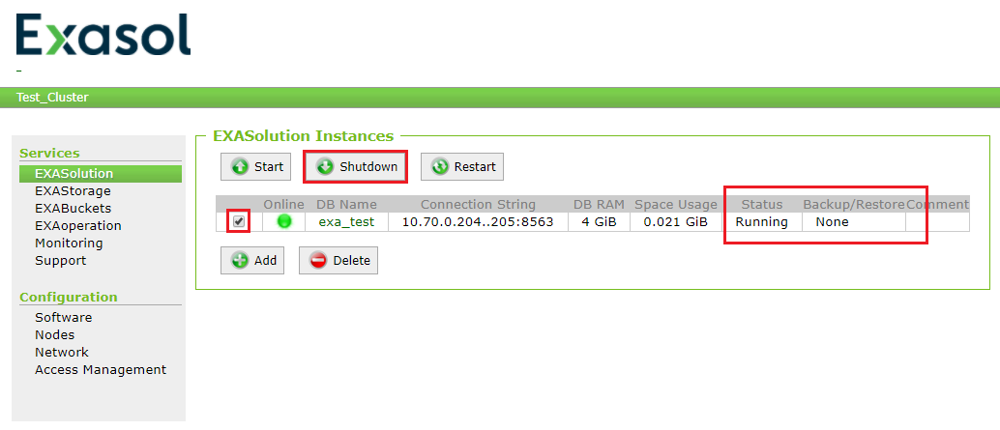* Select all (running) EXASolution instances
* Click on the button "Shutdown"
* Reload the page until all instances change their status from "Running" to "Created"

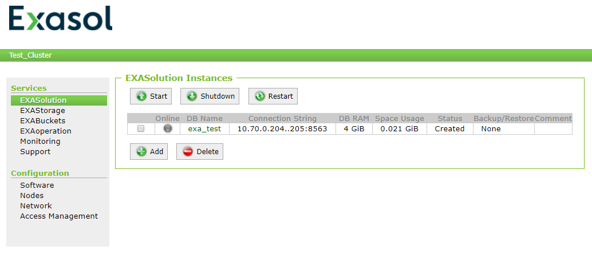You may follow the procedure in an appropriate logservice: 


```
System marked as stopped.  
Volume 1 has been deleted.  
EXASolution exa_test is rejecting connections  
Controller(0.0): Shutdown called.  
User 0 requested shutdown of system
```
## 3. Shutdown EXAStorage

Navigate to the EXAoperation page Services > EXAStorage 

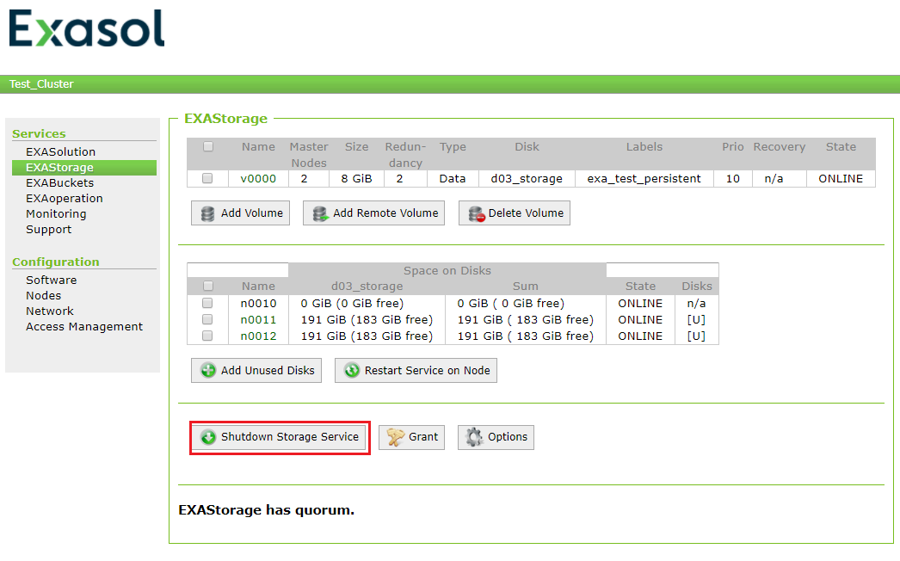  
Click on the button "Shutdown Storage Service" and confirm your choice when prompted. When the storage service is down, it looks like:

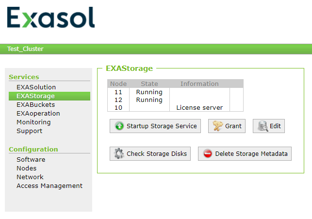## 4. Suspend Nodes

* Open the Configuration > Nodes page in EXAoperation
* Select all nodes in the tab "Cluster Nodes"
* Select "Stop cluster services" from actions dropdown menu
* Confirm with click on the button "Execute"

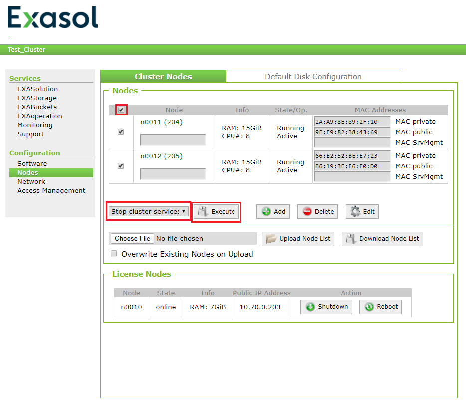  
* Reload the page and until all nodes indicate the State/Op. "Suspended"

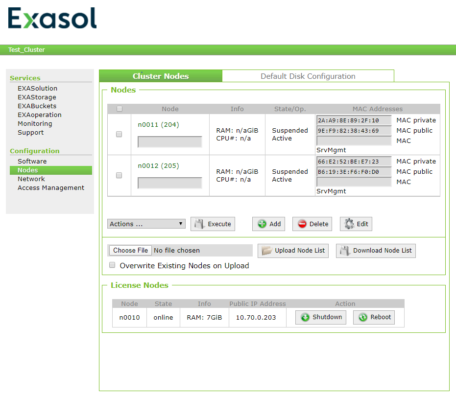  The 2nd state of every node must be "Active"! Restarting a node that has the "To Install" state will lead to an unrecoverable data loss!

## 5. Change network settings

* Navigate to Configuration -> Network
* Click on the button "Edit"

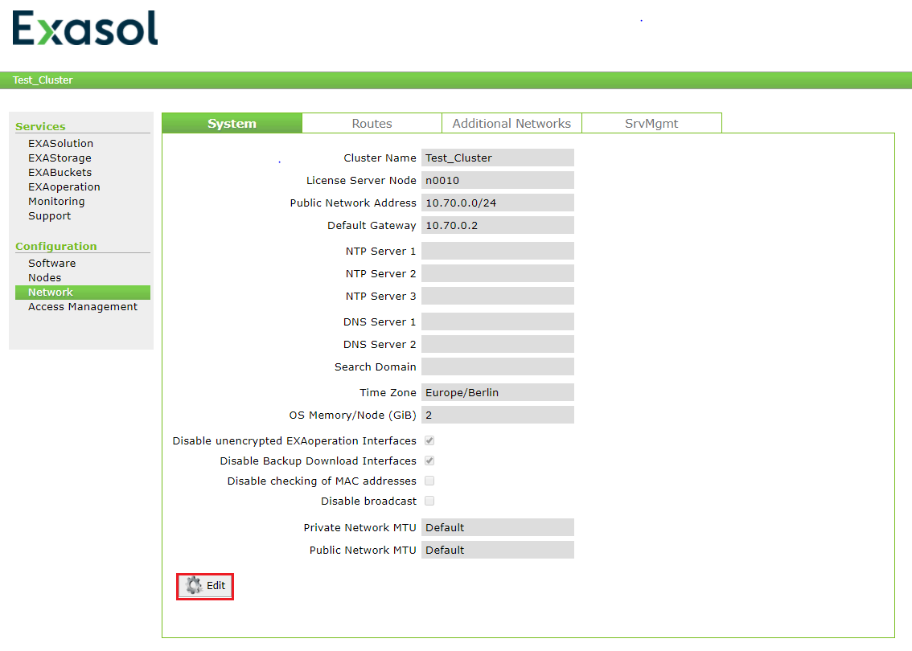* Fill in the characteristics of the new network in Fields "Public Network", "Gateway", "NTP Server 1", "DNS Server 1". If there are no characteristics for NTP or DNS remove the entries, that the field is clear.

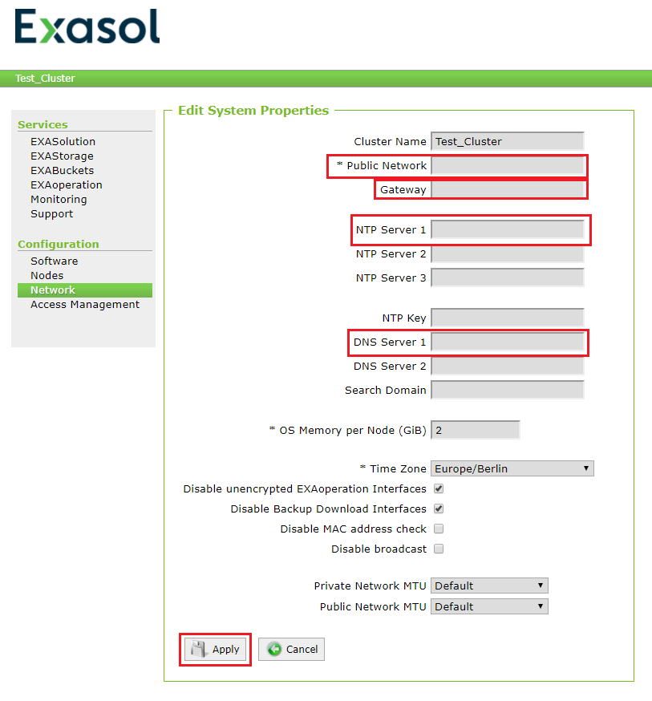*Click on Button "Apply" to save the new configuration

##  6. Change IP and reboot license server

Log in as maintenance user via the console.

 Connect via iDRAC, vSphere, or change it locally on the terminal. If you're connected via ssh and confirm the IP with "OK" you will get disconnected instantly. Make sure that you're able to reboot the server after the reconfiguration.

* confirm on "Configure Network"

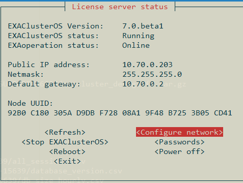* Change IP of the license, subnet mask, and gateway and confirm with "OK"

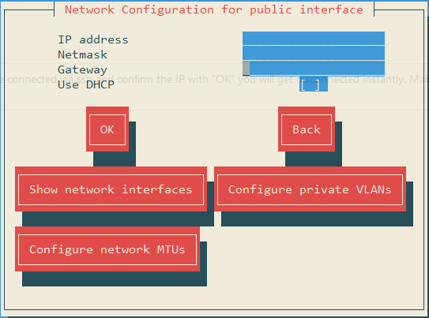* Reboot the license server with the "Reboot" button .

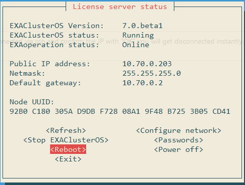 **Now you are able to reconfigure your own network (eg. local public switch, VLAN, etc.)** 

* Wait for the license server to finish its startup procedure and log into EXAoperation again.

## 7. Reboot the database nodes

* Navigate to the Configuration > Nodes page
* Select all nodes in the tab "Cluster Nodes"
* Choose "Reboot" from actions dropdown menu and confirm with click on the button "Execute"

 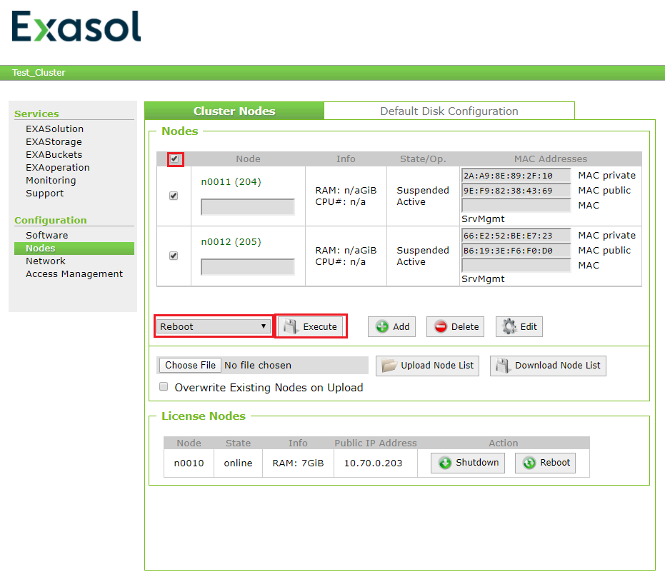

* Wait for the nodes to finish reboot (about 15 to 25 minutes)
* Reload the nodes page until the State/Op. column changes from "booting" to "running" for all nodes
* You may watch the boot process (of node n11 in this example) in an appropriately configured logservice:


```
Boot process stages 1 to 3 took 121 seconds.  
Boot process stage 3 finished.  
Start boot process stage 3.  
successfully initialized thresholds for node monitoring  
successfully unpacked package on client node: JDBC_Drivers-2020-01-22.tar.gz  
successfully unpacked package on client node: EXASolution-7.0.beta1_x86_64.tar.gz  
successfully synchronized EXAoperation.  
successfully unpacked package on client node: EXARuntime-7.0.beta1_x86_64.tar.gz  
successfully unpacked package on client node: EXAClusterOS-7.0.beta1_CentOS-7.5.1804_x86_64.tar.gz  
Node does not support CPU power management (requested 'performance').  
Prepare boot process stage 3.  
Hard drives mounted.  
Mount hard drives.  
client mac address of public0 matches the expected value (9E:F9:82:38:43:69)  
client mac address of private0 matches the expected value (2A:A9:8E:89:2F:10)  
Initialize boot process.  
client mac adress is '2A:A9:8E:89:2F:10'  
client version is '7.0.beta1'  
client ID is '10.17.1.11'Additional Notes
```
## 8. Startup EXAStorage

* Navigate to the EXAoperation page Services > EXAStorage
* Ensure that all database nodes indicates the state "Running"
* Click on the button "Startup Storage Service" and confirm your choice when prompted
* After the EXAStorage page has been reloaded, check the status of all nodes, disks, and volumes

## 9. Start the database

* Select all  EXASolution instances
* Click on the button "Start"
* Reload the page until all instances change their status from "Created" to "Running"

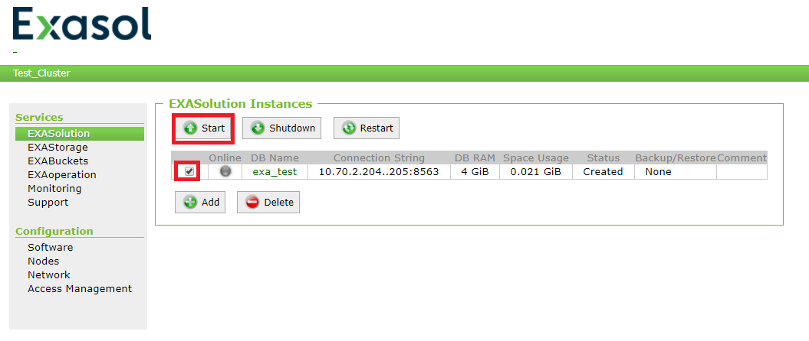* You may follow the procedure in an appropriate logservice:


```
EXASolution exa_test is accepting connections System is ready to receive client connections. System started successfully in partition 44. User 0 requests startup of system. User 0 requests new system setup.
```
