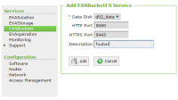
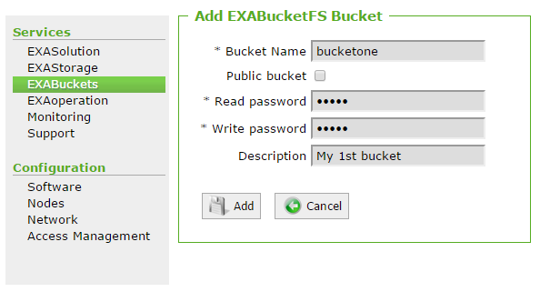
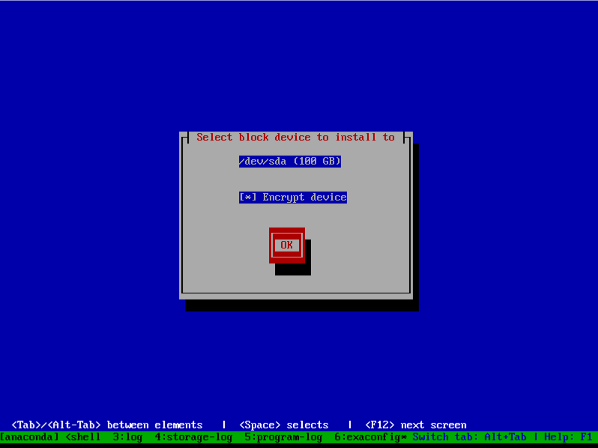
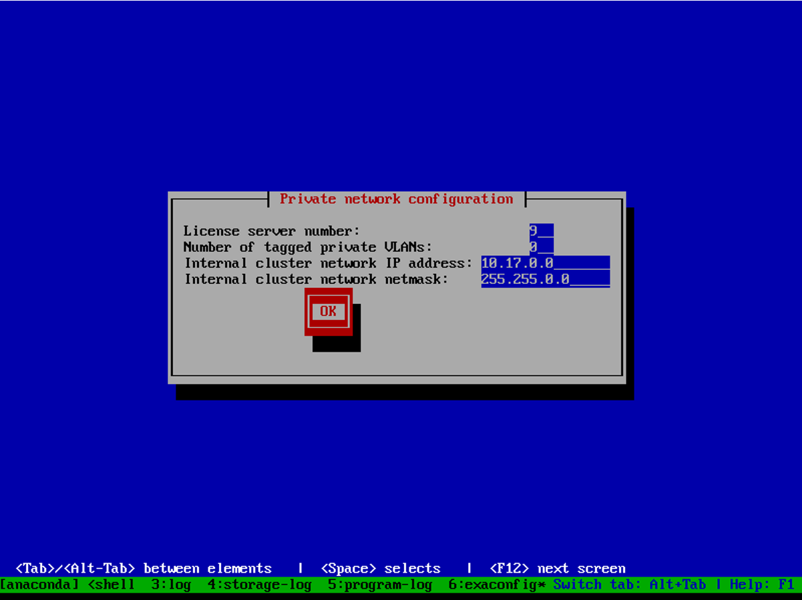
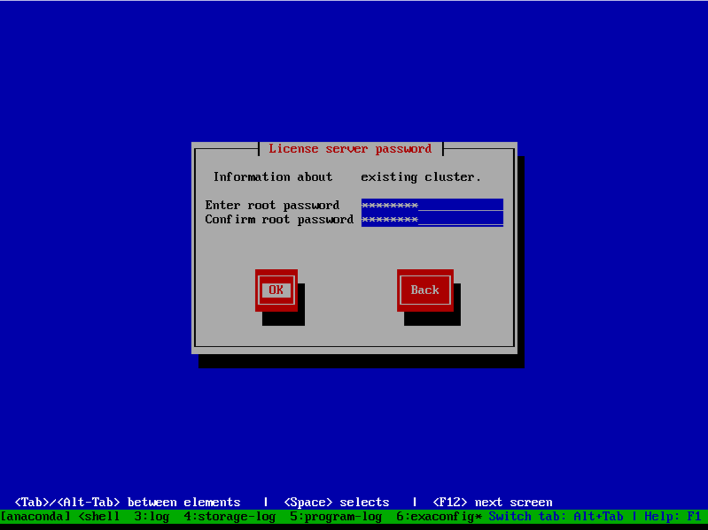
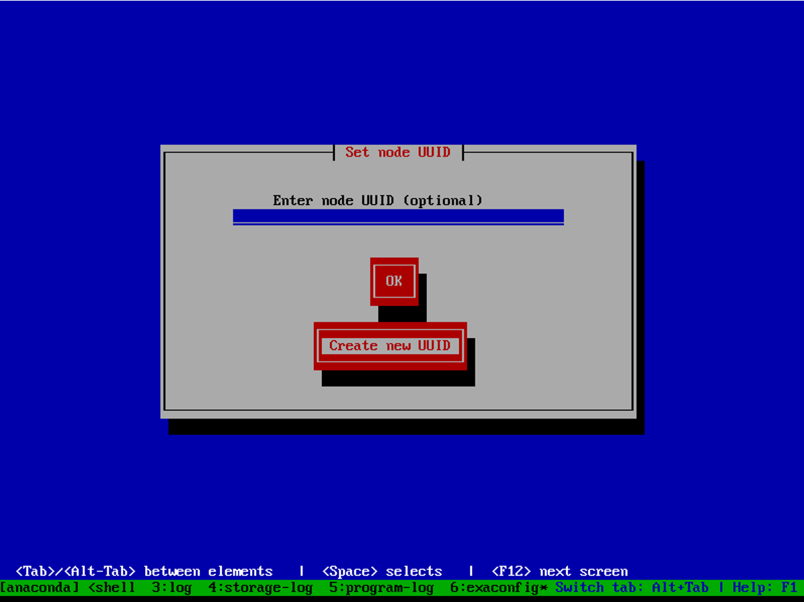
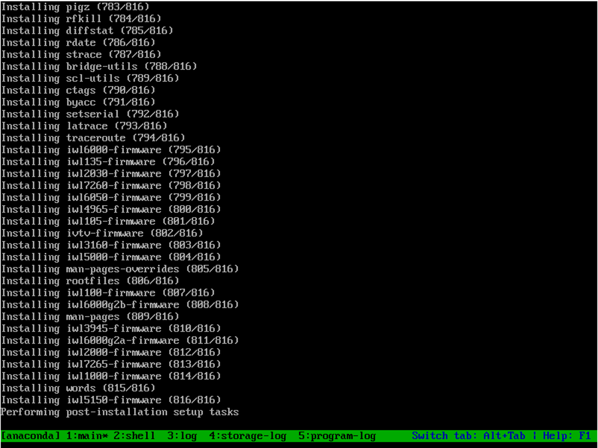
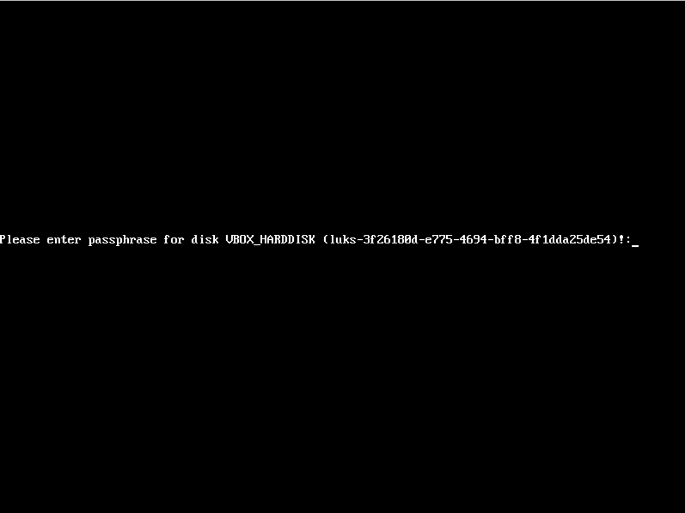
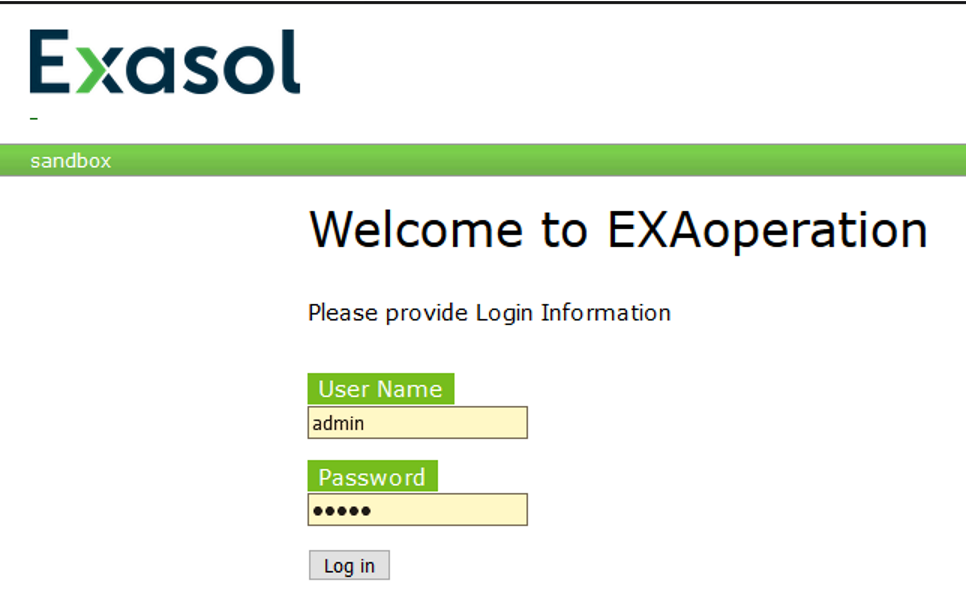
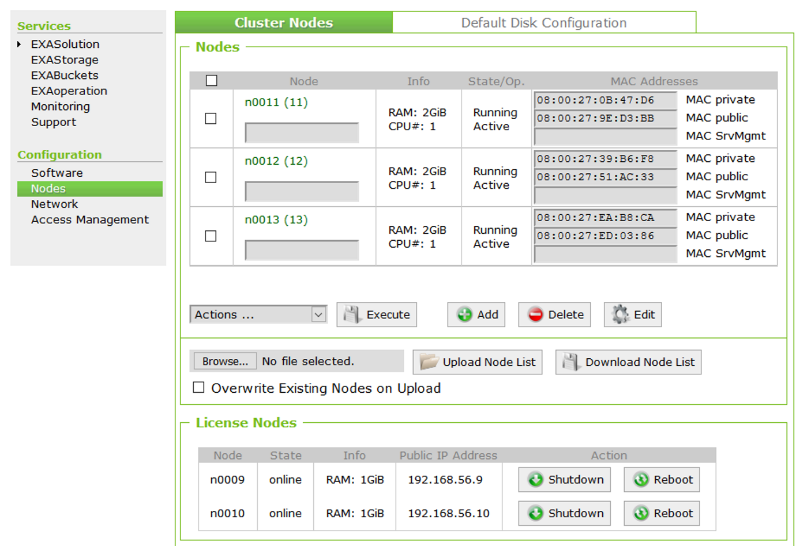

# How to deploy a single-node Exasol database as a Docker image for testing purposes 

## Prerequisites

Host OS:

Currently, Exasol only supports Docker on Linux. It’s not possible to use Docker for Windows to deploy the Exasol database. The requirement for Linux OS is O_DIRECT access.

Docker installed Linux machine:

In this article, we use Centos 7.6 virtual machine with the latest version of docker (currently Version 19.03).

Privileged mode:

Docker privileged mode is required for permissions management, UDF support, and environment configuration and validation (sysctl, hugepages, block-devices, etc.).

Memory requirements for the host environment:

Each database instance needs at least 2 GiB RAM. Exasol recommends that the host reserves at least 4 GiB RAM for each running Exasol container. Since in this article, we deploy a single node container with 6 GiB RAM for the VM.

Service requirements for the host environment:

NTP should be configured on the host OS. Also, the RNG daemon must be running to provide enough entropy for the Exasol services in the container.

## Recommendations

Performance optimization:

Exasol strongly recommends setting the CPU governor on the host to performance, to avoid serious performance problems. You can use the cpupower utility or the command below to set it.

Using cpupower utility


```python
$ sudo cpupower -c all frequency-set -g powersave
```
Change the content of scaling_governor files:


```python
$ for F in /sys/devices/system/cpu/cpu*/cpufreq/scaling_governor; do echo performance >$F; done
```
Hugepages:

Exasol recommends enabling hugepages for hosts with at least 64GB RAM. To do so, we have to set the Hugepages option in EXAConf to either auto, host, or the number of hugepages per container. If we will set it to auto, the number of hugepages will be determined automatically, depending on the DB settings.

When setting it to host, the nr. of hugepages from the host system will be used (i. e. /proc/sys/VM/nr_hugepages will not be changed). However, /proc/sys/VM/hugetlb_shm_group will always be set to an internal value!

Resource limitation:

It's possible to limit the resources of the Exasol container with the following docker run options:


```python
$ docker run --cpuset-cpus="1,2,3,4" --memory=20g --memory-swap=20g --memory-reservation=10g exasol/docker-db:<version>
```
This is especially recommended if we need multiple Exasol containers (or other services) on the same host. In that case, we should evenly distribute the available CPUs and memory throughout your Exasol containers.

Find more detailed information here <https://docs.docker.com/config/containers/resource_constraints/>

## **How to deploy a single-node Exasol database as a Docker image**

## **Step 1 Create a directory to store data from container persistently**

To store all persistent data from the container, we create a directory, name it “container_exa” and place it in the home folder of the Linux user.


```python
$ mkdir $HOME/container_exa/
```
Set the CONTAINER_EXA variable to the folder:


```python
$ echo ‘export CONTAINER_EXA="$HOME/container_exa/"’ >> ~/.bashrc && source ~/.bashrc
```
## **Step 2 Create a configuration file for Exasol database and docker container**

The command for creating a configuration file is:


```python
$ docker run -v "$CONTAINER_EXA":/exa --rm -i exasol/docker-db:<version> init-sc --template --num-nodes 1
```
We use the latest version of exasol (currently 6.2.6) with the **latest** tag.

***Num-nodes** is the number of containers. We need to change the value of this if we want to deploy a cluster*.


```python
$ docker run -v "$CONTAINER_EXA":/exa --rm -i exasol/docker-db:latest init-sc --template --num-nodes 1
```
NOTE: You need to add --privileged option because the host directory belongs to root.  
  




After the command has finished, the directory $CONTAINER_EXA contains all subdirectories as well as an EXAConf template (in /etc).



## **Step 3** **Complete a configuration file**

The configuration has to be completed before the Exasol DB container can be started.

The configuration file is EXAConf and it’s stored in the “$CONTAINER_EXA/etc” folder. To be able to start a container these options have to be configured:



* A private network of all nodes (Public network is not mandatory in docker version of Exasol DB)
* EXAStorage device(s)
* EXAVolume configuration
* Network port numbers
* Nameservers

Different options can be configured in the EXAConf file. 

1)  A private network of the node


```python
$ vim $CONTAINER_EXA/etc/EXAConf
```

```python
[Node : 11]      

   PrivateNet = 10.10.10.11/24 # <-- replace with the real network
```
In this case, the IP address of Linux the virtual machine is **10.1.2.4/24**.

2) EXAStorage device configuration

Use the dev.1 file as an EXAStorage device for Exasol DB and mount the LVM disk to it.



3) EXAVolume configuration

Configure the volume size for Exasol DB before starting the container. There are 3 types of volumes available for Exasol.

Volumes in Exasol serve three different purposes. You can find detailed information in <https://docs.exasol.com/administration/on-premise/manage_storage/volumes.htm?Highlight=volumes>

Since it’s recommended to use less disk space than the size of LVM disk (because Exasol will create a temporary volume and there should be a free disk space for it), we'll use 20 GiB space for the volume. The actual size of the volume increases or decreases depending on the data stored.



4) Network port numbers

Since you should use the host network mode (see "Start the cluster" below), you have to adjust the port numbers used by the Exasol services. The one that's most likely to collide is the SSH daemon, which is using the well-known port 22. We change it to 2222 in EXAConf file:



The other Exasol services (e. g. Cored, BucketFS, and the DB itself) are using port numbers above 1024. However, you can change them all by editing EXAConf. In this example, we use the default ports.


```markup
Port 22 – SSH connection  Port 443 – for XMLRPC  Port 8888 – port of the Database  Port 6583 – port for bucketfs
```
5) Nameservers

We can define a comma-separated list of nameservers for this cluster in EXAConf under the [Global] section. Use the google DNS address 8.8.8.8.

Set the checksum within EXAConf to 'COMMIT'. This is the EXAConf integrity check (introduced in version 6.0.7-d1) that protects EXAConf from accidental changes and detects file corruption.

It can be found in the 'Global' section, near the top of the file. Please also adjust the Timezone depending on your requirements.

## **Step 5 Create the EXAStorage device files**

EXAStorage is a distributed storage engine. All data is stored inside volumes. It also provides a failover mechanism. We recommend using a 32 GB LVM disk for EXAStorage:


```markup
$ lsblk
```
IMPORTANT: Each device should be slightly bigger (~1%) than the required space for the volume(s), because a part of it will be reserved for metadata and checksums.

## **Step 5 Start the cluster**

The cluster is started by creating all containers individually and passing each of them its ID from the EXAConf. Since we’ll be deploying a single node Exasol DB the node ID will be n11 and the command would be:


```python
$ docker run --name exasol-db --detach --network=host --privileged -v $CONTAINER_EXA:/exa -v /dev/mapper/db-storage:/exa/data/storage/dev.1 exasol/docker-db:latest init-sc --node-id 11
```
NOTE: This example uses the host network stack, i.e. the containers are directly accessing a host interface to connect. There is no need to expose ports in this mode: they are all accessible on the host.

Let’s user the “docker logs” command to check the log files.


```python
$ docker logs -f exasoldb
```


We can see 5 different stages in the logs. Stage 5 is the last and if we can see the node is online and the stage is finished this means the container and database started successfully.


```python
$ docker container ls
```
Let’s get a bash shell in the container and check the status of the database and volumes


```python
$ docker exec -it exasol-db bash
```
Inside of the container, you can run some exasol specific commands to manage the database and services. You can find some of these commands below:

**$ dwad_client shortlist**: Gives an output about the names of the databases.

**$ dwad_client list:** Gives an output about the current status of the databases.



As we can see the name of the database is DB1 (this can be configured in EXAConf) and the state is running. The “Connection state: up” means we can connect to the database via port 8888.

**$ csinfo -D** – Print HDD info:

**csinfo -v** print information about one (or all) volume(s):



As we can see the size of the data volume is 20.00 GiB. You can also find information about the temporary volume in the output of the csinfo -v command.

Since the database is running and the connection state is up let’s try to connect and run for example SQL queries. You can use any SQL clients or Exaplus CLI to connect.

I’m going to use DBeaver in this article. You can find more detailed information in <https://docs.exasol.com/connect_exasol/sql_clients/dbeaver.htm>

I’m using the public IP address of the virtual machine and port 8888 which configured as a database port in EXAConf.



By default, the password of the sys user is “exasol”. Let's run an example query:


```markup
SELECT * FROM EXA_SYSCAT;
```
**Conclusion**

In this article, we deployed a single-node Exasol database in a docker container and went through the EXAConf file. In the future, I will be sharing new articles about running Exasol on docker and will analyze the EXAConf file and Exasol services in-depth.

## Additional References

<https://github.com/EXASOL/docker-db>

<https://docs.docker.com/config/containers/resource_constraints/>

<https://docs.exasol.com/administration/on-premise/manage_storage/volumes.htm?Highlight=volumes>

