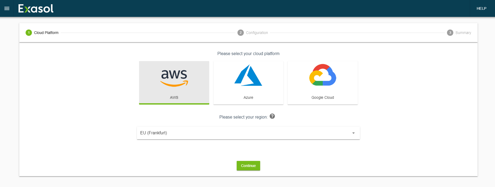
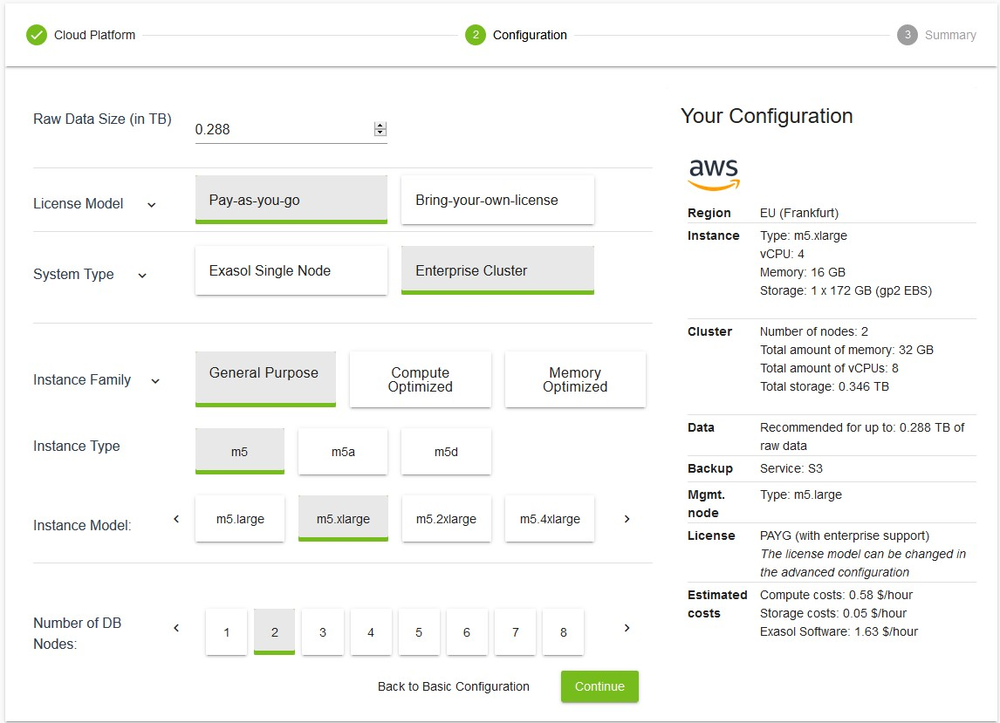
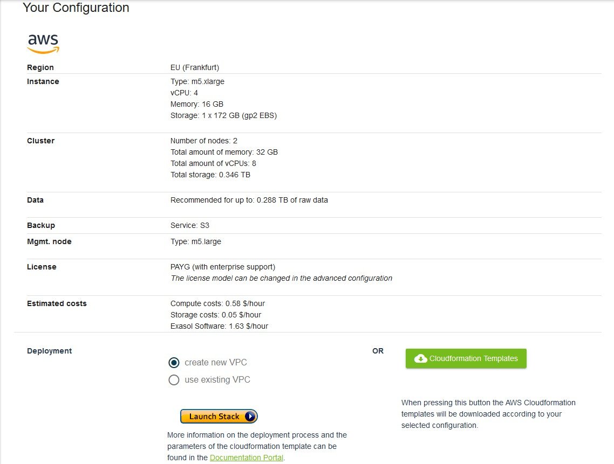
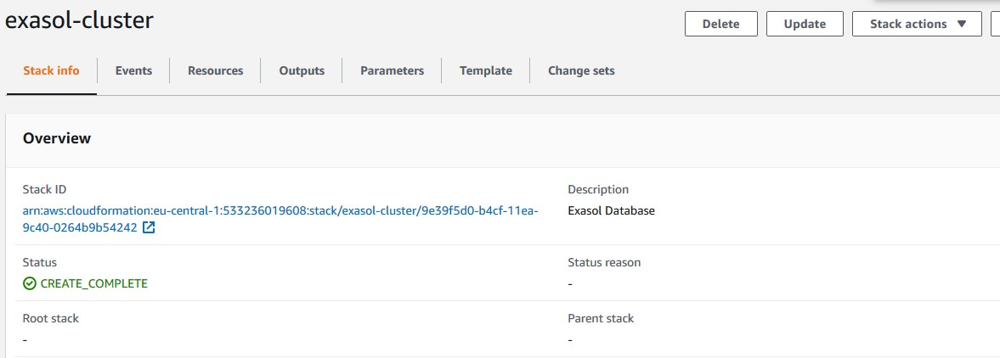
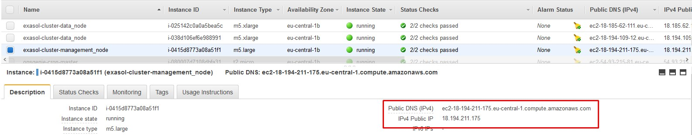
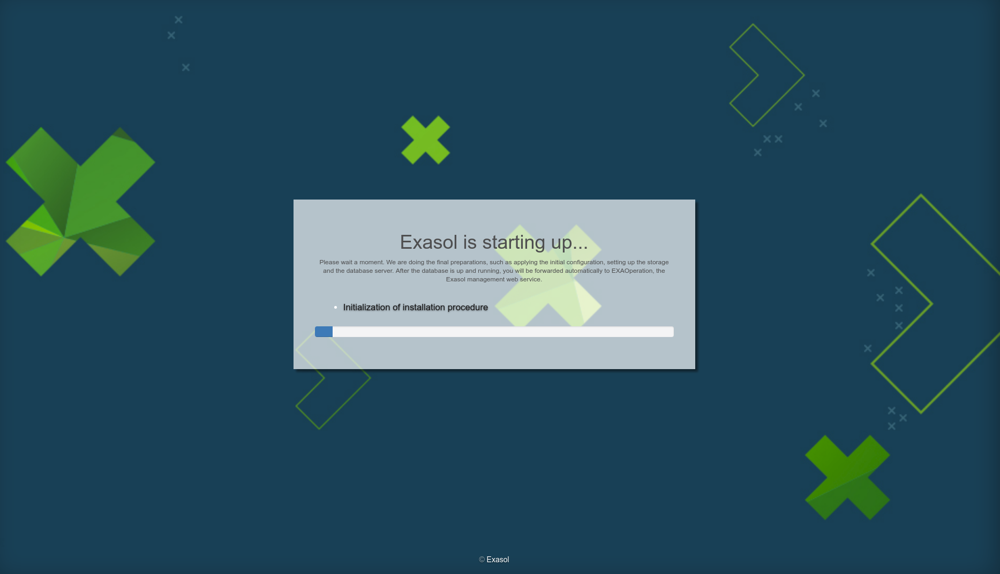
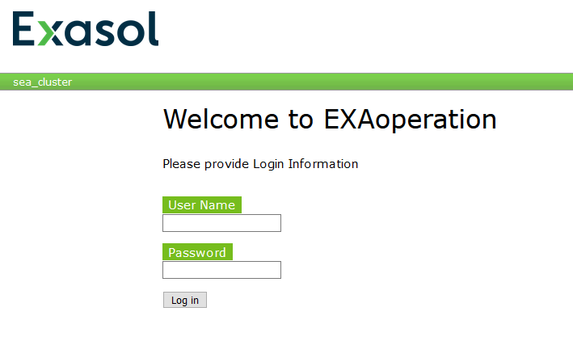

# How to deploy an Exasol Cluster on Amazon Web Service (AWS) 
## Background

Deploying 2+1 Exasol Cluster on Amazon Web Service (AWS)

## **Post snapshot:**

This post will show you:  
How to deploy a 2+1 Exasol Cluster on Amazon Web Services (AWS)  
Before we go into the step-by-step guide, please read through the following prerequisites and recommendations to make sure that you're prepared

## Prerequisites

AWS Account:

Make sure you have an AWS account with the relevant permissions. If you do not have an AWS account, you can create one from the [Amazon Console](https://portal.aws.amazon.com/billing/signup#/start).

AWS Key Pair:

You have a Key Pair created. AWS uses public-key cryptography to secure the log-in information for your instance. For more information on how to create a Key Pair, see [Amazon EC2 Key Pairs](https://docs.aws.amazon.com/AWSEC2/latest/UserGuide/ec2-key-pairs.html) in the AWS documentation.

Subscription on AWS Marketplace:

You must have subscribed to one of the following Exasol subscriptions on AWS Marketplace:

* [Exasol Analytic Database (Single Node / Cluster, Bring-Your-Own-License)](https://aws.amazon.com/marketplace/pp/B01IVOPPN8)
* [Exasol Analytic Database (Single Node / Cluster, Pay-As-You-Go)](https://aws.amazon.com/marketplace/pp/B07M718TBR)

## How to deploy a 2+1 Exasol Cluster

## Step 1

Open <https://cloudtools.exasol.com/> to access the cloud deployment wizard in your browser and choose your cloud provider. In this case, the Cloud Provider should be Amazon Web Services. Select your region from the drop-down list. I'm going to deploy our cluster in Frankfurt

## Step 2

On the **Configuration** screen, by default, you see the **Basic Configuration** page. You can choose one of the existing configurations made by Exasol.

* **Basic Configuration**: Shows a minimum specification for your data size.
* **Balanced Configuration**: Shows an average specification for your data size for good performance.
* **High-Performance Configuration**: Shows the best possible specification for your data size for high performance.

In this case, I'm going to choose **the Advanced Configuration** option.

If you are going to deploy a cluster for production purposes we recommend discussing sizing options with the Exasol support team or use one of the existing configurations made by Exasol.

RAW Data Size (in TB):

You can add the required raw data size on your own, otherwise, it will be calculated automatically after setting Instance type and node count.

License Model:

### Pay as you go (PAYG)

Pay as you go (PAYG) license model is a flexible and scalable license model for Exasol's deployment on a cloud platform. In this mode, you pay for your cloud resources and Exasol software through the cloud platform's billing cycle. You can always change your setup later to scale up or down your system and the billing changes accordingly.

### Bring your own license (BYOL)

Bring your own license (BYOL) license model lets you choose a static license for Exasol software and a dynamic billing for the cloud resources. In this model, you need to purchase a license from Exasol and add it to your cloud instance. This way, you pay only for the cloud resources through the cloud platform's billing cycle and there is no billing for the software. You can always change your setup later to scale up or down your system and the billing changes accordingly. However, there is a limit for the maximum scaling based on your license type (DB RAM or raw data size).

You can find detailed information about licensing in <https://docs.exasol.com/administration/aws/licenses.htm>

System Type:

You can choose one of the Exasol Single Node and Enterprise Cluster options. I'm going to choose the Enterprise Cluster option.

Instance Family:

You can choose one of the instance types of AWS EC2 service to deploy virtual machines for Exasol nodes. You can find detailed information about instance types of AWS EC2 in <https://aws.amazon.com/ec2/instance-types/>

The number of DB Nodes: 

We need to determine the total number of ***active data nodes*** in this section.

  

After finishing the configuration we can see the RAW data size calculated automatically for us. On the left side of the screen, we can see the details of our setup on AWS.

If you have a license from Exasol please choose the BYOL option in License Model, this will cause a decrease in Estimated Costs.

## Step 3

After click **Continue** to proceed with the deployment, we can see the Summary page. We can overview the cluster configuration and choose a deployment option.

We have the option to select **create new VPC** or **use existing VPC** for the CloudFormation stack.

* **Create New VPC** that will create a new VPC and provision of all resources within it.
* **Use Existing VPC** will provision Exasol to use an existing VPC subnet of your choice.

For more information on VPC, see [Amazon Virtual Private Cloud](https://docs.aws.amazon.com/vpc/latest/userguide/what-is-amazon-vpc.html).

Based on this VPC selection, the parameters in the stack creation page on AWS will change when you launch the stack. For more information

on the stack parameters, see [**Template Parameters**](https://docs.exasol.com/cloud_platforms/aws/installation_cf_template.htm#Parameters).

*If you want to download the configuration file and upload them later to your AWS stack through CloudFormation Console, you can click the CloudFormation Templates option on the left side.*

Click **Launch Stack**. You will be redirected to the **Quick create stack** page on AWS.

## Step 4

After redirecting to the **Quick create stack** page on AWSReview and I'm going to fill the required stack parameters:

* Stack Name
* **Key Pair**, **SYS User Password**, or **ADMIN User Password**.
* In the **VPC/Network/Security** section, the **Public IPs** are set to **false** by default. I'm going to set this to **true.**

If you want to keep the **Public IP** address set to **false**, then you need to enable VPN or other methods to be able to access your instance.

* (Optional) **License** is applicable if your subscription model is **Bring-your-own-license**. Paste the entire content of the license file you have in the space provided.
* Click **Create Stack** to continue deploying Exasol in the CloudFormation Console.   
You can view the stack you created under **AWS CloudFormation > Stacks**, with the status CREATE_IN_PROGRESS. Once the stack is created successfully, the status is changed to CREATE_COMPLETE. Additionally, you can monitor the progress in the Events tab for the stack.

For more information about the stack parameters, please check the table here <https://docs.exasol.com/cloud_platforms/aws/installation_cf_template.htm?Highlight=Template%20Parameters>

After filling the required parameters I'm going to click **Create Stack** to continue deploying Exasol in the CloudFormation Console.   
We can view the stack created under **AWS CloudFormation > Stacks**, with the status CREATE_IN_PROGRESS. Once the stack is created successfully, the status is changed to CREATE_COMPLETE.

Additionally, we can monitor the progress in the Events tab for the stack.

## Step 5

### Determine the Public IP Address

We need the Public IP or DNS name displayed in the EC2 Console to connect to the database server or launch the instance. To know the Public IP or DNS name:

1. Open the [EC2 Dashboard](https://console.aws.amazon.com/ec2/) from the AWS Management Console.
2. Click on **Running Instance**. The Instances page is displayed with all the running instances.
3. Select the name of the instance you created. (In this case exasol-cluster-management_node and exasol-cluster-management_node). We need the IP address of management node
4. In the Description section, the IP address displayed for **Public DNS(IPv4)** is the IP address of the database server.

*If the **Public IP** parameter for your stack is set to **false**,  you need to enable VPN or other methods to connect to the database server via the private IP address of the instances.*

**

## Step 6

### Access to Initialization page

Copy and paste this IP address prefixed with **https** in a browser. In the case of an Exasol cluster deployment, I need to copy the IP address or DNS name of the **management node**.

After confirming the digital certificate the following screen is displayed.

Once the installation is complete, I will be redirected to the EXAoperation screen. It may take up to 45 minutes for the EXAoperation to be online after deployment.

You can login with the admin user name and password provided while creating your stack. 

Step 7

### Connect to the database

In this case (a 2+1 cluster deployment), I need to use the Public IP address of the data node along with the admin user name and password to connect to the SQL client. I can also connect to all the data nodes by entering the pubic IP address of all the nodes separated by a comma.

## Additional Notes

### Connect to Exasol

After installing Exasol on AWS, you can do the following:

* [Install drivers required to connect to other tools.](https://docs.exasol.com/connect_exasol/drivers.htm)
* [Connect SQL clients to Exasol.](https://docs.exasol.com/connect_exasol/sql_clients.htm)
* [Connect Business Intelligence tools (BI tools) to Exasol.](https://docs.exasol.com/connect_exasol/bi_tools.htm)
* [Connect Data Integration - ETL tool to Exasol.](https://docs.exasol.com/connect_exasol/data_integration_etl.htm)
* [Connect Data Warehouse Automation tools to Exasol.](https://docs.exasol.com/connect_exasol/data_warehouse_automation.htm)

### Load Data

After you have connected your choice of tool to Exasol, you can load your data into Exasol and process further. To know more about loading data into Exasol, see [Loading Data](https://docs.exasol.com/loading_data.htm).

## Conclusion

In this article, we deployed a 2+1 Exasol cluster on AWS. In the future, I will be sharing new articles about managing the Exasol cluster on AWS, using lambda functions to schedule the start/stop of a cluster, etc.

## Additional References

<https://cloudtools.exasol.com>

<https://docs.exasol.com/administration/aws.htm>

