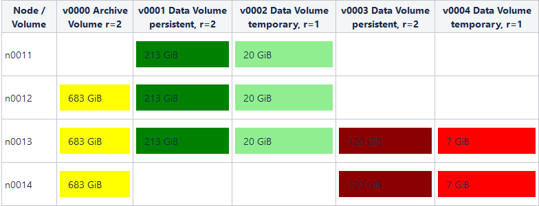

# How to monitor free database disk space 
## Background

In this article, you can find how to calculate the available database disk space. 

## Prerequisites

To calculate the available database disk space we need some informations first:

* available disk sizes on nodes
* how many volumes does exist
* the size of these volumes
* nodes are used by these volumes
* the redundancy of these volumes

## Explanation

Let's explain the calculation with an example:

* available disk space on the "d03_storage" partition on all nodes: 

| Node | Available Disk Size (GiB) |
| --- | --- |
| n0011 | 1786 |
| n0012 | 1786 |
| n0013 | 1786 |
| n0014 | 1786 |
* existing volumes, sizes, and redundancies: 

| Volume | Type | Size | Redundancy |
| --- | --- | --- | --- |
| v0000 | Archive | 1024 | 2 |
| v0001 | Data | 320 | 2 |
| v0002 | Data, tmp | 60 | 1 |
| v0003 | Data | 120 | 2 |
| v0004 | Data, tmp | 15 | 1 |

### Calculation of the free disk space

* The first step is to divide the required size of the volumes by the number of used nodes to get the segment size (example for v0000):   Size / Number of Nodes = Segment Size  
1024 GiB / 3 Nodes = 341.3 GiB/Node
* Next step is to multiply the segment size by the redundancy of the volume:   Segment Size * Redundancy = Used Disk Space per Node  
341.3 GiB/Node * 2 = 682.6 GiB/Node
* This has to be done for every volume. After that we're able to fill a table with the used disk space per node like this:



* Now we can simply substract the used sizes from the available disk size per node:

   
```
n0011:  1786 GiB - 213 GiB - 20 GiB                             = 1553 GiB
n0012:  1786 GiB - 683 GiB - 213 GiB - 20 GiB                   = 870 GiB
n0013:  1786 GiB - 683 GiB - 213 GiB - 20 GiB - 120 GiB - 7 GiB = 743 GiB
n0014:  1786 GiB - 683 GiB - 120 GiB - 7 GiB                    = 976 GiB
```
* The minimum value over all nodes gives us the free available space: **743 GiB** with a redundancy of 1. The reason for the minimum is that all segments of a volume need to have the same size.

### Calculation of the available space in point of view of the database instance

The database instance is able to control the size of its own data volume: data volumes can grow and they can be shrunken. Shrinking of a data volume is an expensive operation and creates a high amount of disk and network usage. To limit the usage the process will only shrink a few blocks after a defined amount of COMMIT statements. That is the reason why data volumes won't shrink immediately when data in the database has been deleted.

This results in the data volume usually aren't used completely by the database and there is an amount of free space:

**Database Volumes v0001 + v0002**

|  |  |  |  |  |  |
| --- | --- | --- | --- | --- | --- |
| v0001 | Used 200 GiB | Unused 120 GiB | Redundancy=2 | 2 * 120 GiB = 240 GiB Free | 2 * 200 GiB = 400 GiB Used |
| v0002 | Used 30 GiB | Unused 20 GiB | Redundancy=1 | 1 * 20 GiB = 20 GiB Free | 1 * 30 GiB = 30 GiB Used |
|  |  |  |  |    260 GiB Free | 430 GiB Used |

Now we can calculate the available space for the database which is using the volumes v0001 and v0002:


```
Free = available space for volumes + available space inside the DB volume
Free = 743 GiB + 260 GiB = 1003 GiB Free (with a redundancy of 1)

Usage = (1 - (free space / (free space + used space))) * 100%
Usage = (1 - (1003 GiB / (1003 GiB + 430 GiB))) * 100% = 30% 
```
### How to get the necessary data for monitoring the free space

To monitor the free space of an EXASolution database instance we need the following information:

* the available disk space of the storage partition
* all EXAStroage volumes
* all sizes of these volumes
* the redundancy of this volume
* the data volumes used by the database instance we want to check (data + temp)
* the usage of those data volumes

All those data are provided by the EXAoperation XMLRPC interface since EXASuite 4.2. You can use the following functions:

|   |   |
|---|---|
|```node.getDiskStates()```   |information about the available space of the storage partition   |
|```database.getDatabaseInfo()```   |volumes and its usages used by the database   |
|```storage.getVolumeInfo(volume)```   |volume sizes and redundancies   |


Please check the EXAoperation user manual for a full description of how to use those functions. You can find this manual on our user portal: [https://www.exasol.com/portal/display/DOWNLOAD/6.0](https://www.exasol.com/portal/display/DOWNLOAD/5.0)

## Additional References

[https://www.exasol.com/portal/display/DOWNLOAD/6.0](https://www.exasol.com/portal/display/DOWNLOAD/5.0)

*We appreciate your input! Share your knowledge by contributing to the Knowledge Base directly in [GitHub](https://github.com/exasol/public-knowledgebase).* 