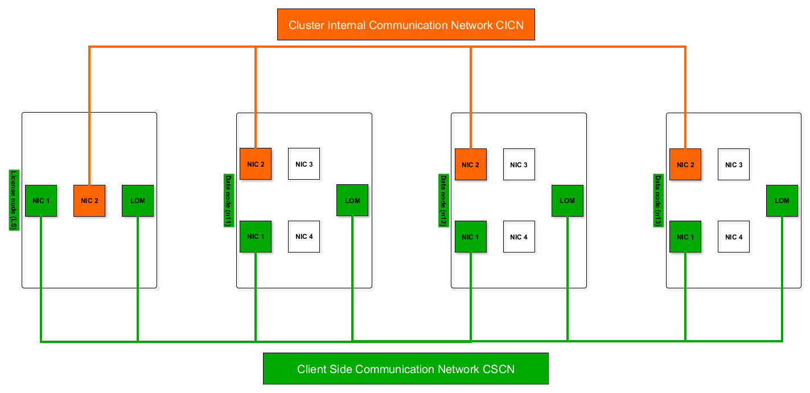
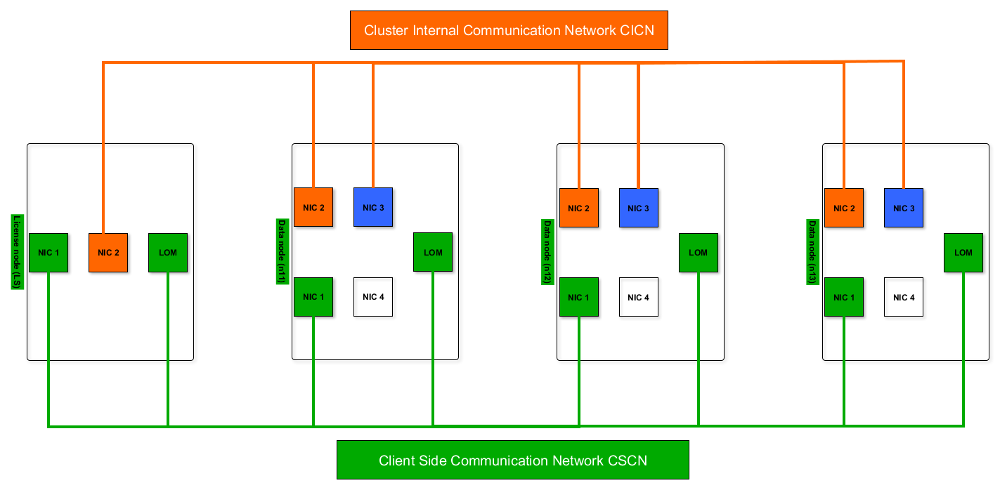
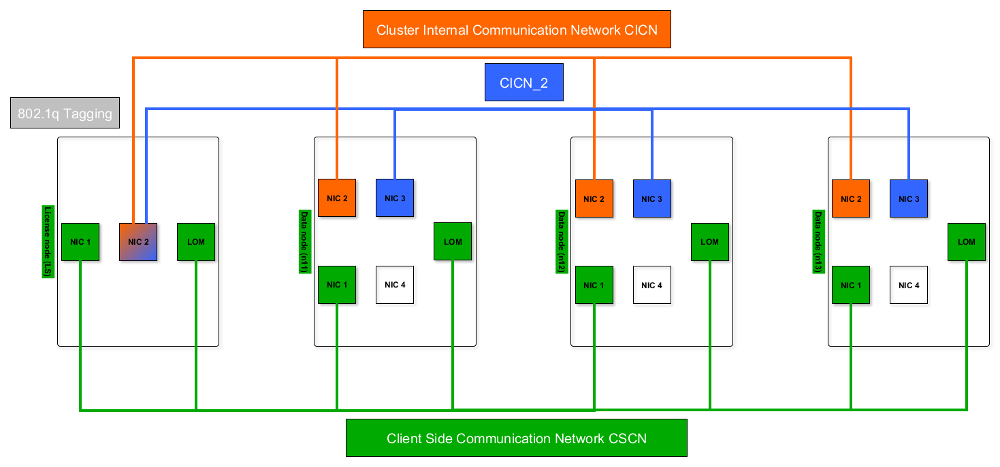

# How to prepare the network for cluster installation 
This article describes how to prepare the network for Exasol installation.

 

The schema above shows a basic network setup needed for Exasol to run properly. In addition to this, failsafety and link bonding can also be used. 

#### Cluster Internal Communication Network (CICN) or "Private Network"

* Create a dedicated and isolated VLAN (called e.g. "VLAN CICN")
	+ Add 1st NIC of each cluster member to it (license node + data nodes)
	+ Disable Flow-Control
	+ Disable STP (Spanning Tree Protocol)
	+ Disable EEE (Energy Efficient Ethernet)
	+ CICN VLAN must not be routed

#### Client Side Communication Network (CSCN) or "Public Network"

* Create a dedicated VLAN (called e.g. "VLAN CSCN")
	+ Add 2nd NIC of each cluster member to it (license node + data nodes)  
	OR
* Use an existing VLAN
	+ Add 2nd NIC of each cluster member to it (license node + data nodes)

#### Additional Network Interfaces (optional)

Depending on, whether network failsafety or link bonding is wanted. Both methods can be implemented for cluster internal or client side communication. The following example describes both methods for the cluster internal communication network (CICN). If the license node has less physical network interfaces than the data nodes add VLAN tagging (802.1q) on the license server's CICN interface. The license node must access all CICN networks.

#### Private failover interface

* Add 3rd NIC of each cluster member to existing VLAN "CICN"

#### Private bonding interface

Create a new dedicated and isolated VLAN "CICN_2"

* Add 3rd NIC of each cluster member to it
* Disable Flow-Control
* Disable STP (Spanning Tree Protocol)
* Disable EEE (Energy Efficient Ethernet)

#### LOM (Out-of-band management)

* LOM addresses can be auto-assigned via cluster internal DHCP "VLAN CICN"  
OR
* Use custom IP addresses from e.g. subnet VLAN "CSCN"  
OR
* Create a dedicated LOM Subnet/VLAN
