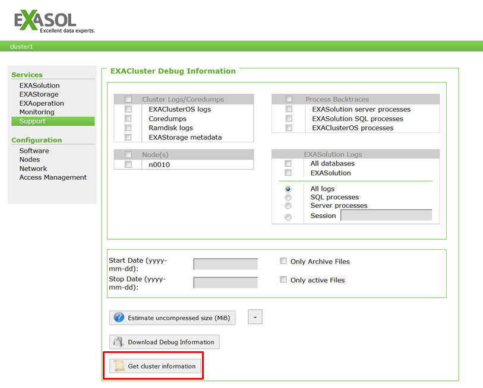

# Public Cloud Support FAQ 
## Question

### Where do I find the "Cluster Info" required during portal registration?

## Answer

You can find the "Cluster Info" in the administration tool EXAoperation (Support / Get cluster information).  
Please navigate to the Support section and press "Get Cluster Information".  

## Additional References

<https://docs.exasol.com/cloud_platforms/cloud_deployment.htm>

<https://docs.exasol.com/get_started/publicdemo/setupguide.htm>

<https://docs.exasol.com/cloud_platforms/exacloud.htm>

*We appreciate your input! Share your knowledge by contributing to the Knowledge Base directly in [GitHub](https://github.com/exasol/public-knowledgebase).* 