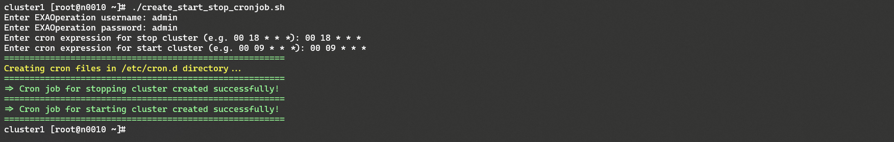

# Schedule Stop/Start all cluster nodes via linux cron job in Exasol cloud deployments 
## Background

If you want to schedule the stop and start of the Exasol cluster in cloud environments in order to save costs this can be done via running Linux cron jobs in the license server.

## Prerequisites

- SSH access to the license server

- Latest CloudUI plugin installed (<https://github.com/exasol/cloud-plugins/releases>)

- The license server is required to be always up and running

## How to schedule Stop/Start all cluster nodes.

The CloudUI plugin will be used in order to stop the database, exasol storage services, and data nodes. The CloudUI plugin is pre-installed in all cloud deployments. In case you want to update it please refer to <https://github.com/exasol/cloud-plugins/releases>

## Step 1

Login to the license server via root user.

- For AWS: You can use the "ec2 key-pair" which defined during cluster deployment. The default user name is **ec2-user**. After login, you can run **the sudo su** command in order to switch to the root user.

- For Azure: During deployment, the resource template for exasol requires ssh-key data and username for ssh access. Please use it accordingly to login

- For GCP: You can use SSH connection via browser from google cloud console. You can find detailed information at <https://cloud.google.com/compute/docs/instances/connecting-advanced>

## Step 2

Create a bash script in the license server.


```python
#/bin/bash

# ----------------------------------
# Colors
# ----------------------------------
RED='\033[0;31m'
GREEN='\033[0;32m'
YELLOW='\033[1;33m'
NC='\033[0m' # No Color

# Display usage message
echo -e "${GREEN}=============================================================================================================================================================${NC} \n"
echo -e "Run this script ${RED}without any argument${NC} in order to schedule start/stop of your exasol cluster."
echo -e "In order to delete existing schedule -d option can to be used."
echo -e "\nUsage: $0 OR $0 [-d] \n"
echo -e "${GREEN}=============================================================================================================================================================${NC} \n"

# Setting up required variables
exacluster_stop=/etc/cron.d/exacluster-stop
exacluster_start=/etc/cron.d/exacluster-start
py_interpreter=$(which python)

check_message="Are you sure that you want to delete the existing schedule?"

# The function for get yes or no if required
function check_yes_or_no {
    while true; do
        read -p "$* [y/n]: " yn
        case $yn in
            [Yy]*) return 0  ;;
            [Nn]*) echo "Aborted" ; return  1 ;;
        esac
    done
}

# Check if user added -d option to delete existing schedule
if [ $# -ne 0 ]; then
    while getopts "d" option; do
        case ${option} in
         d ) #For option c
          check_yes_or_no "$check_message" && echo '#' > $exacluster_stop && echo '#' > $exacluster_start && echo -e "Scheduler has been disabled"
          ;;
         \? ) echo "Usage: cmd [-d]"
          ;;
    esac
    done
    exit 1
fi

# Get Exaoperation username and password from user
read -p "Enter EXAOperation username: " username
read -p "Enter EXAOperation password: " password

# Encrypt the username and password for CloudUI plugin method
base64_credentials=`echo -n $username:$password | base64`

# Get Linux cron expression for stop and start cluster
read -p "Enter cron expression for stop cluster (e.g. 00 18 * * *): " cron_expression_stop
read -p "Enter cron expression for start cluster (e.g. 00 09 * * *): " cron_expression_start

echo -e "${GREEN}=======================================================${NC}"
echo -e "${YELLOW}Creating cron files in /etc/cron.d directory...${NC}"
echo -e "${GREEN}=======================================================${NC}"

# create cron file for stop cluster
cat <<EOF >$exacluster_stop
$cron_expression_stop root $py_interpreter /opt/ui-backend/handle_cloudui_request.py -d '{"method":"stop_cluster","credentials":"'$base64_credentials'"}'
EOF

if [ $? -eq 0 ]; then
    echo -e "${GREEN}=> Cron job for stopping cluster created successfully!${NC}"
    echo -e "${GREEN}=======================================================${NC}"
else
    echo echo -e "${RED}=> Cron job for stopping cluster not created successfully!${NC}"
    echo -e "${GREEN}=======================================================${NC}"
fi

# create cron file for start cluster
cat <<EOF >$exacluster_start
$cron_expression_start root $py_interpreter /opt/ui-backend/handle_cloudui_request.py -d '{"method":"start_cluster","credentials":"'$base64_credentials'"}'
EOF

if [ $? -eq 0 ]; then
    echo -e "${GREEN}=> Cron job for starting cluster created successfully!${NC}"
    echo -e "${GREEN}=======================================================${NC}"
else
    echo echo -e "${RED}=> Cron job for starting cluster not created successfully!${NC}"
    echo -e "${GREEN}=======================================================${NC}"
fi
```
Give executable permission to the script via **chmod** command. (e.g. chmod +x {name_of_file})

The script also can be cloned from GitHub:


```markup
git clone https://gist.github.com/08f6c2f8c59ebd347304cf5dcc266c5c.git
```
## Step 3

Run the bash script and add the required values.



## Additional Notes

Please be aware that the license server is required to be always up and running.

In order to change the existing schedule, the script can be reused.

## Additional References

<https://docs.exasol.com/administration/aws/cloud_plugins.htm>

<https://docs.exasol.com/administration/azure/plugin/cloud_ui_plugin.htm>

<https://docs.exasol.com/administration/google/plugin/cloud_ui_plugin.htm>

*We appreciate your input! Share your knowledge by contributing to the Knowledge Base directly in [GitHub](https://github.com/exasol/public-knowledgebase).* 