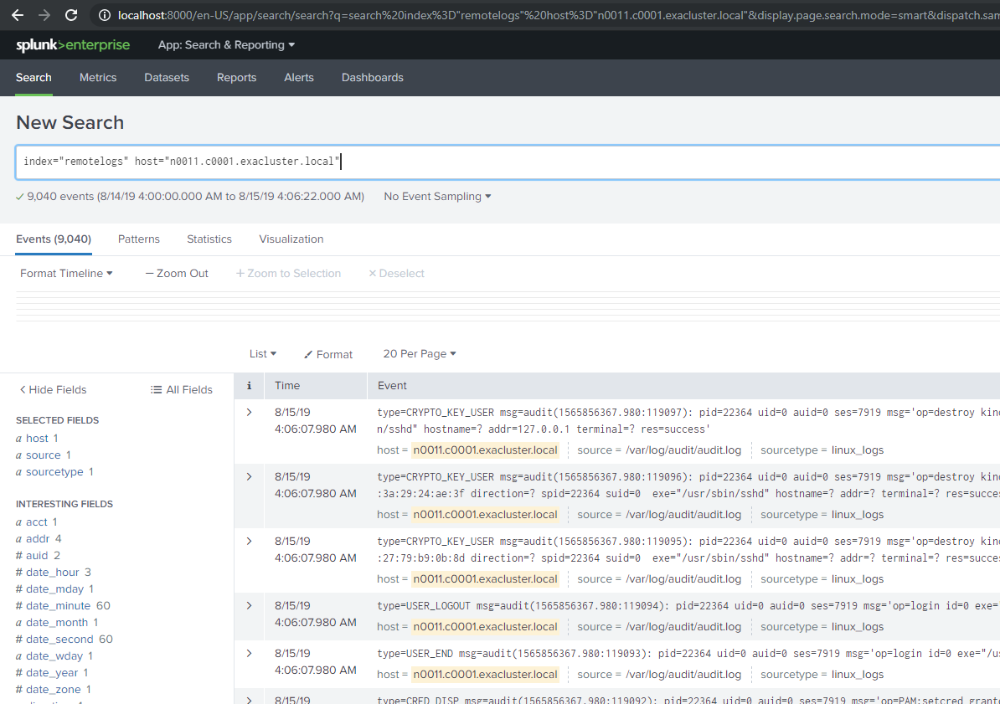

# Splunk Server and Splunk Forwarder 
## Server installation

* Minimal Centos 7
* Register at Splunk and download the e.g. free version
* Download splunk-7.3.1-bd63e13aa157-linux-2.6-x86_64.rpm
* Install RPM, target directory will be /opt/splunk   
```
rpm -ivh splunk-7.3.1-bd63e13aa157-linux-2.6-x86_64.rpm 
```
* Start Splunk, accept EULA and enter **username** and **password**   
```
/opt/splunk/bin/splunk start 
```
* Create a SSH port forward to access the web UI. **NOTE!**   If /etc/hosts is configured properly and name resolution is working, no port forwarding is needed.   
```
ssh root@HOST-IP -L8000:localhost:8000 
```
* Login with username and password you provided during the installation   
```
https://localhost:8000 
```

## Setup an Index to store data

* From the web UI go to
	+ Settings
	+ Indexes
* New Index
	+ Name: remotelogs
	+ Type: Events
	+ Max Size: e.g. 20GB
* Save

## Create a new listener to receive data

* From the web UI go to
	+ Settings
	+ Forwarding and receiving
* Configure receiving: Add new
* New Receiving Port: 9700
* Save
* Restart Splunk   
```
/opt/splunk/bin/splunk restart 
```

## Client installation Splunk Universal Forwarder

* Download the splunkforwarder-7.3.1-bd63e13aa157-linux-2.6-x86_64.rpm
* Install via rpm, target directory will be /opt/splunkforwarder   
```
rpm -ivh splunkforwarder-7.3.1-bd63e13aa157-linux-2.6-x86_64.rpm 
```
* Start Splunk Forwarder, accept EULA and   enter the same username and password as for the Splunk Server   
```
/opt/splunkforwarder/bin/splunk start 
```

## Setup forward-server and monitor

* Add Splunk server as a server to receive forwarded log files. Same username and password as before   
```
/opt/splunkforwarder/bin/splunk add forward-server HOST-IP:9700 -auth USER:PASSWORD 
```
* Add a log file, e.g. audit.log from auditd. It requires the log file location, type of logs and the index we created before.   
```
/opt/splunkforwarder/bin/splunk add monitor /var/log/audit/audit.log -sourcetype linux_logs -index remotelogs 
```
* Check if forward server and log files have been enabled, restart splunkforwarder if nothing happens   
```
/opt/splunkforwarder/bin/splunk list monitor
Your session is invalid.  Please login.
Splunk username: admin
Password:
Monitored Directories:
        $SPLUNK_HOME/var/log/splunk
                /opt/splunkforwarder/var/log/splunk/audit.log
                /opt/splunkforwarder/var/log/splunk/btool.log
                /opt/splunkforwarder/var/log/splunk/conf.log
                /opt/splunkforwarder/var/log/splunk/first_install.log
                /opt/splunkforwarder/var/log/splunk/health.log
                /opt/splunkforwarder/var/log/splunk/license_usage.log
                /opt/splunkforwarder/var/log/splunk/mongod.log
                /opt/splunkforwarder/var/log/splunk/remote_searches.log
                /opt/splunkforwarder/var/log/splunk/scheduler.log
                /opt/splunkforwarder/var/log/splunk/searchhistory.log
                /opt/splunkforwarder/var/log/splunk/splunkd-utility.log
                /opt/splunkforwarder/var/log/splunk/splunkd_access.log
                /opt/splunkforwarder/var/log/splunk/splunkd_stderr.log
                /opt/splunkforwarder/var/log/splunk/splunkd_stdout.log
                /opt/splunkforwarder/var/log/splunk/splunkd_ui_access.log
        $SPLUNK_HOME/var/log/splunk/license_usage_summary.log
                /opt/splunkforwarder/var/log/splunk/license_usage_summary.log
        $SPLUNK_HOME/var/log/splunk/metrics.log
                /opt/splunkforwarder/var/log/splunk/metrics.log
        $SPLUNK_HOME/var/log/splunk/splunkd.log
                /opt/splunkforwarder/var/log/splunk/splunkd.log
        $SPLUNK_HOME/var/log/watchdog/watchdog.log*
                /opt/splunkforwarder/var/log/watchdog/watchdog.log
        $SPLUNK_HOME/var/run/splunk/search_telemetry/*search_telemetry.json
        $SPLUNK_HOME/var/spool/splunk/...stash_new
Monitored Files:
        $SPLUNK_HOME/etc/splunk.version
        /var/log/all.log
        /var/log/audit/audit.log
```

## Check if the Splunk server is available


```
/opt/splunkforwarder/bin/splunk list forward-server
Active forwards:
        10.70.0.186:9700
Configured but inactive forwards:
        None
```
## Search logs in the Web UI



## Collecting Metrics

* Download the Splunk Unix Add-on splunk-add-on-for-unix-and-linux_602.tgz
* unpack and copy to the splunkforwarder app folder   
```
tar xf splunk-add-on-for-unix-and-linux_602.tgz 
mv Splunk_TA_nix /opt/splunkforwarder/etc/apps/ 
```
* Enable Metrics you want to receivce, set **disable = 0** to enable metric   
```
vim /opt/splunkforwarder/etc/apps/Splunk_TA_nix/default/inputs.conf 
```
* Stop splunk forwarder and start splunk forwarder   
```
/opt/splunkforwarder/bin/splunk stop 
/opt/splunkforwarder/bin/splunk start
```

*We appreciate your input! Share your knowledge by contributing to the Knowledge Base directly in [GitHub](https://github.com/exasol/public-knowledgebase).* 