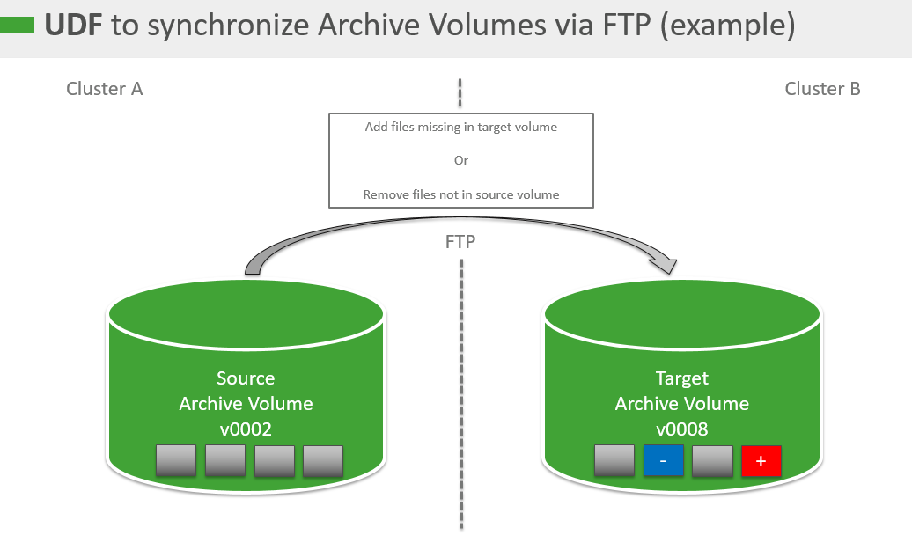

# Synchronize Archive Volumes via FTP

###### Please note that this script is *not officially supported* by Exasol. We will try to help you as much as possible, but can't guarantee anything since this is not an official Exasol product.

## Background

With this UDF (backup_copy_ftp.sql) written in Python, you can easily synchronize archive volumes between clusters. Transport is TLS encrypted (self._ftp = FTP_TLS). After volumes have been initially synchronized, all files added or deleted will be added or deleted in the target archive volume. This UDF does not support synchronizing specific days or backup IDs, but it can be easily adjusted to your needs. Parallelism is handled by the database. So for best performance, the number of database and master nodes of the target archive volume should be the same.



## Prerequisites

* Your Archive Volumes must be accessible to the Exasol cluster.
* The user creating the UDF must have permission to create the script in a schema.

## Step 1: Create the UDF

Open the attached file (backup_copy_ftp.sql), created connection objects `BACKUPSYNC_LOCAL_CONN` and `BACKUPSYNC_REMOTE_CONN`, then create the script in the schema of your choice. Within the connection object definitionss, you should adjust values

* `SourceArchiveVolumeName`
* `SourceEXAoperationOrConfdUser`
* `SourceEXAoperationOrConfdPW`
* `TargetArchiveVolumeName`
* `TargetEXAoperationOrConfdUser`
* `TargetEXAoperationOrConfdPW`

accordingly:

```sql
CREATE CONNECTION BACKUPSYNC_LOCAL_CONN
TO 'ftp://%s:%s@%s/SourceArchiveVolumeName'
USER 'SourceEXAoperationOrConfdUser'
IDENTIFIED BY 'SourceEXAoperationOrConfdPW';

CREATE CONNECTION BACKUPSYNC_REMOTE_CONN
TO 'ftp://%s:%s@%s/TargetArchiveVolumeName'
USER 'TargetEXAoperationOrConfdUser'
IDENTIFIED BY 'TargetEXAoperationOrConfdPW';
```

Note: the calculation of `currentip` in the `run` method might require an adaptation of the name of the respective network interface. Please contact Exasol Support to help you find out this information.

## Step 2

Once the script is created, you can run it like this:


```sql
-- SELECT syncBackups(IPROC,'FIRST_REMOTE_IP,SECOND_REMOTE_IP') FROM EXA_LOADAVG;

SELECT syncBackups(IPROC,'192.168.0.1,192.168.0.2') FROM EXA_LOADAVG;
```
If needed, you can run this script regularly.

## Additional Notes

If a synchronization attempt fails, you must cleanup the target volume manually

## Additional References

* [CREATE CONNECTION](https://docs.exasol.com/db/latest/sql/create_connection.htm)
* [Create Local Archive Volume, version 7.1](https://docs.exasol.com/db/7.1/administration/on-premise/manage_storage/create_local_archive_volume.htm)
* [Create Local Archive Volume, version 8](https://docs.exasol.com/db/latest/administration/on-premise/manage_storage/create_local_archive_volume.htm)
* [Download Local Backup, version 7.1](https://docs.exasol.com/db/7.1/administration/on-premise/backup_restore/download_local_backup.htm)
* [Download Local Backup, version 8](https://docs.exasol.com/db/latest/administration/on-premise/backup_restore/download_local_backup.htm)
* [Upload Local Backup, version 8](https://docs.exasol.com/db/latest/administration/on-premise/backup_restore/upload_local_backup.htm)

## Downloads

* [backup_copy_ftp.sql](https://github.com/exasol/public-knowledgebase/blob/main/Environment-Management/attachments/backup_copy_ftp.sql)

*We appreciate your input! Share your knowledge by contributing to the Knowledge Base directly in [GitHub](https://github.com/exasol/public-knowledgebase).*