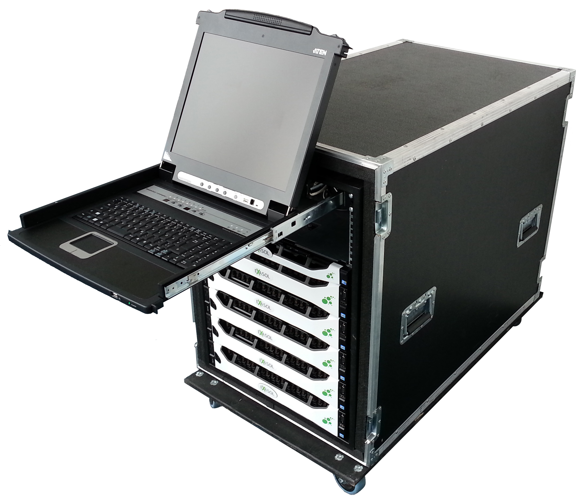

# Technical Requirements &amp; Prerequisites for EXASOL Mobile Test System 
EXASOL offers a fully preconfigured mobile test system in the scope of a proof of concept, to showcase Exasol's capabilities.

In order to ensure a smooth process to start and execute the proof of concept, we kindly ask you to take note of the following technical requirements and prerequisites for the operation of a mobile trial cluster.

Chassis

1. Dimensions (w/h/d):
	* Flight case on wheels: ca. 70cm/100cm/110cm
2. Weight:
	* up to 300 kg (when fully equipped)
3. Power Supply:
	* 2x 230 V European “Schuko” plug
	* Total power consumption either around 3 kW-3,5 kW for smaller configs or 2x 3kW-3.5kW for larger Mobile Test Systems
	* 16A fuse protection per relevant electric circuit
4. Cooling
	* Please assure that the generated heat can be compensated (room size, air conditioning).
	* If the mobile trial cluster is not located in a data center, please consider the noise generated by the machines.

Network

1. Network Bandwidth
	* 10 gigabit Ethernet recommended (25 gigabit or 40 gigabit could be an option as well depending on the configuration)
	* 1 gigabit and fiber optics also work. Please contact us in the latter case as an adapter is required
2. IP Addresses
	* Depending on the number of servers the test system contains, please send us in advance 11 IP addresses of a coherent network, ideally consecutive addresses (example for a system with 11 servers: 192.168.1.10..20/24).
	* If a gateway is required also its address.
	* Optionally internal addresses of NTP and DNS servers.
3. Firewall
	* Please make sure that the Exasol servers can be reached from the workstations and the relevant servers (ETL, BI, …) via port 8563 (TCP). For the administration console, access via port 443 and optionally 20+22 (SSH) is needed. It is required to install necessary drivers to access the database on client machines.
4. Data Migration
	* If data is to be loaded from another database, please make sure that you have the connection parameters and that the database can be reached by Exasol.
5. Remote Maintenance
	* Optionally, a remote connection from Exasol to the test system via VPN or ssh tunnel might be helpful to provide remote support for the proof of concept.

Transport

1. Delivery
	* The test system will be delivered by a forwarding agent. Please make sure that the consignment can be accepted at the appointed date and that the place of location is at ground level or can be reached via a sufficiently sized elevator. Please name a contact person for the forwarding agent.
2. Pick Up
	* The test system will be picked up by a forwarding agent. Please make sure that the system is ready for pick up at the appointed date.
