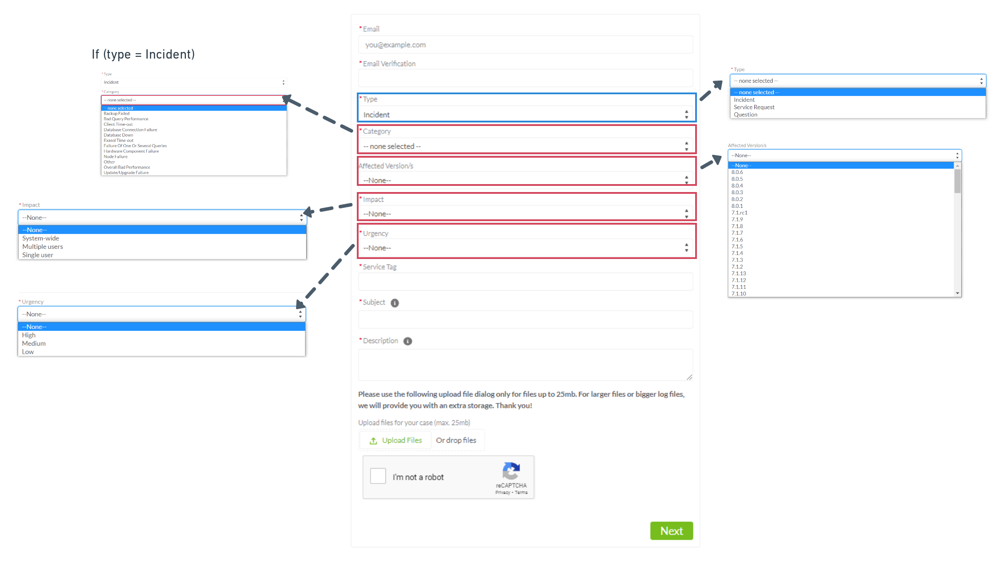

# Create a new case

As a customer, you can report the issue via email, web form, or phone call.  

- Webform: As a customer, you can also report issues by creating the case directly through the web form. Clicking on the link and providing valid input for all the respective fields will enable you to create a case. 

>**NOTE**
>
>Please double-check whether you have entered valid input regarding your identities like Email, Customer Pin, or Service Tag (Service tag is required when the case is incident). Invalid information in customer fields will enable the system to do some predefined action e.g., entering the wrong email will automatically close the case considering the customer not found in system.

- Email: As a customer, you can create a case by sending an Email to service@exasol.com. 

>**NOTE**
>
>- Please make sure you are sending email from approved Email before you report your issue by sending Email to  service@exasol.com.  
>- A case created through email will be treated as a "Question" with priority "Normal".

- Phone call: We at Exasol also provide support through phone calls. You can call (415) 363-5510 (Toll America), +49 911 2399 110 (Toll Europe/Rest of the World). Here Exasol support agent will create a case requesting issue-related information. 

## Webform: 

If you create a case via the web form, make sure that you provide valid information about the issue in the fields. Even though the case is created via the web form, communication about the case is done via email. The fields in the web form vary depending on the type of case you select in the web form, and sometimes depending on the category you select. Below is the example webform for the selected type of 'incident'.

There are three different types of cases: 

-	Incident: An interruption of a service/database.
-	Service Request: Any service request e.g installation or updates.
-	Question: A question that needs support from a Exasol support agent.

### Here you can find a description of the available fields of our web form: 

-	Email: Enter the valid email address registered with Exasol. This information helps us to find your data in our customer management system. If your email address is not known to our system, your case will be closed automatically, and you will receive a confirmation of this by email. In this case, please contact your MyExasol User Manager. 
-	Type: The available options are Incident, Service Request, and Question. 
-	Category: General category of the case to which the issue relates.
-	Affected Version: The version that is affected by the issue.
-	Impact: This field provides information about the severity of the issue so that the Exasol support agent can respond accordingly. 
-	Urgency: How important or how urgent the problem needs to be solved.  
-	Service Tag: Each Exasol license has a unique service tag that allows us to identify the correct system and your booked services. 
-	Subject: One-line description of the issue. 
-	Description: Detailed explanation of the issue. 
-	Upload files: For smaller files such as screenshots or scripts (under 25 MB), you can use the upload function within the webform. For larger logfile uploads you will receive a dedicated upload link in your confirmation email.
-	Customer pin: The customer pin is only required for adding/removing/editing contacts in our system. You can find the customer pin in your onboarding document.

## Communication:

Email serves as a communication channel between Exasol and the customer once the case is created.   

-	After case creation: Once a case is created through any channel, you will receive a case creation confirmation email. A link to upload the log files will also be sent with the case creation confirmation email.  
-	Case-related communication: to communicate with Exasol support, you can simply reply to case-related emails. Please do not delete any details in the email so that there are no issues in the case assignment. 
-	Close case: Once the case is closed, you as a customer will be informed about the status by email. Additionally, you will get the opportunity to rate the processing of the case here.

*We appreciate your input! Share your knowledge by contributing to the Knowledge Base directly in [GitHub](https://github.com/exasol/public-knowledgebase).* 