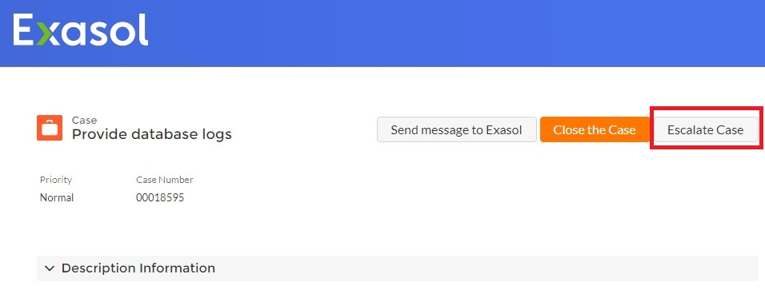

# Escalation Management Explained 

## What is Escalation Management?
The escalation management process describes and defines the steps and roles involved in an escalation. The cause of an escalation can be either technical (e.g., database outage, software error) or non-technical (e.g., complaint). 

## How do I trigger an escalation?
You can trigger an escalation by using the "Escalate Case" button in the customer portal and adding a message about the details of your escalation. Additionally, your account manager can escalate on your behalf. By escalating a case, your case and message is sent directly to Exasol's Support Management. Afterwards, they will reach out to you personally to discuss the next steps.

**For critical incidents outside of German Business hours, please call the Hotline at +49 911 2399 110 or +1 415-363-5510.**

## What happens next?
Exasol will assign someone from the support organization to handle your escalation and take over the coordination (the "Escalation Manager"). If you have an assigned Service Delivery Manager, they will act as the Escalation Manager. The Escalation Manager will reach out to discuss the current state of the case and agree on any next steps, including a regular cadence to discuss the progress of the escalation.

Internally, the Escalation Manager will bring all required stakeholders together to address the current issues from a holistic view. The priority in this phase is to identify workarounds or solutions to bring the database back to a stable or acceptable state. In some cases, this may involve database updates which need to be planned. The Escalation Manager will share updates to our investigations and actions on a regular basis.

## What roles are involved?
Customer side - Exasol assigns several customer-authorized touch points during the customer onboarding phase and assigns roles to them. The customer role relevant for escalation is the "Incident Manager".

Exasol side - Exasol internally assigns an Escalation Manager (e.g., Service Delivery Manager). This role manages the entire escalation process, pulls in all necessary resources, and handles internal and external communication.

The "Incident Manager" and the "Escalation Manager" work closely together in order to resolve the escalation as quickly as possible.

## Progress tracking

Both roles agree on frequency and communication channel for regular meetings to share information and status updates.

The tracking is done within our ticketing system. Required stakeholders are added to the ticket as "participants" to be always up-to-date on the escalation. It is common during an escalation that regular contact happens via calls, however all decisions and actions performed should be documented in the corresponding case. 

## Resolution

After successful resolution of the escalation, you will receive a "Root Cause Analysis" document which describes the cause of the issues, the actions taken, and any long-term steps to improve the situation. Additionally, we will invite you to a "lesson learned" session to continuously improve our services. 

*We appreciate your input! Share your knowledge by contributing to the Knowledge Base directly in [GitHub](https://github.com/exasol/public-knowledgebase).* 
